# AI-agent как усилитель delivery-процесса: от требования до MR

**Формат:** мастер-класс с live demo на opencode.
**Длительность:** 60 минут.
**Аудитория:** Java-разработчики (40%), системные аналитики (30%), tech leads и архитекторы (30%).
**Demo-задача:** добавление поля `daysRemaining` в response endpoint'а `POST /FL/gracePeriod` сервиса `packagesearch` (Spring Boot 3, Java 17). Подробный сценарий — в `[[Live Demo Script]]`.

> Сопровождающие документы: `Live Demo Script.md`, `Speaker Notes.md`, `Fallback Demo Script.md`, `Pre-Show Checklist.md`, `Cannot Show.md`, `Call To Action.md`, `Templates.md`.

**Хронометраж (минуты):**

| Блок | Минут |
|---|---:|
| 0. Введение | 3 |
| 1. Словарь: 4 термина + 6 примитивов AI-агента | 6 |
| 2. Как вызвать skill в opencode | 5 |
| 3. Что происходит внутри opencode, когда вы вызываете skill | 6 |
| 4. Workflow: от бизнес-тикета до MR за 12 шагов | 5 |
| 5. **Live demo** | **20** |
| 6. Зрелость работы с агентом: 4 уровня, 7 паттернов | 9 |
| 7. Риски и ответственность | 3 |
| 8. Как AI встроен в фазы спринта | 2 |
| 9. Финальная формула | 1 |
| **Итого** | **60** |

---

# 0. Введение

За ближайший час я покажу одну вещь: **как встроить AI-агента в обычный delivery-процесс — от бизнес-тикета до merge request — так, чтобы он не ломал процесс, а ускорял его**.

Главный инструмент — **opencode**: open-source CLI-агент с поддержкой Plan/Build режимов, AGENTS.md, плагинов и MCP. На нём пройдут все примеры и live demo.

Что вы заберёте:

- **Словарь**, чтобы понимать, что говорят коллеги и что пишут в документации opencode.
- **Workflow из 12 шагов**, который мы пройдём на живом Java-сервисе. От бизнес-задачи до готового MR.
- **7 паттернов работы**, разложенных на 4 уровня зрелости — чтобы каждый понял, где он сейчас и куда двигаться.
- **3 типа рисков**, которые AI-агент создаёт, и кто за них отвечает.

Главный тезис на 60 минут: **AI-агент не заменяет delivery-процесс. Он его усиливает — но только если встроен правильно. Слабый подход — «дай задачу, получи код». Сильный подход — управляемый workflow с проверками на каждом шаге.**

---

# 1. Словарь: 4 термина + 6 примитивов AI-агента

## 4 термина из мира LLM

Прежде чем говорить про opencode, фиксирую 4 слова, которые будут встречаться весь час. Каждому — одна фраза.

- **Context window (контекстное окно)** — рабочая память агента в одной сессии. Ограничена. Заполняется по ходу разговора: системный промпт, AGENTS.md, история, файлы, ошибки. Когда переполняется — старое вытесняется. Это RAM агента: быстро, но мало.
- **Prompt engineering (формулировка запроса)** — искусство сформулировать один запрос так, чтобы получить нужный ответ. Сегодня уступает место **context engineering** — управлению всем, что видит агент, а не только текстом запроса. Запомните различие — мы к нему вернёмся.
- **Reasoning loop (цикл рассуждения)** — то, как агент работает: думает → выбирает действие (прочитать файл, запустить тест, написать код) → выполняет → смотрит результат → думает дальше. Один turn = один проход цикла.
- **Chain-of-thought (рассуждение вслух)** — когда модель «рассуждает вслух» внутри одного ответа, прежде чем дать финальный результат. Не магия и не отдельный режим — просто формат вывода.

## 6 примитивов AI-агента

Теперь шесть инструментов, из которых собирается работа с opencode. Цель — чтобы дальше, когда я скажу «вызываю subagent» или «через MCP агент видит OpenAPI», вы понимали, о чём речь.

### Subagent (субагент)

Subagent — это отдельный экземпляр агента с собственным контекстом и собственной задачей. Не новая модель, не новый инструмент — просто **изолированная сессия для конкретного задания**.

Зачем. У главной сессии быстро забивается контекст: логи, неудачные попытки, исследования. Subagent выносит часть работы в отдельный «контекстный пузырь» — он сделал своё дело, вернул summary, главная сессия осталась чистой.

В opencode это поддерживается из коробки. Главное: subagent — это не параллелизм ради скорости. Это **изоляция контекста ради качества**. Тот же агент, что писал код, его проверять не должен — это предвзятый ревьюер.

### MCP (Model Context Protocol)

MCP — стандарт, через который агент подключается к внешним источникам и инструментам не как «копипаст текста», а как структурированный API.

Конкретно: вместо того чтобы вы скопировали OpenAPI-спеку в чат — агент через MCP получает к ней программный доступ. Может прочитать схему, найти конкретный endpoint. То же с базой данных, файловой системой, Jira.

Зачем. Без MCP агент работает с тем, что вы ему дали в промпте. С MCP — он работает с источниками напрямую и видит их актуальное состояние. Разница между «снимок в момент копипаста» и «живой запрос».

### AGENTS.md

`AGENTS.md` — файл в корне репозитория, который агент читает в начале каждой сессии. Туда кладутся **правила, которые агент сам не выведет из кода**: build-команды, code style, security-ограничения, naming, что нельзя трогать без явного разрешения.

Зачем. Без AGENTS.md вы повторяете эти правила в каждом промпте: «помни, у нас Spring Boot, Java 17, не используй Lombok». С AGENTS.md — пишете один раз, коммитите в git, и поведение агента становится одинаковым у всех в команде.

В opencode `AGENTS.md` — стандартное имя файла. Это **главный архитектурный артефакт** для команды, которая работает с агентом.

### Skill (умение)

Skill — сохранённая «специализация» агента: набор инструкций и поведенческих правил под конкретный тип задач. Например, skill `pr-reviewer` — агент с чек-листом ревью и стилем feedback'а.

Зачем. Без skills вы каждый раз пишете «представь, что ты ревьюер, проверь diff по чек-листу...». С skills — это переиспользуемая специализация, одинаковая у всей команды.

Особенность: skills **активируются автоматически**, когда агент видит подходящий контекст. Удобно, но непредсказуемо — поэтому есть commands.

### Command (команда)

Command — сохранённый промпт-шаблон с параметрами, который вызывается явно по имени: `/review`, `/impact <feature>`, `/mr-summary`. В opencode команды живут как файлы в `.opencode/commands/<name>.md`.

Зачем. Если один и тот же промпт повторяется десять раз — это кандидат в command. Главное отличие от skills: **skill активируется автоматически по контексту, command — явно по имени**. Skill — автопилот, command — ручное управление. Используются вместе.

### Hook (хук)

Hook — правило «когда происходит X, автоматически выполни Y». Например: после каждой генерации кода — `mvn compile`. Перед коммитом — линтер. После завершения задачи — обновить статус в Jira.

Зачем. Это слой автоматизации, который превращает агента из «отвечает на промпт» в «работает в pipeline». Hooks — то, что делает workflow воспроизводимым, а не зависимым от того, не забыл ли пользователь нажать кнопку.

В opencode hooks реализованы как **плагины на TypeScript** (`.opencode/plugins/*.ts`) — подписываются на события вроде `tool.execute.before`, `file.edited`, `session.created`. Конкретный пример hook'а — в секции про opencode под капотом.

---

**Подведу итог по словарю.** Subagent — изоляция контекста. MCP — структурированный доступ к источникам. AGENTS.md — конвенции проекта. Skill — автоматически активирующаяся специализация. Command — параметризованный шаблон, вызывается явно. Hook — событие → действие.

---

# 2. Как вызвать skill в opencode

Раз словарь введён — сразу к практике. Вопрос «как заставить агента применить мой skill?» — главный, который задают в первую неделю работы с opencode. Ответ в одном предложении: **есть три способа, и они не равнозначны по надёжности**.

## Способ 1. Plain prompt — надежда на автоматический вызов

Вы пишете запрос как обычно, ни о каком skill не упоминаете:

```
> Можешь отревьюить мой PR в feature/auth-refactor?
```

Если skill `pr-reviewer` зарегистрирован и его описание совпало с фразой — opencode сам подсунет его модели, и она применит. Если нет — модель пойдёт писать review «на глаз». **Надёжность: 50–70%**. Зависит от длины сессии, формулировки и того, сколько других skills конкурируют за внимание.

## Способ 2. Explicit invocation — назвать skill по имени

Вы явно говорите модели, какой skill применить:

```
> Use the pr-reviewer skill to review my PR in feature/auth-refactor
```

Имя skill попадает в текст запроса, модель ловит совпадение и почти всегда вызывает. **Надёжность: ~90%**. Цена — вы должны помнить имена своих skills.

## Способ 3. Slash-command — детерминированный запуск

Вы создаёте файл `.opencode/commands/review.md`:

```markdown
# .opencode/commands/review.md
Follow the steps from `pr-reviewer` SKILL.md for $ARGUMENTS.

1. Read .opencode/skills/pr-reviewer/SKILL.md
2. Execute every step in order.
3. Output the structured review.
```

Дальше пользователь печатает `/review feature/auth-refactor` — это уже не вероятность, это команда. **Надёжность: 100%**. Правильный путь для регулярных операций: `/review`, `/impact`, `/mr-summary`, `/standup`.

## Когда какой использовать

- **Plain prompt** — для разовых задач, где «не вспомнит — и ладно». Экспло­ра­тив­ная работа.
- **Explicit invocation** — когда нужно сейчас, в этой сессии, без файлов. Самый быстрый способ повысить шанс с 60% до 90%.
- **Slash-command** — для всего, что вы делаете больше одного раза в неделю. Цена создания — 5 минут на файл, выигрыш — детерминизм.

Главная инверсия по сравнению с «agent сам всё знает»: **explicit invocation и slash-commands — это не workaround, это основной интерфейс**. Автоматический вызов — приятный бонус, когда срабатывает.

## Куда положить skill

- `~/.config/opencode/skills/<name>/SKILL.md` — глобально, доступен во всех ваших проектах.
- `./.opencode/skills/<name>/SKILL.md` — в репозитории проекта, версионируется в git, доступен всей команде. Проектный приоритетнее глобального.

## Подсказать через AGENTS.md

Дополнительный рычаг — правило в `AGENTS.md`, которое модель читает в начале каждой сессии:

```markdown
## Workflow

- Когда пользователь просит code review или говорит про PR/diff/merge —
  ВСЕГДА сначала вызывай skill `pr-reviewer` и следуй его чек-листу.
- Перед изменением Java-кода — вызывай skill `impact-analyzer` для поиска
  call sites через MCP.
- Перед коммитом — skill `mr-summary` для генерации описания.
```

Несколько строк существенно повышают invocation rate без переписывания запросов. Это soft guarantee — модель чаще вспоминает про skill, но run-to-run может промахнуться. Hard guarantee остаётся за slash-command и hooks.

> [!important]
> **Главное правило раздела:** skill — это soft (мягкая) подсказка, command и hook — hard (жёсткая) гарантия. Если результат критичен — заверните в command или hook. Если «обычно полезно» — оставьте skill'ом и дополните правилом в AGENTS.md. Это единственное упоминание этого правила — оно ключевое, запомните.

---

# 3. Что происходит внутри opencode, когда вы вызываете skill

Зачем эта секция. Чтобы у вас была честная картина, **почему авто­ма­ти­че­ский вызов skill не всегда срабатывает**. Это сэкономит вам часы дебага «почему агент не вспомнил про мой skill».

## 3.1. Skill на диске

Skill — это **директория с одним обязательным файлом `SKILL.md`** и опциональным payload'ом:

```
.opencode/skills/pr-reviewer/
├── SKILL.md          ← обязательный, с YAML frontmatter
├── checklist.md      ← опционально, грузится по требованию
└── examples/
    └── good-review.md
```

`SKILL.md` обязан содержать два поля во frontmatter — `name` и `description` — и инструкции в теле:

```yaml
---
name: pr-reviewer
description: Reviews a pull request diff for security issues and style
  violations against project conventions from AGENTS.md.
---

# PR Reviewer
When invoked, perform these steps in order:
1. Read AGENTS.md for project conventions.
2. Run `git diff origin/main...HEAD` to get the diff.
3. For each modified file, look for hardcoded secrets, missing null checks,
   changes to public API signatures.
4. Output a structured review.
```

Важно понять: **тело `SKILL.md` — это инструкция для модели, не исполняемый код**. Skill, который должен прогнать `pytest`, не запускает `pytest` сам. Он инструктирует модель: «вызови bash с pytest». Skill — это инжектируемый промпт, не runtime-сущность.

## 3.2. Что видит модель: трёхуровневая видимость

opencode регистрирует **один встроенный tool** — `skill`. Модель в каждом запросе видит **только листинг** доступных skills:

```
[Tool: skill]
Available skills:
  <skill name="pr-reviewer"      description="Reviews a pull request diff..."/>
  <skill name="impact-analyzer"  description="Finds all call sites of a Java..."/>
  <skill name="mr-summary"       description="Drafts MR description for a..."/>
  ...
```

Три уровня видимости — это **прогрессивное раскрытие**:

1. **До вызова** — модель видит только `name` + `description`. Тела SKILL.md она не видит. Payload-файлов не видит.
2. **В момент вызова** `skill("pr-reviewer")` — runtime читает `SKILL.md` целиком и кладёт в conversation.
3. **При следующих шагах** — если в SKILL.md сказано «прочитай `checklist.md`» — модель отдельно вызовет `read` для него.

Это и есть «карточка в стопке»: модель видит обложку каждой карточки, и читает целиком только ту, которую достала.

## 3.3. Три причины, почему авто-вызов skill ненадёжен

И вот тут — главное. **Модель не «знает» о skills магически. Каждый turn она с нуля смотрит на листинг и решает, использовать ли skill.** Из-за этого есть три структурные причины, почему auto-invoke промахивается.

### Причина 1. Память агента конечна, и skill listing в ней «древний»

Context window типового провайдера — порядка 200 тысяч токенов. На skill listing уходит примерно 1% (≈ 2 тысячи токенов на 15–30 skills). Остальное — системный промпт, AGENTS.md, история разговора, файлы.

Чем длиннее сессия, тем меньше внимания у модели остаётся на skill listing. На первом turn skill listing — 5% от всего, что видит модель. К 30-му turn — 1%. К 100-му — 0,3%. **Вероятность того, что модель вспомнит про skill, систематически падает с длиной сессии.**

Это объясняет загадочное «утром skill срабатывал, а после обеда тот же skill — мимо». Утром сессия была свежая, после обеда — забита.

### Причина 2. Нет поиска по skills

В Maven Central и в PyPI есть индекс и ranking. В opencode skills — **плоский список без индекса**. Модель не «ищет» skill — она просто видит его в листинге.

Работает на 5–10 skills. Деградирует на 15–20. Бесполезно на 30+. Это структурное ограничение, не баг. Поэтому **жёсткое правило: ≤ 15 skills на проект**, дальше — режьте лишнее.

### Причина 3. Нет шанса передумать

В opencode reasoning monolithic: модель за один проход решает «вызывать skill или нет». Если в первом forward pass она про skill не подумала — turn закончится без skill. Нет phase «plan → re-plan → act», в которой можно вернуться и проверить «а есть ли тут подходящий skill?».

В LangGraph и подобных фреймворках есть explicit state graph, и в нём можно поставить узел «проверь skills перед действием». В opencode такой архитектуры нет — это осознанный tradeoff в пользу простоты.

## 3.4. Что с этим делать — пять практических действий

Это не workaround'ы. Это **основной интерфейс работы**:

1. **Skills ≤ 15 на проект.** Раз в квартал — ревизия и удаление неиспользуемых.
2. **Описания (`description`) — без перекрытий.** Каждое начинается с глагола действия и буквально совпадает с тем, как пользователи формулируют запрос. «Reviews a pull request diff» работает лучше, чем «Checks code for problems».
3. **Для критичных операций — `/command`, не skill.** Slash-command даёт детерминированный запуск. Skill — нет.
4. **Для invariants — `hook`, не AGENTS.md правило.** Если перед коммитом обязательно прогнать тесты — это hook на `tool.execute.before` для `git commit`, не пожелание в AGENTS.md.
5. **Routing-подсказки — в AGENTS.md.** Несколько строк «когда пользователь говорит X — вызывай skill Y» повышают invocation rate. Это soft, но дёшево.

## 3.5. Пример hook'а (опционально, если интересно)

Для критичного workflow — hook на TypeScript:

```typescript
// .opencode/plugins/skill-nudge.ts
export default {
  "tool.execute.before": (ctx) => {
    if (ctx.tool === "bash" && /review|pr|diff/i.test(ctx.session.lastUserTurn())) {
      if (!ctx.session.hasInvoked("pr-reviewer"))
        ctx.injectSystemMessage("Reminder: вызови skill 'pr-reviewer' сначала.");
    }
  }
};
```

Это превращает probabilistic invocation в близкое к deterministic. Цена — плагин на TypeScript и Bun/Node runtime.

> [!note]
> **Что унести из этой секции.** Skills — это **подсказки в листинге**, которые модель замечает не всегда. Hooks и commands — это **гарантии**. Если важно, чтобы что-то произошло — заворачивайте в hook или command. Skills — для «обычно полезно».

---

# 4. Workflow: от бизнес-тикета до MR за 12 шагов

Дальше — общая модель delivery с AI-агентом. Сначала каркас, потом 12 шагов.

## Базовая 7-шаговая модель

Любая нетривиальная задача с AI-агентом проходит семь шагов:

1. **Анализ** — изучить, что есть и где менять.
2. **План** — описать минимальные правки и порядок.
3. **Подтверждение** — человек читает план и валидирует.
4. **Маленькие правки** — точечные изменения с явным scope.
5. **Diff review** — человек читает diff каждой правки.
6. **Тесты** — прежде чем что-то коммитить.
7. **Ручное принятие** — `git commit` от человека, не автоматически.

Шаги 1–3 идут в **Plan-mode** — режим, где агент только читает и предлагает, никаких правок. Шаги 4–7 — в **Build-mode**, где агент уже меняет файлы и запускает команды.

В opencode переключение между Plan и Build — **встроенная функция инструмента**, не настройка. Plan по умолчанию имеет file edits в `ask`, Build — в `allow`. Это разные permission-профили, переключаются Tab в TUI.

## 12 шагов: операционализация под enterprise delivery

```mermaid
flowchart LR
    A[Требование] --> B[Понимание]
    B --> C[Вопросы к бизнесу]
    C --> D[Уточнение ФС]
    D --> E[Business TO-BE handoff]
    E --> F[Impact area]
    F --> G[AS-IS из кода]
    G --> H[План реализации]
    H --> I[Реализация]
    I --> J[Тесты]
    J --> K[Self-review]
    K --> L[MR description]
```



Шаги 1–5 — **аналитик в Plan-mode** (без доступа к коду). Шаги 6–12 — **разработчик**: шаги 6–7 в Plan-mode (read-only через MCP), переход в Build-mode после одобрения плана на шаге 8.

| # | Шаг | Кто | Режим |
|---:|---|---|---|
| 1 | Бизнес-тикет с AC. Агент уже прочитал AGENTS.md проекта. | shared | — |
| 2 | Понимание: что я понял, какие неизвестные. | аналитик | Plan |
| 3 | Вопросы к бизнесу: что не закрыто требованием. | аналитик | Plan |
| 4 | Уточнённая ФС с явными edge cases в бизнес-терминах. | аналитик | Plan |
| 5 | Business TO-BE: диаграмма «Пользователь → Клиент → API». Точка handoff к разработчику. | аналитик | Plan |
| 6 | Impact area: какие места в коде затрагиваются. Через MCP — конкретные `file:line`. | dev | Plan |
| 7 | AS-IS: как это работает сейчас. Sequence из живого кода. | dev | Plan |
| 8 | **План реализации + approval gate.** Что и в каких файлах меняем. После approve — переключение в Build. | dev | Plan → Build |
| 9 | Реализация: маленький контролируемый diff. По одному пункту плана. | dev | Build |
| 10 | Тесты: happy path + edge cases (приходят из шага 3). | dev | Build |
| 11 | Self-review: пройти чек-лист, найти свои же ошибки. | dev | Build |
| 12 | MR description: handoff на reviewer'а. | dev | Build |

Точка синхронизации между аналитиком и разработчиком — **письменный артефакт шага 5** (refined FS + Business TO-BE). Без него разработчик импровизирует, аналитик не закрыт.

Операционные детали каждого шага — таймер, WOW-моменты, human-checkpoints — в `[[Live Demo Script]]`. Здесь — концептуальный каркас.

## Четыре правила управления агентом

Под этим workflow лежат четыре правила. Их нарушение делает любой workflow декоративным.

1. **Plan first.** Анализ и план до правок. Plan-mode.
2. **Маленькие diff'ы.** Лучше пять контролируемых diff'ов по 30 строк, чем один на 200.
3. **Diff review каждой правки.** Без пропусков. Если не понимаете каждую строку — не мержите.
4. **Ответственность на человеке.** За код — вы. За постановку — аналитик. «Агент так написал» в post-mortem не работает.

---

# 5. Live demo: 20 минут от тикета до MR

А теперь — то же самое на живом сервисе. Пройдём все 12 шагов от бизнес-задачи «расхождение в показателе grace-периода между мобильным и веб-клиентами» до готового MR с обновлением `GracePeriodResponseDto`.

Внутри demo — **6 human-checkpoint точек**, где работа агента останавливается и человек принимает решение. Это первое, что должно врезаться: процесс с обратимыми checkpoint'ами, а не one-shot prompt.

Операционный сценарий, тайминги, WOW-моменты и fallback — в `[[Live Demo Script]]`.

→ **Переходим к экрану.**

---

**После demo:** мы только что прошли весь workflow от бизнес-тикета до MR за 20 минут. Дальше — разложим то, что вы видели, на 7 паттернов работы с AI-агентом и на 4 уровня зрелости команды.

---

# 6. Зрелость работы с агентом: 4 уровня, 7 паттернов

Главный экспертный блок доклада. Не «топ-10 советов по AI», а **лестница из 4 уровней зрелости**. Через четыре минуты вы сможете честно ответить: «я где?». Через девять — у вас будет карта, как двигаться выше.

## Каркас: Maturity ladder

| Уровень | Описание | Что появляется |
|---|---|---|
| **Level 1 — Промптовый пользователь** | Стартовая точка. Один промпт — один результат. Через неё проходят все. | — (это фрейм, не паттерны) |
| **Level 2 — Контекстный пользователь** | Управляет тем, что агент видит. | Pattern A — Context engineering. Pattern B — AGENTS.md. |
| **Level 3 — Workflow-пользователь** | Структурирует процесс: фазы, проверки, изоляция. | Pattern C — Plan mode. Pattern D — Verification Oracle. Pattern E — Subagent + Writer/Reviewer (опционально). |
| **Level 4 — Team playbook owner** | Закрепляет workflow в коде команды. | Pattern F — Hooks as gates (опционально). Pattern G — Output structure as contract. |

## Level 1 — Промптовый пользователь

Это базовая точка. Через неё проходят все. Я через неё проходил, скорее всего, и вы. Здесь работа с агентом выглядит просто: тикет → один промпт → один большой результат. Нет уровневой постановки, нет фаз, нет проверок до коммита. Просто «дай задачу — получи код».

Это **не «плохо»**. Это точка отсчёта. Симптомы Level 1, которые вы могли видеть на своём проекте: 200-строчные PR от агента вместо 30; свободный текст в MR description, который ревьюер реверс-инжинирит из diff; повторение одних и тех же конвенций в каждом промпте. Если узнаёте — это просто значит, что у вас впереди уровни 2, 3, 4.

## Level 2.A — Context engineering

**Что появляется.** Управление тем, что агент видит, **как ресурсом**. Не «лучший промпт» — а контролируемый контекст.

**Какую боль закрывает.** Узнаваемая ситуация: вы 40 минут в сессии, агент написал работающий код — и в финале возвращает результат, который **противоречит вашему первому требованию**. Не «забыл», не «глупый» — контекст забился, и раннее требование вытеснилось.

Anthropic в статье *«Effective Context Engineering for AI Agents»* (сентябрь 2025) формулирует задачу так: найти **минимальный набор high-signal токенов**, который максимизирует вероятность нужного результата.

**Как это выглядит на практике.**

- Сессия > 20 минут или > 3 итераций — `/clear`. Перезагрузить только то, что нужно сейчас.
- Длинные failed attempts, stack traces, экспериментальные diff'ы — выносить в файлы, не держать в активном контексте.
- Перед началом новой подзадачи — отдельная сессия, не продолжение предыдущей.

**Demo callback — шаг 6.** MCP к OpenAPI вернул impact-карту за полторы минуты. Это сработало не потому, что агент быстрый. А потому, что MCP **передал в контекст структурированный контракт**, не сорок страниц YAML. Структурированный контекст — это и есть минимальный набор high-signal токенов. Это context engineering в действии.

**Опора в opencode.** Plan-mode и Build-mode — два разных профиля контекста. Plan читает много, но edits заблокированы — контекст не разрастается diff'ами.

**Take-away.** Контекст — это RAM. Профилируйте до того, как заметите, что он переполнен.

## Level 2.B — AGENTS.md как project memory

**Что появляется.** Конвенции проекта переезжают **из головы — в файл**. Файл коммитится в git и становится частью кодовой базы. Агент читает его в начале каждой сессии.

**Какую боль закрывает.** Каждый разработчик в команде работает с агентом по-своему. Один пишет в каждом промпте «у нас Spring Boot, Java 17, Lombok запрещён». Второй забывает. Через два месяца стиль кода в репо начинает расходиться. Ревью на каждом MR — комментарий «у нас так не делают».

**Что класть в AGENTS.md** (инструкции, которые агент сам не выведет из кода):

- build-команды (как собирать, как запускать тесты);
- code style (запрещённые библиотеки, naming для DTO/Service/Controller);
- security-ограничения (что нельзя трогать без явного разрешения);
- конвенции логирования и метрик;
- ссылки на ADR-ы критичной архитектуры.

GitHub Engineering в 2025 опубликовал [анализ 2500 репозиториев](https://github.blog/ai-and-ml/github-copilot/how-to-write-a-great-agents-md-lessons-from-over-2500-repositories/) с лучшими практиками AGENTS.md. Главный вывод: **успешные файлы — короткие и специфичные. «Один реальный сниппет вашего стиля бьёт три параграфа описания».**

**Живой фрагмент** *(30 секунд на сцене)*: открываем мой текущий `AGENTS.md` для рабочего репозитория, проходим по 3–4 ключевым секциям. Это стартовая версия — личная, у меня в working tree. Командная версия — следующий шаг: согласовать содержимое с коллегами и закоммитить. Это **то, с чего я предложу стартовать pilot'у**.

**Опора в opencode.** opencode официально поддерживает `AGENTS.md`. Приоритет `AGENTS.md > CLAUDE.md`. Генерация скелета через `/init`. Scope: project root + `~/.config/opencode/AGENTS.md` для глобальных правил.

**Take-away.** Конвенции — на диске, в git, как часть кодовой базы. Без этого AI-workflow в команде расходится через два месяца.

## Level 3.A — Plan mode: Explore → Plan → Implement

**Что появляется.** Разделение фаз. Сначала агент **только читает и предлагает план** — никаких правок файлов. Потом — approval. Только после approval — переключение в режим, где агент пишет код.

**Какую боль закрывает.** Агент возвращает PR на 200 строк, когда задача требовала 30. Половина — generic-абстракции, которые в проекте не приживутся. Ревьюер тратит час на «понять, что это за рефакторинг», вместо двух минут на ревью локального изменения.

**Demo callback — шаг 8.** В demo я попросил план реализации, **не код**. Агент вернул 5–7 пунктов с файлами и порядком. Я сказал: «шаги 1–3, тесты отдельно». Получил 30 строк, не 200. Это и есть Plan mode в действии.

**Цитата.** Anthropic в [Claude Code best practices](https://code.claude.com/docs/en/best-practices) формулирует напрямую: *«Letting Claude jump straight to coding can produce code that solves the wrong problem. Use plan mode to separate exploration from execution».* Четыре фазы: Explore (read-only) → Plan → Implement → Commit. Между Plan и Implement — **ваш approval**.

**Опора в opencode.** Plan и Build — встроенные primary-агенты с разными permission-профилями. Plan: file edits и bash установлены в `ask` по умолчанию. Build: все инструменты `allow`. Переключение — Tab в TUI. **Это не настройка, это архитектура инструмента.**

**Take-away.** План — отдельная фаза. Approval — отдельная фаза. Код — отдельная фаза. Граница между ними — это и есть архитектура.

## Level 3.B — Verification Oracle

**Что появляется.** Агент **сам запускает** тесты, build, линтер, OpenAPI-валидатор — и читает результат. Не «агент написал — я запустил — агент починил» с человеком как ботом-передатчиком. Замкнутая петля.

**Какую боль закрывает.** Случай, который случается у всех: агент возвращает «правдоподобный код». Компилируется, выглядит корректно. На интеграционном тесте — падает. Узнаёте через CI на следующий день. Час на дебаг + два часа на переделку.

**Demo callback — шаги 10 и 11.** В demo агент написал тесты, прошёл self-review своего диффа и нашёл NPE-риск, который сам же создал две минуты назад. Это не магия. Это **verification loop с тестами как оракулом**.

**Цитата.** Anthropic в Claude Code best practices: *«Claude performs dramatically better when it can verify its own work, like run tests, compare screenshots, and validate outputs. Without clear success criteria, it might produce something that looks right but actually doesn't work».*

**Главное правило.** Никогда не давайте агенту задачу без verifiable success criterion. Если ответ на вопрос «как мы узнаем, что результат правильный?» — «никак» или «протестируем вручную потом», — вы не делегируете агенту, **вы маскируете риск**.

**Опора в opencode.** Через MCP агент имеет программный доступ к bash — может выполнять `mvn test`, `gradle build`, `npm test`. Через permissions: `"mvn test": "allow"`, `"git push *": "deny"` — verification-команды разрешены, деструктивные — запрещены.

**Take-away.** Тест, схема, линтер, build — это и есть оракул, который говорит агенту, когда он закончил. Без оракула — у вас не agent, у вас chat.

## Level 3.C — Subagent + Writer/Reviewer *(опционально, режется первым при дефиците времени)*

**Что появляется.** Изолированные сессии под отдельные задачи: investigation, implementation, review — каждая со своим чистым контекстом. Тот же агент, что писал код, его проверять **не должен** — он предвзятый ревьюер.

**Demo callback — шаг 3.** На шаге Questions to business агент вернул вопросы, среди которых был тот, что я мог пропустить. Это работало именно потому, что агент посмотрел на тикет **с чистого контекста как pair-аналитик**.

**Writer/Reviewer pattern** (Anthropic, Claude Code best practices):

| Session A (Writer) | Session B (Reviewer) |
|---|---|
| `Implement a rate limiter for our API endpoints` | (отдельная сессия с fresh context) |
| | `Review the rate limiter. Look for edge cases, race conditions, consistency with existing middleware.` |

Reviewer работает в свежем контексте — нет bias к коду, который он не писал.

**Опора в opencode.** opencode из коробки умеет subagents через Task tool. Встроенные: Build, Plan, General, Explore, Scout. Можно создавать свои в `.opencode/agents/<name>.md`. Возможен конкурентный запуск.

**Take-away.** Subagent — это не параллелизм ради скорости. Это изоляция контекста ради качества.

## Level 4.A — Hooks as deterministic gates *(опционально)*

**Что появляется.** Команда переходит от **рекомендаций** к **гарантиям**. Hooks — правила, которые срабатывают **на каждом событии**, без исключений.

**Цитата.** Anthropic: *«Unlike CLAUDE.md instructions which are advisory, hooks are deterministic and guarantee the action happens».*

**Конкретные примеры для Java-проекта:**

- `tool.execute.before` на любой `git commit` → автоматически прогнать `mvn test`. Красные — заблокировать коммит.
- `file.edited` на `*.sql` миграции → автоматически валидировать через линтер.
- `tool.execute.after` на любой edit → пересчитать coverage.
- `permission.asked` на действия в auth-модуле → требовать дополнительный approval.

**Опора в opencode.** Plugin system: JS/TS файлы в `.opencode/plugins/`. Около 25 lifecycle events. Pluggable, версионируется в git, выполняется на машине разработчика — без зависимости от vendor lock-in.

**Take-away.** Конвенции — рекомендация. Hooks — закон. На уровне команды закон масштабируется, рекомендация теряется.

## Level 4.B — Output structure as contract

**Что появляется.** Output агента — не свободный текст, а **interface contract** с downstream pipeline. Не «напиши summary», а «верни Markdown с этими разделами».

**Какую боль закрывает.** MR description'ы — свободный текст, у каждого свой формат. Ревьюер открывает PR и сразу попадает в реверс-инжиниринг: что изменено, зачем, что проверили, какие риски. Никакая автоматизация поверх MR description **невозможна** — нечего парсить.

**Demo callback — шаг 12.** В demo агент сгенерировал MR description по строгому шаблону: что изменено / затронутые файлы / тесты / риски / AI-attribution. Это не decoration — это **machine-readable artifact**. На нём можно построить:

- CI hook, который парсит секцию «Риски» и блокирует merge при `risk_level: high` без approval от tech lead.
- Дашборд: процент кода по всем MR, отмеченного AI-assisted.
- Автоматический tagging для security review.

**Как это выглядит на практике.** Возьмите три типовые задачи, которые в команде повторяются (impact analysis, MR summary, code review) — и **зафиксируйте output** как структуру. В opencode это становится `command`:

```
.opencode/commands/mr-summary.md
.opencode/commands/impact.md
.opencode/commands/review.md
```

Каждая команда — параметризованный шаблон. Один формат. Один output во всей команде.

Anthropic называет такие structured output [«guardrails as a first line of control»](https://www.anthropic.com/engineering/building-effective-agents). Eugene Yan в [LLM Patterns](https://eugeneyan.com/writing/llm-patterns/): *«Apply guidance whenever possible. It provides direct control over outputs and offers a more precise method to ensure that output conforms to a specific structure»*.

**Take-away.** Output — это interface. Структура output — это контракт между агентом и delivery pipeline.

## Outro: verifiability boundary

Семь паттернов. Четыре уровня. Если свести всё это в одну ментальную рамку — она такая.

Karpathy на [Sequoia Ascent 2026](https://karpathy.bearblog.dev/sequoia-ascent-2026/): *«Traditional software automates what you can specify. LLMs and reinforcement learning automate what you can verify».*

Перед каждой задачей — один вопрос:

> **Как я узнаю, что результат правильный?**

- Если есть тест, схема, линтер, build, который ответит — агент закроет свой loop сам. Это **high-verifiability** задача. Здесь работают Plan mode + Verification Oracle, и вы экономите часы.
- Если ответа нет — это **low-verifiability** задача: архитектурные решения, security model, дизайн интеграций. Здесь агент **не ускоряет процесс — он маскирует риск**. Нужен человек на каждом output.

Знать, где эта граница — это и есть зрелая дисциплина работы с агентом.

> **Сильный пользователь — это не промпты. Это workflow и playbook. Maturity ladder показывает путь. Pilot 4 недели запускает первое движение по нему.**

---

# 7. Риски и ответственность

Три минуты, три категории рисков. Без сглаживания.

## Риск 1 — Безопасность, IP, утечки

Главный принцип: **никогда не передавать в агента то, что не должно покидать контур**. Секреты, production-данные клиентов, внутренние NDA-документы целиком, IP-логика (скоринг, ценообразование). Если данные нельзя в внешнюю систему — их нельзя и в агента, который работает через внешний API. Классификация данных компании применима к работе с агентом 1:1.

Анти-паттерн: «копирую production-логи в чат для дебага». Решение: обезличивание перед отправкой.

## Риск 2 — Качество кода, галлюцинации

Главный риск: **ложное ощущение готовности**. Агент даёт уверенный ответ, выглядит правдоподобно. Но правдоподобно — не значит правильно. Результат агента — гипотеза, не истина.

Агент может выдумать API, класс, метод — иногда видно только в runtime. Защита: сборка локально, тесты зелёные, edge cases покрыты, diff review без пропусков. На агентский код смотреть **внимательнее**, чем на свой.

## Риск 3 — Ответственность, ownership и attribution

Главный вопрос: **кто отвечает за код, написанный с агентом?**

Ответ: **человек, который закоммитил.** Точка. Тот, кто на git blame. Когда в три ночи прилетит alert — поднимут не агента. Поднимут вас. И вопрос будет не «как агент это написал», а «почему ты это закоммитил».

Из этого:

- Code review, SAST, penetration testing — остаются как были.
- Архитектурные решения принимает человек.
- Никаких автоматических мержей агентского кода.
- В MR — **обязательно AI-attribution**: что делал агент, какая модель, какие шаги были полностью человеческими.

**Регуляторный контекст** (на случай вопроса). EU AI Act, Article 12 (record-keeping для high-risk систем) — изначально enforcement 2 августа 2026. В ноябре 2025 EC опубликовал Digital Omnibus с предложением переноса high-risk обязательств на 2 декабря 2027. Точная дата в момент доклада — следить за статусом регулирования. Принцип не меняется: **прослеживаемость, где AI участвовал в принятии решений, — обязательное требование, не пожелание**.

---

# 8. Как AI встроен в фазы спринта

![[Pasted image 20260512201800.png]]

На слайде — пять фаз спринта: Подготовка, Планирование, Реализация, Review/Testing, Улучшение. Сверху — этапы внедрения, начиная с пилота. Снизу — что происходит внутри одной фазы: основное действие человека → AI помогает → human checkpoint → артефакт на выход.

Артефакты идут по цепочке: AI-ready постановка → Ready for Sprint → Review-ready MR → Accepted increment → обновлённая документация.

Суть: **AI не заменяет роль — он сидит внутри неё**. Аналитик остаётся аналитиком, разработчик — разработчиком. AI ускоряет черновик, человек подписывает выход фазы.

Достигается это не указом, а пилотом. Конкретные шаги — в `[[Call To Action]]`.

---

# 9. Финальная формула

```text
AI-agent не заменяет delivery-process.
AI-agent усиливает delivery-process, если встроен в него правильно.

Слабый подход:
требование → агент → большой непроверенный результат.

Сильный подход:
требование → понимание → impact area → объяснение → вопросы →
ФС → sequence → план → реализация → тесты → self-review → MR.

Это не один промпт. Это workflow.
И главное — он управляемый.
```

> **Не делегируйте агенту ответственность. Делегируйте ему рутину анализа, структурирования и первичной подготовки. Контроль над решением, качеством и рисками — оставляйте человеку.**

---

# Приложение A. Шпаргалка по 4 правилам управления агентом *(раздаточный материал)*

| # | Правило | Анти-паттерн | Решение |
|---|---|---|---|
| 1 | Контекст перед действием | «Сразу пиши код по тикету» | Сначала понимание, impact area, гипотеза |
| 2 | План перед правкой | «Diff без объяснения, что меняем» | Approval gate перед кодом |
| 3 | Маленький diff | «Перепиши класс» | По одному шагу плана |
| 4 | Проверка через инструменты | «Верю объяснению» | Сборка, тесты, grep, IDE, SQL |

---

# Приложение B. Чек-листы качества *(раздаточный материал)*

## Для аналитики

```text
[ ] Понятна бизнес-цель изменения
[ ] Описан основной сценарий
[ ] Описаны альтернативные сценарии
[ ] Описаны ошибки и исключения
[ ] Есть список открытых вопросов
[ ] Проверены входные и выходные данные
[ ] Проверены изменения OpenAPI/контрактов
[ ] Есть acceptance criteria (проверяемые)
[ ] Есть data mapping, если затронуты данные
[ ] Есть sequence diagram/BPMN, если сценарий интеграционный
```

## Для разработки

```text
[ ] Найдена точка входа
[ ] Определён impact area
[ ] Изменения ограничены scope задачи
[ ] Нет лишнего рефакторинга
[ ] Использован существующий стиль проекта
[ ] Добавлены/обновлены тесты (включая edge cases)
[ ] Проверена обработка ошибок (включая null)
[ ] Проверены логи/метрики, если нужно
[ ] OpenAPI обновлён, если менялся контракт
[ ] Подготовлено понятное MR summary
[ ] В MR указано использование агента
```

## Для безопасности

```text
[ ] Нет секретов в промптах/контексте
[ ] Нет персональных данных без обезличивания
[ ] Не раскрыты внутренние production-данные
[ ] Не раскрыта IP/проприетарная бизнес-логика
[ ] Используется разрешённый инструмент/контур
[ ] Diff проверен человеком
[ ] Архитектурные решения не приняты агентом автономно
[ ] В MR явно указано использование агента
```
