# AI-agent как усилитель delivery-процесса: от требования до MR

**Формат:** мастер-класс с live demo на opencode.
**Длительность:** 60 минут.
**Аудитория:** Java-разработчики (40%), системные аналитики (30%), tech leads и архитекторы (30%).
**Тон:** прямой, с критикой текущего хаоса в использовании Kilo Code.
**Demo-задача:** добавление поля `priority` в response endpoint'а сервиса (synthetic demo-rig, не production).

> Сопровождающие документы: `Live Demo Script.md`, `Speaker Notes.md`, `Fallback Demo Script.md`, `Pre-Show Checklist.md`, `Cannot Show.md`, `Call To Action.md`, `Templates.md`.

---

## План

| Время | Блок                                                                          |
| ----: | ----------------------------------------------------------------------------- |
|   0–4 | Введение: формат, цель, что увидим                                            |
|   4–9 | AI-агент по частям: subagents, MCP, AGENTS.md, skills, commands, hooks        |
|  9–17 | End-to-end workflow: 12 шагов от требования до MR + 4 правила управления      |
| 17–29 | Live demo (12 шагов на реальном сервисе через opencode)                       |
| 29–53 | **Сильные паттерны: 8 экспертных приёмов — deep dive с реальными примерами**  |
| 53–56 | Риски, анти-паттерны, контроль качества                                       |
| 56–60 | Pilot-команда на 4 недели — конкретный CTA                                    |

---

# 0–4 мин. Введение: формат, цель, что увидим

Добрый день. Шестьдесят минут про AI-агентов в delivery-процессе. Не маркетинг ChatGPT и не «что такое искусственный интеллект». Инженерный разбор: как встроить агента в путь от требования до merge request — чтобы это работало, а не просто звучало.

Формат — семь блоков. Девять минут фундамента: словарь и workflow. Двенадцать минут live demo на реальном сервисе через opencode — и аналитический, и разработческий flow внутри. И **двадцать четыре минуты** — главный экспертный блок: восемь сильных паттернов с реальными примерами из проекта, цитатами Anthropic, Karpathy, Willison, EU AI Act. В финале — конкретный CTA: pilot-команда на четыре недели.

Что **не** будет: объяснений, как работают LLM, сравнений провайдеров, «топ-10 промптов». Это всё в гугле и не несёт инженерной ценности.

Что **будет**: управляемый процесс на живом коде, паттерны от сильного пользователя, план внедрения, который запускается завтра.

Аудитория — Java-разработчики, аналитики, лиды, архитекторы. Если вы пробовали Kilo Code — попадание в вас.

Поехали.

---

# 4–9 мин. AI-агент по частям: subagents, MCP, AGENTS.md, skills, commands, hooks

Прежде чем говорить о workflow, нужен общий язык. Когда я скажу «запускаю subagent» или «через MCP агент видит OpenAPI» — вы должны понимать, о чём речь. Шесть элементов, по сорок секунд на каждый. Это не deep dive — это калибровка словаря.

## Subagents

Subagent — это отдельный экземпляр агента с собственным контекстом и собственной задачей. Не новая модель, не новый инструмент — просто **изолированная сессия для конкретного concern**.

Зачем. Когда вы делаете большую задачу, у главной сессии быстро забивается контекст: логи, неудачные попытки, исследования. Subagent позволяет вынести часть работы в отдельный «контекстный пузырь» — он сделал своё дело, вернул summary, главная сессия осталась чистой.

В opencode это поддерживается из коробки: можно вызвать subagent для исследования или review, и он работает в своём контексте. Anthropic в Building Effective Agents называет этот шаблон orchestrator-workers: главный агент координирует, рабочие выполняют узкие задачи.

Ключевое: subagent — это не параллелизм ради скорости. Это **изоляция контекста ради качества**. Тот же агент, что писал код, его проверять не должен — это предвзятый ревьюер.

## MCP — Model Context Protocol

MCP — это стандарт, через который агент подключается к внешним источникам и инструментам не как «копипаст текста», а как структурированный API.

Конкретно: вместо того, чтобы вы скопировали OpenAPI-спеку в чат — агент через MCP получает к ней программный доступ. Может прочитать схему, проверить контракт, найти конкретный endpoint. То же с базой данных, файловой системой, Jira, GitHub.

Зачем. Без MCP агент работает с тем, что вы ему дали в промпте. С MCP — он работает с источниками напрямую и видит их актуальное состояние. Это разница между «снимок в момент копипаста» и «живой запрос». Anthropic, кстати, сами опубликовали MCP как открытый стандарт, и сейчас его поддерживают и opencode, и другие агентные инструменты.

В demo через 19 минут увидим живое подключение MCP к OpenAPI на шаге impact analysis.

## AGENTS.md — правила проекта

AGENTS.md — это файл в корне репозитория, который агент читает в начале каждой сессии. Туда кладутся **конвенции, которые агент сам не выведет из кода**: build-команды, code style, security-ограничения, naming-правила, что нельзя трогать без явного разрешения.

Зачем. Без AGENTS.md вы повторяете правила в каждом промпте: «помни, у нас Spring Boot, Java 17, не используй Lombok». С AGENTS.md — пишете один раз, коммитите в git, и поведение агента становится консистентным между всеми разработчиками команды.

Karpathy формулировал это так: context window — это RAM, файловая система — это disk. AGENTS.md — это boot sequence: то, что загружается перед началом работы.

В opencode AGENTS.md — стандартное имя файла. В других агентных инструментах могут быть свои названия, но концепция универсальна.

## Skills — переиспользуемые специализации

Skill — это сохранённая «специализация» агента: набор инструкций, контекст, поведенческие правила под конкретный тип задач. Например: skill `pr-reviewer` — агент с чек-листом ревью, паттернами проверки безопасности и стилем feedback'а.

Зачем. Без skills вы каждый раз пишете «представь, что ты ревьюер, проверь diff по чек-листу...» — и каждый раз получается чуть по-разному. С skills — это переиспользуемая специализация, которая работает одинаково у всех в команде.

Особенность skills: они **активируются автоматически**, когда агент видит подходящий контекст. Не вы вызываете skill — агент сам выбирает, применить ли его. Это удобно, но иногда непредсказуемо — поэтому есть commands, к которым перейдём через минуту.

## Commands — параметризованные промт-шаблоны

Command — сохранённый промт-шаблон с параметрами, который вызывается явно по имени: `/review`, `/impact <feature>`, `/mr-summary`. В opencode команды живут как файлы в `.opencode/commands/<name>.md`.

Зачем. Если один и тот же промт повторяется в команде десять раз — это кандидат в command. Главное отличие от skills: skill **активируется автоматически** по контексту, command — **явно по имени**. Skill — автопилот, command — ручное управление. На практике используются вместе: skills в фоне, commands — для предсказуемых типовых операций.

## Hooks — события, запускающие действия

Hook — это правило: «когда происходит X, автоматически выполни Y». Например: после каждой генерации кода — автоматически запустить `mvn compile`. Перед коммитом — прогнать линтер. После завершения задачи — обновить статус в Jira или отправить нотификацию.

Зачем. Это слой автоматизации, который превращает агента из «отвечает на промпт» в «работает в pipeline». Hooks — это то, что делает workflow воспроизводимым, а не зависимым от того, не забыл ли пользователь нажать кнопку.

В opencode hooks реализованы через permission-rules и автоматические команды. В других инструментах — иначе. Но смысл один: события и реакции на них.

---

Шесть элементов. **Subagents** — изоляция контекста. **MCP** — структурированный доступ к источникам. **AGENTS.md** — конвенции проекта. **Skills** — автоактивирующиеся специализации. **Commands** — параметризованные шаблоны промптов. **Hooks** — события и реакции.

Запомните эти шесть терминов. Дальше вы будете их слышать на каждом шаге demo и в блоке про сильные паттерны.

	И это работает только в управляемом процессе.


---


# 9–17 мин. End-to-end workflow: 12 шагов от требования до MR

Теперь — общая модель. Прежде чем дать вам двенадцать шагов, я хочу показать **базовый паттерн**, который под ними лежит. Это не моя выдумка — это то, как сейчас устроено в инженерной практике: opencode, agentic CLI, любой managed agent.

## Базовая 7-шаговая модель

Любая нетривиальная задача с AI-агентом проходит семь шагов:

1. **Анализ** — изучить, что есть, как работает, где менять.
2. **План** — описать минимальные правки и порядок.
3. **Подтверждение** — человек читает план и валидирует.
4. **Маленькие правки** — точечные изменения с explicit scope.
5. **Diff review** — человек читает diff каждой правки.
6. **Тесты** — прежде чем что-то коммитить.
7. **Ручное принятие** — git commit от человека, не автоматически.

Шаги один–три идут в **Plan-mode** — это режим, где агент только читает и предлагает, никаких правок. Шаги четыре–семь — в **Build-mode** — где агент уже меняет файлы, запускает команды.

В opencode переключение между режимами явное. Когда мы перейдём в demo через девять минут — увидите этот переход на шаге восемь. До восьми — Plan, после восьми — Build.

Двенадцать шагов, которые я сейчас покажу — это операционализация этой семёрки под enterprise delivery с явным handoff от аналитика к разработчику.

## 12 шагов: от требования до MR

```mermaid
flowchart LR
    A[Требование] --> B[Понимание]
    B --> C[Impact area]
    C --> D[Объяснение текущей реализации AS-IS]
    D --> E[Вопросы к бизнесу]
    E --> F[Уточнение ФС]
    F --> G[Sequence новой логики TO-BE]
    G --> H[План реализации]
    H --> I[Реализация]
    I --> J[Тесты]
    J --> K[Self-review]
    K --> L[MR description]
```



Шаги один–семь — **территория аналитика и Plan-mode**. Шаги восемь–двенадцать — **территория разработчика, переход в Build-mode на шаге девять**. Восьмой шаг — approval gate, граница между ролями и режимами.

1. **Требование** — входной артефакт. Тикет, AC, ФС. Агент уже прочитал `AGENTS.md` проекта — конвенции, запреты, стек. Это фундамент, на котором всё держится.
2. **Понимание** *(Plan-mode)* — что я понял из требования, какие неизвестные. Первая точка, где агент ловит то, что мы пропустили.
3. **Impact area** *(Plan-mode)* — какие места в коде затрагиваются. Самый дорогой шаг вручную; здесь агент даёт максимальный выигрыш.
4. **Объяснение текущей реализации — AS-IS** *(Plan-mode)* — как это работает сейчас, sequence из живого кода. Половина багов рождается из непонимания того, что код реально делает.
5. **Вопросы к бизнесу** *(Plan-mode)* — что не закрыто требованием. Без этого шага мы реализуем не то.
6. **Уточнение ФС** *(Plan-mode)* — после ответов на вопросы. ФС после impact analysis всегда точнее.
7. **Sequence diagram новой логики — TO-BE** *(Plan-mode)* — диаграмма «как должно стать». Один артефакт работает на трёх — analyst, dev, QA. Это финальная точка работы аналитика — handoff к разработчику.
8. **План реализации** *(approval gate, Plan→Build)* — что и в каких файлах меняем. Самый важный шаг, на который большинство забивают. После approval — переключаемся в Build-mode.
9. **Реализация** *(Build-mode)* — маленький контролируемый diff. По одному пункту плана за раз.
10. **Тесты** *(Build-mode)* — happy path + edge cases. Edge cases приходят из шага пять — открытых вопросов.
11. **Self-review** *(Build-mode)* — пройти чек-лист, найти свои же ошибки. У агента это получается лучше, чем у нас, потому что он не устаёт.
12. **MR description** *(Build-mode)* — handoff на reviewer'а. Финальный артефакт, и его reviewer открывает первым.

Это не водопад. Это короткие циклы. Где-то цикл занимает минуту, где-то три. Но никогда — двадцать на один промпт.

И что критично: handoff между аналитиком и разработчиком в этой модели — не пакет документов в Confluence через два дня. Это точка семь — sequence-диаграмма TO-BE, которую разработчик подхватывает в шаге восемь. Цикл analyst→dev короче на порядок.

## Четыре правила управления агентом

Под workflow лежат четыре правила. Их нарушение делает любой workflow декоративным.

**Правило первое: Plan first.** Анализ и план до правок. Plan-mode и Build-mode — не аббревиатуры, а режимы работы, между которыми граница. Я однажды попросил агента «добавить retry» — он добавил с экспоненциальным бэкоффом из своих знаний. А в сервисе retry уже был в общей библиотеке. Получилось двойное retry. Правильный путь: сначала Plan — найти существующее. Тридцать секунд сэкономили скрытый баг.

**Правило второе: Маленькие diff'ы.** Лучше пять контролируемых diff'ов по тридцать строк, чем один на двести. Я просил рефакторинг класса — получил двести строк, половина generic-абстракций, которые в проекте не приживутся. По одному методу за раз — остановил бы на середине.

**Правило третье: Diff review каждой правки.** Без пропусков. Если не понимаешь каждую строку — не мержишь. Я попросил «убери неиспользуемый класс» — агент удалил, сборка упала: он не нашёл использования через рефлексию. Diff review с инструментами grep, IDE, lsp references — страховка от уверенно ошибающегося агента.

**Правило четвёртое: Ответственность на человеке.** AI-agent не является субъектом ответственности. За код — вы. За архитектурное решение — архитектор. За постановку — аналитик. «Агент так написал» в post-mortem не работает. Label `ai-assisted` на MR **повышает** внимание ревьюера, не отменяет human-review.

Поднимите руку, кто хоть раз получал от агента двести строк вместо двадцати. Спасибо. Поднимите руку, кто хоть раз доверился объяснению и потом обжёгся. Спасибо. Это все в зале — не по одному разу. Эти четыре правила и нужны, чтобы такого больше не было.

И заметьте — когда мы пройдём demo, все четыре правила будут работать одновременно. Plan first перед каждой правкой. Маленькие diff'ы. Diff review на каждом шаге. Ответственность не делегируется. Это не отдельные правила — это одна модель работы.

А теперь — live demo. Двенадцать минут реального сервиса. Пройдём весь workflow от тикета до MR. И отдельно подсвечу те шаги, где работает аналитик — потому что demo показывает не только разработческую часть, а полный лайфцикл.

---

# 17–29 мин. Live demo: 12 шагов на реальном сервисе

## 17:00 — Введение в demo (30 сек)

Сейчас live demo на opencode. На реальном сервисе, реальный код, реальные имена. Двенадцать шагов за двенадцать минут — быстрее, чем кажется. Пять WOW-моментов я буду подсвечивать. И отдельно — буду помечать шаги, в которых работает **аналитик**, чтобы 30% зала видели, где их рабочий процесс. Если что-то промелькнёт мимо — спросите в Q&A. Поехали.

---

## [DEMO STEP 1] 17:30–18:00 — Trigger

На экране — псевдо-Jira-тикет: добавить поле `priority` в response `GET /api/orders/{id}`. Источник — inventory-system через event, хранится в таблице orders.

Три строки требования + acceptance criteria. Не даю агенту команду «реализуй» — это первая ошибка большинства.

**Pattern callout:** анти-паттерн «сделай задачу целиком».

---

## [DEMO STEP 2] 18:00–18:45 — Understanding *(шаг аналитика)*

> Промпт: «Прочитай тикет, не пиши код, верни понимание + что не ясно».

Агент возвращает карту понимания + четыре открытых вопроса. Один — про null-семантику — критичный, к нему вернёмся.

**Аналитики, обратите внимание:** это **декомпозиция требования** агентом — первый из ваших ключевых сценариев. Агент не пишет финальную ФС — он раскладывает входной артефакт на структуру: сущности, входы, выходы, сценарии, неопределённости. Дальше аналитик правит, не пишет с нуля.

**Pattern callout:** Plan first. Сначала понять, потом делать.

---

## [DEMO STEP 3] 18:45–20:15 — Impact area + MCP ⚡ WOW #1

Включаю MCP к OpenAPI: агент видит спеку как структурированный контракт, не как текст.

> Промпт: «Через MCP найди все места изменения для `priority`. file:line + что меняется».

[Агент возвращает 7–9 точек за ~90 сек.]

**Стоп.** Семь точек. Вручную — двадцать минут с find-usages, тестами, БД, OpenAPI. Здесь — полторы минуты, и каждую строку могу проверить. **Codebase exploration сократился в пятнадцать раз.**

**Pattern callout:** MCP даёт структурированный доступ — это смена качества impact analysis.

---

## [DEMO STEP 4] 20:15–21:15 — Explain existing + Mermaid ⚡ WOW #2

> Промпт: «Объясни текущий flow endpoint'а, нарисуй Mermaid sequence с асинхронной веткой consumer'а».

[Агент возвращает Mermaid + краткое описание.]

Это диаграмма **не из ФС, а из живого кода**. Если что-то не так — проблема в коде, не в документации. Сколько у вас сервисов, где доки совпадают с реализацией? С агентом мы закрываем расхождение за минуту.

**Pattern callout:** Mermaid из кода = самый дешёвый способ сверить ФС и реализацию.

---

## [DEMO STEP 5] 21:15–22:15 — Questions to business ⚡ WOW #3 *(шаг аналитика)*

> Промпт: «Какие вопросы я должен задать аналитику/бизнесу до кода? 3–5 конкретных».

[Агент возвращает 4–5 вопросов, среди них незаложенный «третий».]

**Стоп. Третий вопрос.** Этот вопрос я мог пропустить. Аналитик мог пропустить. Здесь агент сработал как pair-аналитик. Вы покупаете не «AI пишет код» — вы покупаете «AI заставляет нас не пропускать вопросы».

И здесь — жёсткая мысль для аналитиков в зале. Если ваш сценарий использования агента — «напиши красивый текст ФС» — вы используете его слабо. Сильное использование — это не генерация текста, а **ускорение мышления**: найти дырки в требовании, разложить сценарии, проверить контракт, собрать вопросы. ФС, написанная агентом без понимания, опасна. ФС, которую аналитик готовит с агентом как с инструментом анализа, — существенно качественнее.

**Pattern callout:** ускорение мышления, не генерация текста.

---

## [DEMO STEP 6] 22:15–22:45 — Refine ФС *(шаг аналитика)*

«Подменяю» аналитика 15 секунд: priority может быть null; nullable в API; только display; обновляется при каждом event.

> Промпт: «Учти ответы, обнови AC, добавь edge cases. Не код».

[Агент возвращает обновлённую ФС: race condition, последовательные events, null-обработка.]

Цикл «требование → impact → уточнение ФС» — обычно два дня. Здесь — минуты.

---

## [DEMO STEP 7] 22:45–23:15 — Sequence новой логики *(шаг аналитика → handoff к dev)*

> Промпт: «Обнови Mermaid с веткой priority=null и edge case с последовательными events».

Та же диаграмма + ветки. **Handoff-артефакт.** Один артефакт работает на три роли: аналитик использует для документации, разработчик — для понимания, QA — для test-плана. Это и есть точка передачи между analyst-частью и dev-частью workflow.

**Pattern callout:** один артефакт на три роли — analyst, dev, QA.

---

## [DEMO STEP 8] 23:15–24:15 — Implementation plan (approval gate) *(переход к dev)*

> Промпт: «Предложи план. НЕ пиши код. Файлы, порядок, риски. Жди одобрения».

[Агент возвращает 5-7 пунктов плана.]

**Approval gate.** Агент остановился. План разумный. Большинство тут говорит «давай реализуй» — и теряет единственный момент перехвата scope creep. Я говорю: «шаги 1–3, тесты отдельно, NPE-риск — после первого diff».

**Pattern callout:** approval gate отделяет хаотичный AI от controlled workflow.

---

## [DEMO STEP 9] 24:15–25:15 — Limited implementation

> Промпт: «Реализуй шаги 1–3 плана. Не трогай тесты. Без рефакторинга. Стиль проекта».

[Diff в 3 файлах, ~30 строк.]

Тридцать строк. Три файла. Никакого «я заодно поправил». Маленький контролируемый diff — на ревью ревьюер тратит две минуты, не двадцать.

**Pattern callout:** маленький diff = низкая стоимость ревью + низкий риск регрессий.

---

## [DEMO STEP 10] 25:15–26:00 — Tests

> Промпт: «Добавь unit-тесты: happy path + null edge case + mapper-уровень. Стиль проекта».

[2–3 теста.]

Включая null-edge case — тот самый вопрос к бизнесу пятью минутами ранее. **Цикл замкнулся:** открытый вопрос → ответ → ФС → реализация → тест.

**Pattern callout:** тесты выводятся из открытых вопросов, не из «кажется, надо проверить».

---

## [DEMO STEP 11] 26:00–27:00 — Self-review ⚡ WOW #4

> Промпт: «Self-review своего диффа по чек-листу. Что я бы не пропустил при ревью?».

[Агент находит NPE-риск в собственном коде, созданный две минуты назад.]

**Стоп.** Агент нашёл свой же баг. У него чек-лист, и он проходит без исключений. Я знаю про этот чек-лист — но могу пропустить, устать, торопиться. Это не «агент умнее меня» — это **«агент не пропустит то, что я пропущу»**.

**Pattern callout:** self-review = чек-лист без исключений.

---

## [DEMO STEP 12] 27:00–28:30 — MR description ⚡ WOW #5

> Промпт: «MR description по шаблону: что изменено, файлы, что проверено, риски, attribution AI».

[Полный MR description.]

Это reviewer открывает первым — не diff. Сразу видит: что, где смотреть, риски, что делал агент. Сколько у вас MR'ов с описанием «fix bug»? Вот это съедает часы ревью.

Две минуты генерации экономят пятнадцать минут реверс-инжиниринга. Это «агент в delivery workflow» — не magic, не chatbot, инструмент.

**Pattern callout:** MR description = handoff на reviewer'а.

---

## 28:30 — Завершение demo (30 сек)

Двенадцать шагов. Двенадцать минут. Реальный сервис, реальный код, реальный flow от требования до MR. Включая шаги аналитика — два, пять, шесть и семь — и шаги разработчика — восемь–двенадцать. **Один workflow, две роли, полный delivery cycle.**

Если бы я бросил всё в один промпт — был бы двести-строчный diff, никаких артефактов handoff'а, никакого approval gate. Двенадцать маленьких циклов с моим контролем — это и есть «усилитель delivery-процесса».

Дальше — главный экспертный блок. Восемь паттернов с реальными примерами из этого же сервиса.

---

# 29–53 мин. Сильные паттерны: 8 экспертных приёмов — deep dive с реальными примерами

## 29:00 — Интро (1 мин)

Главный экспертный блок. Двадцать четыре минуты — восемь паттернов, по две с половиной минуты на каждый, плюс время на ваши реакции и уточнения. Каждый паттерн — определение, что замещает, **реальный пример из этого же сервиса**, который вы только что видели в demo, цитата авторитетного источника, и как починить если уже сломано.

Это не «10 советов из интернета». Это паттерны, которые либо уже работают в моём проекте, либо я знаю, чем платил за их отсутствие. Источники: Anthropic engineering, Karpathy на Sequoia 2026, Simon Willison, Eugene Yan, EU AI Act compliance research.

Готовы — поехали.

---

## Паттерн 1 — Context engineering, не prompt engineering (2 мин)

**Что это.** Управление context window как ресурсом. Не «лучший промпт», а «что модель видит, когда рассуждает».

**Что замещает.** Бесконечную доработку промптов вместо профилирования контекста.

**Реальный пример из проекта.** Помню сессию, в которой я рефакторил обработчик ошибок в `[SERVICE_A]`. В первом промпте дал агенту требование: «не ломать backward compatibility, error format соответствует стандарту команды». Дальше загрузил три файла, потом ещё пять, stack trace упавшего теста, два failed attempt'а агента.

Через двадцать минут он написал рабочий код, который **возвращал новый формат ошибок**. Не «забыл» — context window забился до того, что моё первое требование вытеснилось.

Сделал `/clear`, перезагрузил только AGENTS.md и оригинальное требование. Всё заработало с первого захода. С тех пор правило: сессия больше двадцати минут или больше трёх итераций — flush.

**Цитата.** Anthropic engineering, статья «Effective Context Engineering for AI Agents» — этот год.

**Recovery.** Если уже сломано — `/clear` сессии, вынос длинной истории в файл, restart с чистого контекста + AGENTS.md. Profile перед action, не после.

---

## Паттерн 2 — Plan-Gate-Execute (2 мин)

**Что это.** Approval gate перед кодом — это и есть архитектура работы с агентом, не бюрократия.

**Что замещает.** «Дай задачу — жди готовый PR» одним промптом.

**Реальный пример из проекта.** Свежий кейс. Задача: добавить retry в один обработчик в `[MODULE_B]`. Попросил агента — план, не код. Он вернул шесть пунктов; **третий**: «вынести retry в общий util-класс и обновить пять потребителей по проекту».

Звучит разумно — но это совсем не моя задача. Я просил retry в одном модуле; он предложил рефакторинг с breaking-change-эффектом на четыре других команды.

Если бы я сказал «реализуй» — получил бы PR на двести строк, breaking change в общем util'е, две недели согласований. Approval gate сработал. Я сказал: «scope — только этот модуль, рефакторинг — отдельный тикет архитектору». Получил retry на 30 строк, merge в тот же день.

Видели в demo шаге 8 — это была не процедура, это была реальная защита от чужого решения.

**Цитата.** Anthropic «Building Effective Agents» прямо называет этот шаблон `gate`. Devin от Cognition встроил два mandatory checkpoint: approval плана и approval PR. В opencode это plan mode.

**Recovery.** Если у вас сейчас «один промпт → готовый PR» — введите правило: первый ответ всегда план, без кода. Build-mode только после approval. Тридцать секунд на review плана сэкономят два часа на реверт.

---

## Паттерн 3 — Verification Oracle (2 мин)

**Что это.** Агент сам запускает тесты/линтер/сборку и читает результат. Verification loop без человека-посредника.

**Что замещает.** «Агент написал → я запустил → агент починил» с пользователем как ботом-передатчиком.

**Реальный пример из проекта.** Две похожие задачи в одну неделю — обе «новый endpoint в разных сервисах».

Первая, в `[SERVICE_A]`. Дал команду: «реализуй endpoint, после каждого изменения прогоняй `mvn test`, фикси красные тесты сам». За три итерации агент довёл до зелёного **самостоятельно**. Я появился только в финале — посмотреть diff и approve. Тридцать пять минут до коммита.

Вторая, в `[SERVICE_C]`. Я не дал verifiable criterion — только «сделай по этой ФС». Агент написал «правдоподобный» код. Компилировался, но падал на интеграционном тесте. Узнал я через CI на следующий день. Час дебага + два часа переделки.

Один и тот же агент. Разница — в одной фразе про тесты как oracle.

**Цитата.** Anthropic в engineering-постах: `single highest-leverage thing you can do`. Simon Willison в Red/Green TDD chapter формулирует прямо: тесты — это оракул, говорящий агенту, когда он закончил. Defining characteristic of coding agent — не генерация кода, а возможность запустить его и прочитать результат.

**Recovery.** Если у вас агент работает только в чате, без выполнения команд — переходите на CLI/IDE-агента с инструментами. Без verification loop вы получаете chat, не agent.

---

## Паттерн 4 — Subagent Decomposition (2 мин)

**Что это.** Изолированные сессии под отдельные задачи: investigation, implementation, review — каждая со своим чистым контекстом.

**Что замещает.** Одна гигантская сессия, в которой тот же агент исследует, реализует, и сам же ревьюит свой код — предвзятый ревьюер по определению.

**Реальный пример из проекта.** Bug fix в legacy-модуле `[LEGACY_MODULE]`. Подозревал, что класс используется через рефлексию в нескольких местах, но не был уверен где.

Запустил subagent с одной задачей: «найди все места использования `[ClassName]` через рефлексию и DI. Верни file:line + что делает». Subagent вернул четыре места: Spring `@Component`, два `Class.forName`, и одно в тестах через JMX. В main-сессии я не загружал эту investigation — использовал summary. Main context остался чистым для implementation.

После реализации запустил **второй subagent** в режиме reviewer: fresh context, только diff и checklist. Он нашёл NPE-риск, который main-сессия не заметила. Predictable bias — тот, кто писал, не видит свои ошибки.

**Цитата.** Anthropic в Building Effective Agents называет это orchestrator-workers. opencode поддерживает subagents из коробки.

**Recovery.** Если вы делаете всё в одной сессии — попробуйте просто: investigation в subagent, его результат как summary в главной. Качество main-сессии вырастает от того, что в контексте нет «мусора» investigation.

---

## Паттерн 5 — Working memory externalization (AGENTS.md) (2 мин)

**Что это.** Конвенции проекта в файле, который агент читает в начале каждой сессии. RAM (context) — disk (файлы).

**Что замещает.** Повторение правил «помни, у нас Spring Boot, Java 17, не используй Lombok» в каждом промпте. И главное — расхождение поведения между разработчиками.

**Реальный пример из проекта.** Команда из шести разработчиков — у каждого свой стиль работы с агентом. Кто-то писал в каждом промпте «помни, у нас Spring Boot 3, Java 21, не используй Lombok». Кто-то не писал. Через два месяца стиль кода в репо начал расходиться: где-то Lombok, где-то нет; разные паттерны логирования; разный naming для DTO.

За два часа написал AGENTS.md: build-команды, code style, security-ограничения, что не трогать. Закоммитил в git. Через неделю поведение агента стало одинаковым у всех в команде. **Без единого нового промпта.** На review стало меньше комментариев «у нас так не делают».

**Цитата.** Karpathy на Sequoia 2026: context window — это RAM, файловая система — disk. AGENTS.md — boot sequence.

**Recovery.** Если AGENTS.md нет — создайте за пятнадцать минут. Build-команды, code style, security-ограничения, naming. Закоммитьте в git как часть кодовой базы. Через неделю поведение агента у всех в команде станет одинаковым без единого нового промпта.

---

## Паттерн 6 — Output structure as constraint (2 мин)

**Что это.** Не «напиши summary», а «верни JSON по этой схеме / Markdown с этими разделами». Output как machine-readable контракт.

**Что замещает.** Prose-output, который никто не парсит и каждый раз получается чуть другим.

**Реальный пример из проекта.** В команде была боль: MR description'ы — свободный текст, у каждого свой формат. Ревьюеры тратили время на «реверс-инжиниринг» из diff: что изменено, зачем, что проверили.

Сделал MR template со строгой структурой: «Что изменено / Затронутые файлы / Тесты / Риски / AI-attribution». Зафиксировал как command в opencode: `/mr-summary` — один промпт, один формат, одинаково у всех.

Через две недели — два эффекта. Первый: время ревью сократилось измеримо. Второй, неожиданный: добавили в CI хук, который парсит секцию «Риски». Если risk_level = high — required-approval от tech lead.

Когда output машиночитаемый, он скармливается CI напрямую. Это не nice-to-have, это **interface contract** между агентом и delivery-pipeline. Пока MR был prose — никакая автоматизация была невозможна. Шаблон стал — открылась.

**Цитата.** Eugene Yan в `LLM Patterns`: structured output снижает error rate на десятки процентов. Anthropic — guardrails как первая линия контроля.

**Recovery.** Возьмите три промпта, которые вы пишете чаще всего (review, impact analysis, MR summary). Замените prose на схему. Через неделю эти промпты станут commands.

---

## Паттерн 7 — Agentic attribution в MR (2 мин)

**Что это.** Structured attribution AI в MR description: какие файлы agent-generated, какая модель, что показал security scan.

**Что замещает.** Теневое использование AI без следов — по сути, недокументированный compliance-риск.

**Реальный пример из проекта.** Полгода назад мы внедрили AI-агента в команду. MR'ы merge'ились обычно — без отметок, что код agent-assisted. Никто специально не скрывал, просто не было процесса.

В прошлом квартале — внутренний security audit. Аудиторам нужно было оценить, какая часть свежего кода написана с AI. **Никто не знал.** Подняли git log, смотрели коммиты — отметок нет. Полтора дня ручной работы.

После этого ввели три вещи: label `ai-assisted` на каждый MR; секцию «AI usage» в template (модель, какие файлы, security scan); pre-commit hook, который добавляет label если агент модифицировал >50% файла.

Audit стал занимать минуты, не дни. Главное — ревьюеры стали смотреть AI-секции внимательнее. Это **правильное** поведение, не паранойя.

Сейчас — для лидов и архитекторов в зале — главное. Каждый MR с AI без attribution — недокументированный compliance-риск. EU AI Act Article 12, enforcement август 2026, для high-risk систем: employment, financial, critical infrastructure. Это не теория — это закон в Европе через несколько месяцев.

И отдельно — это меняет code review: ревьюер, знающий что функция написана агентом, проверяет её внимательнее. Что и есть правильное поведение.

**Цитата.** EU AI Act Article 9/11/12; CodeSlick audit trail framework; ISACA — agentic AI auditing.

**Recovery.** Добавьте секцию «AI usage» в MR-template. Label `ai-assisted` на PR. Это пять минут setup'а и реальное снижение compliance-риска.

---

## Паттерн 8 — Verifiability boundary (тезис Karpathy) (2 мин)

**Что это.** Метапаттерн: агент покрывает только то, что можно проверить. Если нельзя — нужен human reviewer на каждый output, и весь throughput-выигрыш стирается.

**Что замещает.** «Использую агента везде» без различения, где он закрывает свой loop, а где требует постоянного human-checkpoint.

**Реальный пример из проекта.** Две задачи в одном спринте. Похожие по описанию — обе про «новый функционал в `[SERVICE_X]`». Очень разные по природе.

Задача A: добавить новый REST endpoint, контракт описан, тесты согласованы, AC проверяемые. **High-verifiability.** Дал агенту: реализуй + прогоняй тесты. Тридцать минут до merge.

Задача B: спроектировать authorization model для multi-tenant сценария. Trade-offs: row-level security vs application guards vs OAuth scopes. **Low-verifiability** — нет теста, который скажет «правильно». Принципиально архитектурное решение.

Соседняя команда попыталась дать агенту автономию на B. Получили правдоподобный ADR, основанный на одном варианте. Через две недели обнаружили: модель не подходит под constraint региональной изоляции данных. Откатили, переделали с архитектором. Потеряли две недели.

Я на B попросил агента только подсветить trade-offs. Решение принимал архитектор. Час обсуждения — и оно было правильным.

Karpathy на Sequoia в этом году: traditional automation покрывает то, что можно специфицировать в коде; AI-агенты — то, что можно проверить. Тест, линтер, schema-check — loop закрыт. Нет — human reviewer на каждом output.

На вашем delivery-pipeline: написать REST endpoint — high-verifiability. Спроектировать authorization model — нет. Знать границу — это и есть дисциплина.

**Цитата.** Karpathy, Sequoia AI Ascent 2026.

**Recovery.** Перед каждой задачей — задавайте себе один вопрос: «как я узнаю, что результат правильный?». Если ответ «никак» или «тестирование вручную» — это low-verifiability задача, и агент тут не ускоряет, а маскирует риск. Используйте на high-verifiability — экономите часы. Используйте на low — теряете контроль качества.

---

## 52:00 — Outro блока (1 мин)

Восемь паттернов за двадцать минут. Три из них — Context engineering, Plan-Gate-Execute, Verification — вы видели в demo, теперь у них есть имена. Четыре — Subagent decomposition, AGENTS.md, Output structure, Attribution — продвинутые, в pilot вы их освоите за две-три недели. Восьмой — Verifiability boundary — это рамка, через которую смотреть на любую задачу: подходит она агенту или нет.

Это и есть мастер-класс. Не «как работает AI», а **«как работают команды, которые с AI делают delivery».**

Дальше — риски и контроль качества.

---

# 53–56 мин. Риски, анти-паттерны, контроль качества

Три минуты, три категории рисков плюс одна общая мораль. Без сглаживания.

## Риск 1 — Безопасность, IP, утечки (53:00–53:50)

Главный принцип: **никогда не передавать в агента то, что не должно покидать контур**. Секреты, production-данные клиентов, внутренние NDA-документы целиком, IP-логика (скоринг, ценообразование). Если данные нельзя в внешнюю систему — их нельзя и в агента, который работает через внешний API. Классификация данных компании применима к работе с агентом 1:1.

Анти-паттерн: «копирую production-логи в чат для дебага». Решение: обезличивание перед отправкой.

## Риск 2 — Качество кода, галлюцинации (53:50–54:40)

Главный риск: **ложное ощущение готовности**. Агент даёт уверенный ответ, выглядит правдоподобно. Но правдоподобно — не значит правильно. Результат агента — гипотеза, а не истина.

Агент может выдумать API, класс, метод — иногда видно только в runtime. Защита: сборка локально, тесты зелёные, edge cases покрыты, diff review без пропусков. На агентский код смотреть **внимательнее**, чем на свой.

## Риск 3 — Ответственность, ownership (54:40–55:30)

Главный вопрос: **кто отвечает за код, написанный с агентом?**

Ответ: **человек, который закоммитил.** Точка. Тот, кто на git blame. Когда в три ночи прилетит alert — поднимут не агента. Поднимут вас. И вопрос будет не «как агент это написал», а «почему ты это закоммитил».

Из этого: code review, SAST, penetration testing остаются как были. Архитектурные решения принимает человек. Никаких автоматических мержей агентского кода. И в MR — обязательно attribution: что делал агент, какая модель.

## Общая мораль (55:30–56:00)

> **AI-agent ускоряет сильную инженерную дисциплину. И он же ускоряет хаос — если дисциплины нет.**

Если в команде нет нормального ревью, тестов, требований — агент не починит это. Он просто быстрее произведёт больше слабого результата. Внедрение агента — это не про инструмент. Это про процесс.

Дальше — как этот процесс запустить.

---

# 56–60 мин. Pilot — 4 недели — конкретный CTA

Я не предлагаю вам начать использовать агента завтра. И не предлагаю обсуждать абстрактно, нужен ли AI команде.

Я предлагаю одно конкретное действие.

## Что я НЕ предлагаю

Сначала — что точно **не** работает:

- ❌ «Купим лицензии всем» — лицензии не дают workflow.
- ❌ «Сначала напишем policy» — policy без данных pilot'а пишется в воздухе.
- ❌ «Подождём, пока техника созреет» — она созрела; ждать значит потерять год.

Это всё — известные анти-паттерны внедрения. Не пойдём туда.

## Что я предлагаю

**Pilot. Четыре недели. Одна команда.**

Состав:
- 1 системный аналитик
- 2 разработчика (senior + middle, чтобы видеть кривую освоения)
- 1 tech lead (owner pilot'а)
- 1 architect (consultative, не daily)

Что делают:

- **W1.** Setup, выбор трёх задач из бэклога, прогон workflow до конца. Decision gate: запустились ли все три?
- **W2.** Handoff analyst↔dev на агенте. Метрика: число вопросов post-handoff. Decision gate: снизилось ли?
- **W3.** Третий батч задач, метрики на чекпоинте. Decision gate: видим ли тренд по 2+ метрикам?
- **W4.** Retrospective. Решение: scale / iterate / kill.

Первая неделя выглядит так: pilot-команда выбирает три задачи из последнего спринта — типа той, что я показал в demo, средней сложности, без миграций. Аналитик прогоняет шаги один–семь, логирует время. В четверг handoff к dev. В пятницу первые MR-ы готовы. На retro обсуждаем не «понравилось ли», а реальное время по сравнению с baseline.

Какие метрики мерим:

1. Время первичного анализа задачи
2. Время поиска impact area
3. Число вопросов dev→analyst после handoff'а
4. Время подготовки MR description
5. Замечания на ревью
6. Subjective: «стало проще / так же / сложнее» по 1–5

Сравниваем с baseline, который снимаем до pilot'а на типовой задаче последнего спринта. Конкретно: если у вас сейчас первичный impact analysis на задаче типа «добавить поле в endpoint» занимает в среднем девяносто минут — pilot покажет, стало ли это сорок минут или ничего не изменилось. Это и есть данные для решения. Не «понравилось ли», а число.

В W4 — ретро на 90 минут с командой и лидами. Четыре вопроса:

1. Что сработало? (конкретные примеры)
2. Что не сработало? (где агент мешал)
3. Что менять в playbook'е перед scale?
4. Decision: scale / iterate / kill.

Никакого «продолжим экспериментировать ещё месяц». Четыре недели — данные есть, либо их не будет.

## Финальный CTA

Я не предлагаю обсуждать стратегию AI в компании. Не предлагаю выделять бюджет на исследования. Не предлагаю писать policy сначала.

**Pilot. Четыре недели. Одна команда. Метрики, которые мы согласуем. Решение по данным.**

Кто хочет вписаться pilot-командой — поднимите руку. Я подойду после доклада.

Спасибо.

---

# Приложение A. Сжатая шпаргалка по 4 правилам

| # | Правило | Анти-паттерн | Решение |
|---|---|---|---|
| 1 | Контекст перед действием | «Сразу пиши код по тикету» | Сначала понимание, impact area, гипотеза |
| 2 | Гипотеза перед правкой | «Diff без объяснения, что меняем» | Approval gate перед кодом |
| 3 | Маленький diff | «Перепиши класс» | По одному шагу плана |
| 4 | Проверка через инструменты | «Верю объяснению» | Сборка, тесты, grep, IDE, SQL |

---

# Приложение B. Чек-лист качества (раздаточный)

## Для аналитики

```text
[ ] Понятна бизнес-цель изменения
[ ] Описан основной сценарий
[ ] Описаны альтернативные сценарии
[ ] Описаны ошибки и исключения
[ ] Есть список открытых вопросов
[ ] Проверены входные и выходные данные
[ ] Проверены изменения OpenAPI/контрактов
[ ] Есть acceptance criteria (проверяемые)
[ ] Есть data mapping, если затронуты данные
[ ] Есть sequence diagram/BPMN, если сценарий интеграционный
```

## Для разработки

```text
[ ] Найдена точка входа
[ ] Определён impact area
[ ] Изменения ограничены scope задачи
[ ] Нет лишнего рефакторинга
[ ] Использован существующий стиль проекта
[ ] Добавлены/обновлены тесты (включая edge cases)
[ ] Проверена обработка ошибок (включая null)
[ ] Проверены логи/метрики, если нужно
[ ] OpenAPI обновлён, если менялся контракт
[ ] Подготовлено понятное MR summary
[ ] В MR указано использование агента
```

## Для безопасности

```text
[ ] Нет секретов в промптах/контексте
[ ] Нет персональных данных без обезличивания
[ ] Не раскрыты внутренние production-данные
[ ] Не раскрыта IP/проприетарная бизнес-логика
[ ] Используется разрешённый инструмент/контур
[ ] Diff проверен человеком
[ ] Архитектурные решения не приняты агентом автономно
[ ] В MR явно указано использование агента
```

---

# Приложение C. Финальная формула доклада

```text
AI-agent не заменяет delivery-process.
AI-agent усиливает delivery-process, если встроен в него правильно.

Слабый подход:
требование → агент → большой непроверенный результат.

Сильный подход:
требование → понимание → impact area → объяснение → вопросы →
ФС → sequence → план → реализация → тесты → self-review → MR.

Это не один промпт. Это workflow.
И главное — он управляемый.
```

> **Не делегируйте агенту ответственность. Делегируйте ему рутину анализа, структурирования и первичной подготовки. Контроль над решением, качеством и рисками — оставляйте человеку.**
