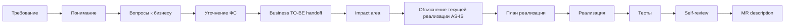

# AI-agent как усилитель delivery-процесса: от требования до MR

**Формат:** мастер-класс с live demo на opencode.
**Длительность:** 60 минут.
**Аудитория:** Java-разработчики (40%), системные аналитики (30%), tech leads и архитекторы (30%).
**Тон:** прямой, с критикой текущего хаоса в использовании Kilo Code.
**Demo-задача:** добавление поля `daysRemaining` в response endpoint'а `POST /FL/gracePeriod` сервиса `packagesearch` (Spring Boot 3, Java 17). Подробный operational сценарий — в `[[Live Demo Script]]`.

> Сопровождающие документы: `Live Demo Script.md`, `Speaker Notes.md`, `Fallback Demo Script.md`, `Pre-Show Checklist.md`, `Cannot Show.md`, `Call To Action.md`, `Templates.md`.

---

# Введение: формат, цель, что увидим

Добрый день. будет рассказано про управляемый процесс на живом коде, паттерны, план внедрения AI агенты в разработке.

---

# AI-агент по частям: subagents, MCP, AGENTS.md, skills, commands, hooks

Введу в курс про базовые термины  AI-агентов, чтоб понимать, когда я скажу «запускаю subagent» или «через MCP агент видит OpenAPI» —  понимать, о чём речь.

## Subagents

Subagent — это отдельный экземпляр агента с собственным контекстом и собственной задачей. Не новая модель, не новый инструмент — просто **изолированная сессия для конкретного задачи**.

Зачем. Когда вы делаете большую задачу, у главной сессии быстро забивается контекст: логи, неудачные попытки, исследования. Subagent позволяет вынести часть работы в отдельный «контекстный пузырь» — он сделал своё дело, вернул summary, главная сессия осталась чистой.

В opencode это поддерживается из коробки: можно вызвать subagent для исследования или review, и он работает в своём контексте. Называется этот шаблон orchestrator-workers: главный агент координирует, рабочие выполняют узкие задачи.

Ключевое: subagent — это не параллелизм ради скорости. Это **изоляция контекста ради качества**. Тот же агент, что писал код, его проверять не должен — это предвзятый ревьюер.

## MCP — Model Context Protocol

MCP — это стандарт, через который агент подключается к внешним источникам и инструментам не как «копипаст текста», а как структурированный API.

Конкретно: вместо того, чтобы вы скопировали OpenAPI-спеку в чат — агент через MCP получает к ней программный доступ. Может прочитать схему, проверить контракт, найти конкретный endpoint. То же с базой данных, файловой системой, Jira.

Зачем. Без MCP агент работает с тем, что вы ему дали в промпте. С MCP — он работает с источниками напрямую и видит их актуальное состояние. Это разница между «снимок в момент копипаста» и «живой запрос». 

После покажу как подключать mcp.
## AGENTS.md — правила проекта

AGENTS.md — это файл в корне репозитория, который агент читает в начале каждой сессии. Туда кладутся **правила, которые агент сам не выведет из кода**: build-команды, code style, security-ограничения, naming-правила, что нельзя трогать без явного разрешения.

Зачем. Без AGENTS.md вы повторяете правила в каждом промпте: «помни, у нас Spring Boot, Java 17, не используй Lombok». С AGENTS.md — пишете один раз, коммитите в git, и поведение агента становится консистентным между всеми разработчиками команды.

В opencode AGENTS.md — стандартное имя файла. В других агентных инструментах могут быть свои названия, но концепция универсальна.

## Skills — переиспользуемые специализации

Skill — это сохранённая «специализация» агента: набор инструкций, контекст, поведенческие правила под конкретный тип задач. Например: skill `pr-reviewer` — агент с чек-листом ревью, паттернами проверки безопасности и стилем feedback'а.

Зачем. Без skills вы каждый раз пишете «представь, что ты ревьюер, проверь diff по чек-листу...» — и каждый раз получается чуть по-разному. С skills — это переиспользуемая специализация, которая работает одинаково у всех в команде.

Особенность skills: они **активируются автоматически**, когда агент видит подходящий контекст. Не вы вызываете skill — агент сам выбирает, применить ли его. Это удобно, но иногда непредсказуемо — поэтому есть commands.

> [!note]
> Как реально вызвать skill в opencode — в следующем разделе, сразу после словаря. Глубокий разбор «почему auto-invoke не гарантия» — ниже, в разделе про lifecycle и orchestration.

## Commands — параметризованные промт-шаблоны

Command — сохранённый промт-шаблон с параметрами, который вызывается явно по имени: `/review`, `/impact <feature>`, `/mr-summary`. В opencode команды живут как файлы в `.opencode/commands/<name>.md`.

Зачем. Если один и тот же промт повторяется в команде десять раз — это кандидат в command. Главное отличие от skills: skill **активируется автоматически** по контексту, command — **явно по имени**. Skill — автопилот, command — ручное управление. На практике используются вместе: skills в фоне, commands — для предсказуемых типовых операций.

## Hooks — события, запускающие действия

Hook — это правило: «когда происходит X, автоматически выполни Y». Например: после каждой генерации кода — автоматически запустить `mvn compile`. Перед коммитом — прогнать линтер. После завершения задачи — обновить статус в Jira или отправить нотификацию.

Зачем. Это слой автоматизации, который превращает агента из «отвечает на промпт» в «работает в pipeline». Hooks — это то, что делает workflow воспроизводимым, а не зависимым от того, не забыл ли пользователь нажать кнопку.

В opencode hooks реализованы через permission-rules и автоматические команды. В других инструментах — иначе. Но смысл один: события и реакции на них.

> [!note]
> Это упрощение для intro. Реально hooks в opencode — это **plugin system на TypeScript** (`.opencode/plugins/*.ts`), подписывающийся на порядка 30 lifecycle events: `tool.execute.before`, `tool.execute.after`, `session.created`, `session.compacted`, `permission.asked`, `file.edited` и других. Permission-rules — отдельный механизм (через `permissions` в config). Hooks могут блокировать tool calls, переопределять permissions, инжектировать сообщения. Требуют Bun/Node runtime — не bash-скрипт в YAML. Конкретный пример hook'а — ниже, в разделе про compensations (R8/C2).

---

**Subagents** — изоляция контекста. **MCP** — структурированный доступ к источникам. **AGENTS.md** — конвенции проекта. **Skills** — автоактивирующиеся специализации. **Commands** — параметризованные шаблоны промптов. **Hooks** — события и реакции.

---

# Как вызвать skill в opencode

Раз словарь введён — сразу к практике. Вопрос «как мне в opencode заставить агента применить мой skill?» — главный, который задают в первую неделю работы. Ответ в одном предложении: **есть три способа, и они не равнозначны по надёжности**.

## Три способа

**1. Plain prompt — надежда на auto-invoke.**

Вы пишете запрос как обычно, ни о каком skill не упоминаете:

```
> Можешь отревьюить мой PR в feature/auth-refactor?
```

Если skill `pr-reviewer` зарегистрирован и его description совпал с фразой — opencode сам подсунет его модели, и она применит. Если нет — модель пойдёт писать review «на глаз». **Надёжность: 50–70%**, сильно зависит от длины сессии, формулировки и того, сколько других skills конкурируют за внимание.

**2. Explicit invocation — назвать skill по имени.**

Вы явно говорите модели, какой skill применить:

```
> Use the pr-reviewer skill to review my PR in feature/auth-refactor
```

Или короче — «вызови skill 'pr-reviewer'…». Имя skill попадает в текст запроса, модель ловит лексическое совпадение с листингом и почти всегда вызывает. **Надёжность: ~90%**. Цена — вы должны помнить имена своих skills.

**3. Slash-command — детерминированный запуск.**

Вы создаёте файл `.opencode/commands/review.md`, который инжектит инструкции прямо в user turn:

```markdown
# .opencode/commands/review.md
Follow the steps from `pr-reviewer` SKILL.md for $ARGUMENTS.

1. Read .opencode/skills/pr-reviewer/SKILL.md
2. Execute every step in order.
3. Output the structured review.
```

Дальше пользователь печатает `/review feature/auth-refactor` — это уже не вероятность, это команда. **Надёжность: 100%**. Это правильный путь для регулярных операций — `/review`, `/impact`, `/mr-summary`, `/standup`.

## Когда какой использовать

- **Plain prompt** — для разовых задач, где «не вспомнит — и ладно». Эксплоративная работа.
- **Explicit invocation** — когда нужно сейчас, в этой сессии, без файлов. Самый быстрый способ повысить шанс с 60% до 90%.
- **Slash-command** — для всего, что вы делаете больше одного раза в неделю. Цена создания — 5 минут на файл, выигрыш — детерминизм.

Главная инверсия по сравнению с «agent сам всё знает»: **explicit invocation и slash-commands — это не workaround, это основной интерфейс**. Auto-invoke — приятный бонус, когда срабатывает.

## Куда положить skill

- `~/.config/opencode/skills/<name>/SKILL.md` — глобально, доступен во всех ваших проектах.
- `./.opencode/skills/<name>/SKILL.md` — в репозитории проекта, версионируется в git, доступен всей команде. Проектный приоритетнее глобального.

## Подсказать опытом — через AGENTS.md

Дополнительный рычаг: правило в `AGENTS.md`, которое модель читает в начале каждой сессии. Несколько строк существенно повышают invocation rate без переписывания запросов:

```markdown
## Workflow

- Когда пользователь просит code review или говорит про PR/diff/merge —
  ВСЕГДА сначала вызывай skill `pr-reviewer` и следуй его чек-листу.
- Перед изменением Java-кода — вызывай skill `impact-analyzer` для поиска
  call sites через MCP.
- Перед коммитом — skill `mr-summary` для генерации описания.
```

Это soft guarantee — модель чаще вспоминает про skill, но run-to-run всё равно может промахнуться. Hard guarantee остаётся за slash-command и hook'ами.

> [!important]
> Запомнить: skill — soft, command — hard. Если результат критичен — заверните в command. Если «обычно полезно» — оставьте skill'ом и дополните правилом в AGENTS.md.

---

# OpenCode skills под капот: lifecycle, runtime, orchestration

До этого был словарь. Дальше — как это реально работает. 

> [!note]
> Под «opencode» — SST opencode (https://opencode.ai). Где относится к Claude Code от Anthropic — отмечается явно. Концептуально системы совместимы, фреймворковые детали различаются (frontmatter, discovery, compaction). Различия — по ходу разделов.

## 1. Skill на диске: что это реально

Skill — это **директория с одним обязательным markdown-файлом и опциональным payload'ом**.

```
.opencode/skills/pr-reviewer/
├── SKILL.md          ← обязательный, с YAML frontmatter
├── checklist.md      ← payload, грузится только по требованию
├── examples/
│   └── good-review.md
└── scripts/
    └── extract-diff.sh
```

`SKILL.md` обязан содержать frontmatter с двумя полями:

```yaml
---
name: pr-reviewer
description: Reviews a pull request diff for security issues, style
  violations, and contract-breaking changes against project conventions
  from AGENTS.md. Use when the user asks to review a PR, audit a diff,
  or check changes before merging.
---

# PR Reviewer

When invoked, perform these steps in order:
1. Read AGENTS.md for project conventions.
2. Run `git diff origin/main...HEAD` to get the diff.
3. For each modified file, look for:
   - Hardcoded secrets (passwords, tokens, API keys)
   - Missing null checks on public method parameters
   - Changes to public API signatures
4. Cross-reference with `examples/good-review.md` for tone.
5. Output a structured review with sections: Security, Style, Contract, Suggestions.

If a finding is high-severity, mark it [BLOCKER]. Otherwise [NIT] or [SUGGEST].
```

Три факта, которые легко упустить:

- **Skill — это директория, не файл.** Один `SKILL.md` — обязательный entrypoint, остальное — payload, читается моделью через `read` tool на дальнейших шагах.
- **`name` и `description` — обязательные.** Остальные поля (`when_to_use`, `paths`, `model`, `effort`, `context: fork`) — расширения Claude Code; в opencode игнорируются.
- **Тело `SKILL.md` — это инструкция для модели, а не код.** Skill, требующий прогнать `pytest`, не запускает `pytest` сам. Он инструктирует модель — «вызови `bash` с `pytest`». **Skill — это инжектируемый промпт, не runtime-сущность**.

> [!important]
> Skill ближе к **сохранённой главе README**, которую агент решит дочитать. Никакой execution, никакой callback — только текст, попадающий в context модели в нужный момент.

## 2. Discovery и registration: что происходит на старте сессии

opencode сканирует фиксированный набор путей:

```
1. Глобальные:     ~/.config/opencode/skills/
2. Проектные:      ./.opencode/skills/    (от CWD до git root)
3. Совместимость:  ./.claude/skills/      (для skills из Claude Code)
```

Ключевые свойства init phase:

- **Тело `SKILL.md` НЕ читается на init.** Парсится только frontmatter (первые ~4KB). Skill из 8000 токенов не тратит токенов, пока его не вызвали.
- **Дубликаты по `name` разрешаются по приоритету путей** (project > global). Локальный skill переопределяет глобальный — полезно, но порождает тёмные edge cases.
- **Никакого индекса, никаких embeddings.** Реестр — обычный in-memory map `name → path`. Поиск — линейный.

После init модель **ещё не знает** ни о каких skills. Знание появится, когда opencode соберёт **каталог tools** для следующего запуска

## 3. Что видит модель — progressive disclosure

opencode регистрирует **один встроенный tool** — `skill`. В его `description` встраивается XML-листинг доступных skills.

Что модель видит в каталоге tools (упрощённая визуализация):

```
[Tool: skill]
Description:
  Loads the full content of a registered skill into the conversation.
  Available skills:
  <available_skills>
    <skill name="pr-reviewer"      description="Reviews a pull request diff..."/>
    <skill name="impact-analyzer"  description="Finds all call sites of a Java..."/>
    <skill name="mr-summary"       description="Drafts MR description for a..."/>
    <skill name="db-migration"     description="Validates a SQL migration..."/>
    ...
  </available_skills>

  When the user request matches one of these descriptions, call skill(name=...)
  BEFORE proceeding with other tools.
Parameters:
  name: string  — name of the skill to load
```

**Это всё.** Модель не знает, где skill лежит, не знает body, не знает paths. Она видит листинг — несколько строк на каждый skill — и больше ничего.

### 3.1. Token economics

Реальные порядки величин:

- **На один skill в листинге** — от 30 до 200 токенов (зависит от длины `description`).
- **Полный SKILL.md** на типовой skill — 1000–5000 токенов.

Что это значит на практике:

```
Сессия с 50 зарегистрированными skills:
  Listing в каталоге tools: ~5000 токенов (если descriptions ёмкие)
  → превышение бюджета на ~150%
  → opencode обрезают descriptions
  → модель видит только имена без описаний для последних 30 skills
  → эти skills эффективно невидимы для inference
```

Это **первая структурная причина**, почему 30+ skills в команде — antipattern, а не «richer agent».

### 3.2. Что точно НЕ попадает в context до invocation

| Что                                          | Где живёт до invocation               |
| -------------------------------------------- | ------------------------------------- |
| Body `SKILL.md`                              | Только на диске                       |
| Файлы payload (`checklist.md`, `examples/*`) | Только на диске                       |
| Path skill'а                                 | В реестре opencode, не в conversation |
| Frontmatter поля кроме `name + description`  | Игнорируются на этой стадии           |

Модель **не имеет способа узнать**, что у `pr-reviewer` есть `checklist.md`, пока не вызовет `skill("pr-reviewer")`. Тогда тело SKILL.md скажет «прочитай `checklist.md`», и модель позовёт `read("checklist.md")`.

## 4. Reasoning loop и invocation decision

Здесь рушится главный миф — «модель сама выбирает skill по контексту».

### 4.1. Что происходит на одном reasoning-шаге

Модель получает на входе три блока: system prompt (provider header + AGENTS.md + agent prompt), полную conversation history, и каталог tools — куда `skill` входит как один из вариантов с XML-листингом доступных skills.

На выходе — следующий ход. Это либо текст пользователю, либо один из tool_call'ов: `bash`, `read`/`edit`, любой MCP tool, `task` (субагент) или `skill(name="…")`. Skill выбирается тогда — и только тогда — когда модель вспомнила про инструмент `skill`, description одного из skills семантически совпал с задачей, и это совпадение перевесило других tool-кандидатов.

Никакого предварительного routing, никакого capability lookup, никакого embedding search. **Решение — это inference**: модель внутри одного forward pass формирует tool_call как часть chain-of-thought.

### 4.2. Reasoning loop простыми словами

Один turn — это цикл: opencode собирает system prompt + tool catalog (включая `skill`), отдаёт модели вместе с историей разговора, получает либо текстовый ответ, либо tool_call. Если tool_call — выполняет (с возможностью hook вклиниться до и после), кладёт результат обратно в conversation, и снова спрашивает модель. Никакой plan-phase, никакого внешнего router.

**`skill(...)` — это один из вариантов tool_call.** Архитектурно неотличим от `bash` или `edit`. Модель не различает skill и любой другой tool.

### 4.3. Один и тот же запрос — два исхода

**Сценарий А (успех).** Пользователь спрашивает «можешь отревьюить мой PR в feature/auth-refactor?» в начале сессии. Модель видит в каталоге tools skill `pr-reviewer` с описанием «Reviews a pull request diff…», ловит совпадение, вызывает skill, получает в conversation тело SKILL.md, дальше идёт по его чек-листу.

**Сценарий Б (провал).** Тот же пользователь, тот же запрос — но после тридцати turn'ов обсуждения той же auth-логики. Модель уже глубоко в коде, помнит детали, в reasoning решает «просто прочитаю diff и прокомментирую» — и вызывает `bash` напрямую. Skill `pr-reviewer` так и не активировался; review написан «from scratch», без checklist.

**User turn идентичен. Разница — content окна на момент reasoning.** В первом случае skill listing был свежим контентом и связался с запросом. Во втором — внимание ушло на conversation history, skill listing получил меньше attention budget.

> [!important]
> «Skill auto-invoke» — это не **гарантия**, это **корреляция**. Корреляция между качеством description, recency запроса, объёмом context, выбором модели и run-to-run sampling variance.

## 5. Invocation flow: что происходит после `skill("X")`

Когда модель отдаёт tool_call `skill(name="X")`, runtime делает пять вещей подряд:

1. Запускает hook `tool.execute.before` — deterministic код может вмешаться или заблокировать вызов.
2. По имени находит skill в registry, читает весь `SKILL.md` body с диска (обычно 3000–8000 токенов).
3. Запускает hook `tool.execute.after`.
4. Возвращает тело SKILL.md как `tool_result` message в conversation history.
5. Модель видит эту message на следующем reasoning-шаге и продолжает уже с инструкциями skill'а в контексте.

### 5.1. Состояние после invocation

С момента шага 7 и до конца сессии (либо до auto-compaction):

- **Контент skill'а живёт в conversation history.** Каждый следующий запрос модели включает его в input.
- **Цена**: пусть SKILL.md = 4000 токенов. 20 turns после invocation → 4000 × 20 = 80,000 «лишних» input-токенов в bill (минус prompt caching).
- **Контроля над выгрузкой нет.** Модель не может «забыть» skill body. Это обычная message в истории.

### 5.2. Auto-compaction edge case

Когда conversation подходит к пределу context window, opencode/Claude Code применяют auto-compaction — heuristic, которая сворачивает старые messages в summary.

В Claude Code задокументированы правила (порядок величины):

- Каждый недавно вызванный skill сохраняет первые ~5000 токенов своего body.
- Общий бюджет на re-attached skills — ~25000 токенов.
- Если SKILL.md длиннее 5000 — обрезка. Если skills вызывалось более 5 — выбор.

Рождает диагностический edge: «в середине сессии skill инструкции потеряны после compaction». Модель помнит, что skill вызывала, но конкретные шаги уже не в окне. На практике диагностируется как «агент стал делать review хуже после 50 turns».

### 5.3. Что если SKILL.md ссылается на файлы

Skill обычно инструктирует: «прочитай `checklist.md` в моей директории». Что происходит:

```
1. Модель видит инструкцию в загруженном SKILL.md.
2. Модель вызывает read("path/to/checklist.md").
3. Содержимое файла попадает в conversation как tool_result.
4. Дальше — общее состояние conversation.
```

Payload-файлы skill'а **тоже** оказываются в context window — но только если модель решит их прочитать. Никакой автоматической предзагрузки.

## 6. Chaining, parallelism, limits

### 6.1. Skill не вызывает skill

Native skill-chaining не существует. Если в `SKILL.md` написано «теперь вызови skill X», это **подсказка модели**, не jump. Модель прочитает эту строку в conversation, дальше — её решение: вызвать `skill("X")` следующим tool_call или проигнорировать, если посчитает работу уже сделанной. Никакого автоматического перехода runtime не делает.

### 6.2. Параллельный запуск

Sequential only. opencode/Claude Code не параллелят skills внутри одного turn'а. Если модель сделала batch `tool_calls` — они выполняются последовательно, и каждый возвращает результат до следующего reasoning step.

### 6.3. `context: fork` (только Claude Code)

В Claude Code в frontmatter SKILL.md можно указать:

```yaml
---
name: long-running-investigation
description: ...
context: fork
---
```

Это запускает skill как **subagent** в собственном context window. Body skill'а становится частью system prompt этого subagent. Полезно, когда skill сам по себе тратит длинный контекст, не загрязняя основной.

В opencode такой опции нет. Если нужна изоляция — `task` tool с явным subagent.

## 7. Что унести из этой части

Три «не-факта», которые надо унести:

1. **Никакого orchestration-сервиса между моделью и tool layer.** Модель — единственный решатель в loop'е. Runtime лишь подаёт ей prompt + tools и забирает tool_call.
2. **Skill — это просто tool с особым contract'ом** (грузит markdown в conversation). Архитектурно неотличим от `bash` или `read`.
3. **Hooks работают между tool dispatch и model continuation.** Это единственное место, где **deterministic code** может вклиниться в loop — заблокировать вызов, переписать аргументы, инжектировать сообщение.

---

# Почему auto skill invocation — сложная проблема

Системный разбор. Перечисляются root causes — не workaround'ы, а архитектурные ограничения, которые «лучше промптом» не победить.

## P1. Модель не «знает» skills магически

У пользователя обычно есть mental model: «opencode зарегистрировал skill — теперь агент про него знает». Это иллюзия.

Что реально есть:

- На диске лежит файл.
- В каталоге tools модели есть **строка XML** с именем и описанием.
- Эта строка занимает место в input prompt **каждого** запроса.

«Знание» модели = эта строка в её input. Если строка вытеснена (обрезана, compacted, заменена), знание исчезло. Никакого «registry, к которому модель может обратиться» — нет.

Следствие: **skill — это не state, это recurring prompt cost.** Каждый turn вы платите токены за листинг. Каждый turn модель заново решает, нужен ли skill.

## P2. Context window economics

Бюджет на skills и tools — конечен.

```
Типовой провайдер, 200,000 input tokens context window:
  ├─ System prompt:           ~5,000 (AGENTS.md + agent prompt + provider header)
  ├─ Tool catalog:            ~5,000
  │   ├─ Built-in tools:      ~1,500
  │   ├─ Skill listing:       ~2,000   (≈ бюджет 1%, ~30 skills cap)
  │   └─ MCP tools:           ~1,500   (зависит от подключённых серверов)
  ├─ Conversation history:    ~150,000 (растёт с каждым turn'ом)
  ├─ Latest user turn:        ~500
  └─ Reserved for response:   ~40,000
```

Что происходит, когда:

- **Skill listing превышает 2000 токенов**: descriptions обрезаются, модель видит имена без объяснения. Effective invisibility последних skills.
- **MCP подключает 40 tools**: каталог раздувается, skills делят с MCP общий attention budget. Skills проигрывают «свежим» MCP tools.
- **Conversation длиннее 100 turns**: skill listing — «древний» фрагмент prompt'а, attention уходит на recent.

## P3. Discoverability problem

В operating system, библиотеке, базе данных — discoverability решается **индексом**. Запрос → инвертированный индекс → быстрый lookup.

В opencode skills нет индекса. Что есть:

- Линейный листинг в одном tool description.
- LLM, который при reasoning «сам» решает, что подходит.

Это эквивалентно поиску по 30-страничному документу через «вспомнил ли я, что там было». Работает на 5–10 skills. Деградирует на 20+. Бесполезно на 100+.

## P4. Routing ambiguity

Если у вас два skills с описаниями:

```
<skill name="pr-reviewer"   description="Reviews pull requests for issues"/>
<skill name="code-reviewer" description="Reviews code changes for quality"/>
```

…какой выберет модель на запрос «review my changes»?

**Неопределённо.** Выбор зависит от:

- Точного wording'а user turn.
- Порядка skills в листинге (первый имеет преимущество — recency bias).
- Recent conversation context.
- Sampling temperature.

Run-to-run одна и та же сессия может выбирать разный skill. Это **не баг**, это контракт probabilistic decision-making.

Workaround: писать descriptions радикально неперекрывающимися. Требует курирования и аудита. Большинство команд этого не делает.

## P5. Semantic matching: что это на самом деле

«Семантический матч» в контексте skill-выбора — это **не cosine similarity на embeddings**. Это inference внутри одного forward pass модели: «description X говорит про Y, пользователь спросил про Y → call X».

Это subject к:

- **Lexical bias**: совпадение конкретных слов в description и user turn повышает вероятность.
- **Recency bias**: то, что упомянуто свежее в conversation, перевешивает.
- **Distraction**: длинный conversation тянет attention с tool catalog.
- **Phrasing sensitivity**: «отревьюй PR» vs «check this diff» — разный вес, при одинаковом описании.

**Семантика тут pseudo.** Полагаемся на LLM intuition, не на поиск.

## P6. Orchestration instability

Одинаковый промпт + одинаковый context может вернуть разные tool_call в разных запусках. Источники variance:

- **Sampling temperature** (> 0 — стохастика).
- **Model rolling updates** (provider обновил модель — поведение изменилось).
- **Latent state** в conversation (один лишний `\n`, один порядок MCP tools).

Skills, чья invocation полагается на «обычно срабатывает», нестабильны под нагрузкой. То, что работает в demo, проигрывает в production.

## P7. Prompt collisions

System prompt — иерархический payload:

```
[Provider header — fixed]
[Provider-specific prompt — fixed per-provider]
[Environment — date, cwd, OS]
[AGENTS.md / Custom Instructions — yours]
[Agent-specific prompt — opencode]
[User override — optional]
```

Если в AGENTS.md написано «всегда сначала проверь tests» — это **конфликтует** с инструкциями в SKILL.md «начни с git diff». Какая выиграет? Та, что свежее в input или сильнее по wording'у. **Никакого приоритета на уровне runtime не задано.**

То же между двумя skills, между skill и MCP tool.

Большое AGENTS.md (> 5000 токенов) сжимает effective attention, оставшееся на skill descriptions. Прирост AGENTS.md → деградация skill invocation.

## P8. Planner limitations

В opencode/Claude Code **нет explicit planner**. Reasoning loop простой: пока модель хочет tool — сгенерировать tool_call, выполнить, положить результат обратно в conversation, спросить модель снова. Это **single-pass reasoning per turn**, без декомпозиции, без plan-then-execute разделения.

Сравните с ReAct (Yao 2022): один цикл, но в **prompt** инструкция «Think: … Act: …». Модель сама создаёт plan/act разделение через шаблон. opencode идёт ещё проще: никакого шаблона, просто tool catalog + reasoning.

LangGraph: **explicit state graph**. Вы пишете nodes и edges; planner ходит по graph'у. Структура НАД LLM, не внутри prompt'а.

**Следствие**: если модель «забыла» подумать про skills в начале reasoning — она их не вспомнит. Нет «вернись и переплоди план».

## P9. Retrieval limitations

В RAG-системах есть retrieval pipeline:

```
query → embed → vector DB → top-K chunks → context
```

В opencode skills этого pipeline нет. Что есть:

- Filesystem scan на init.
- Static листинг в tool description.

«Retrieval» = модель смотрит на листинг и думает. Это не retrieval в смысле информационного поиска. Это **prompt-based skill selection**, в той же лиге, что «выбери tool из tool catalog».

---

# Почему skills не вызываются автоматически

Это центральная failure mode opencode workflow. Каждое утверждение здесь — root cause, не симптом. Эта секция — самая важная техническая часть доклада. Если унесёте отсюда только две вещи — пусть это будут (1) skills — это **pull, не push**, и (2) компенсации — это **discipline, не fix**.

## R1. Architectural root cause: skills — это tool descriptions, не события

Модель не получает callback «у тебя есть skill X». Skill живёт в input prompt как фрагмент tool description. Каждый turn модель **с нуля** читает этот фрагмент и решает, использовать или нет.

Сравнение с другими системами:

| Активатор | Механизм |
|---|---|
| OS daemon | Сигнал ядра по событию |
| Spring bean | DI-контейнер по запросу |
| MQ consumer | Брокер пушит message |
| HTTP route | Router по URL |
| **Skill** | **Модель сама вспомнила, что в одном из tool descriptions есть подходящее имя** |

Skill в этом смысле — **pull**, не push. Никакого механизма «toolkit замечает, что в запросе есть слово 'review' → запускает pr-reviewer» — не существует.

## R2. Context economics: attention is finite

Внимание модели на input prompt — **ограниченный ресурс**. Размер conversation history растёт линейно. Размер skill listing — фиксирован.

```
turn 1:   skill listing — ~5% от input
turn 30:  skill listing — ~1% от input
turn 100: skill listing — ~0.3% от input
```

Attention распределяется неравномерно. Recency, similarity, syntactic salience — всё это перетягивает attention на свежие части prompt'а. Skill listing — древний.

**Математика**: relative attention weight на skill listing убывает как ~1/(history_size). После 50 turns эта величина на порядок ниже, чем на первом turn. **Вероятность invocation падает с длиной сессии систематически**.

## R3. Planner constraint: no second chance

Если модель в reasoning не подумала про skills, **нет механизма заставить её подумать снова в этом же turn'е**.

В системах с explicit planner (LangGraph, ReAct, AutoGen) есть «plan» phase, потом «act», потом возможный «replan». Можно повесить node «check skills before act».

В opencode reasoning monolithic. Один forward pass. Если skills не всплыли — turn закончится без них.

## R4. Orchestration constraint: нет «pre-tool router»

Нет hook'а вида «user_turn → route to proper skill → reasoning». Есть только «user_turn → reasoning (with skill listing somewhere in input) → tool_call (or text)». Skill становится одним из вариантов tool_call, не предшественником reasoning.

Можно сделать compensation: pre-tool-call hook, который **детектирует**, что reasoning пошёл не туда, и инжектирует системное сообщение «у тебя есть skill X — ты уверен?». Это и есть «nudge pattern» из community workarounds (например, GitHub issue obra/superpowers#439). Это **compensation, не fix архитектуры**.

## R5. Discoverability failure: нет capability index

В Maven Central: index, search, ranking. В PyPI: index, search, semver. В Google: index, ranking, query language.

В opencode skills: **flat list в tool description, никакого ranking**. Модель не «ищет» — она просто **видит** листинг в input. Если она «забыла» проверить — выбора не было.

## R6. Discoverability failure: нет contextual skill filtering

Claude Code добавил `paths` filter:

```yaml
paths:
  - "*.py"
  - "src/api/**"
```

Это значит «отображай skill в listing'е только если модель работает с этими файлами». Уменьшает листинг для текущего контекста — больше attention на релевантные skills. Помогает.

В opencode этого нет. Все skills всегда в листинге. Бюджет 1% делится между всеми.

## R7. Почему explicit invocation работает

Практику «use the X skill» уже разобрали в разделе [[#Как вызвать skill в opencode]]. Здесь — почему это работает на уровне механики: имя skill попадает в user turn → **лексическое совпадение** с именем в листинге tools → модель «вспоминает» о листинге → invocation.

Это **decompiles auto-invoke до манульного вызова**. Если каждый раз пишете «use the X skill», вы используете не skill, а **command в облике skill'а**. И это нормально — главное, понимать, что происходит, и не путать с «модель сама всё знает».

## R8. Compensations: что реально работает

Практические способы вызова — explicit invocation и slash-command — вынесены в раздел [[#Как вызвать skill в opencode]] в начало доклада, потому что это **основной** интерфейс работы, не workaround. Здесь — то, что помогает поверх: технические compensations для команд, которые хотят сделать invocation rate выше «обычно срабатывает».

### C2. Pre-tool-call hook nudge

Hook, подписанный на `tool.execute.before`, может детектировать, что модель идёт не туда, и подсказать ей:

```typescript
// .opencode/plugins/skill-nudge.ts — концепт, не полный код
export default {
  "tool.execute.before": (ctx) => {
    if (ctx.tool === "bash" && /review|pr|diff/i.test(ctx.session.lastUserTurn())) {
      if (!ctx.session.hasInvoked("pr-reviewer"))
        ctx.injectSystemMessage("Reminder: вызови skill 'pr-reviewer' сначала.");
    }
  }
};
```

Хак, но эффективный. Превращает probabilistic invocation в более deterministic для конкретного workflow. Цена — плагин на TypeScript и Bun/Node runtime.

### C4. Жёсткий аудит skill descriptions

Каждые 2 недели — review всех descriptions. Цель: каждое description **lexically unique** и **starts with action verb relevant to user phrasing**. «Reviews a pull request diff» работает лучше, чем «Checks code for problems». Совпадает с реальной речью user turns.

### C5. Skill count budget

Hard limit: **≤ 15 skills per project**. Дальше — деградация invocation rate. Лучше курировать тщательно, чем накапливать. Periodic prune.

## R9. Workflow для команды

Если строите команду на opencode:

1. **Skills ≤ 15.** Аудит descriptions ежеквартально.
2. **Hooks** для критичных invariants (run tests after edit, validate SQL after migration touch). Hooks — это hard guarantees.
3. **Commands** для гарантированных операций (`/review`, `/impact`, `/mr-summary`). Commands — это user-triggered hard.
4. **Skills** для опциональных «может пригодиться» паттернов. Skills — soft.
5. **Pre-tool-call hooks** как nudge layer над skills, если invocation rate низкий.

**Разделение по contract'у**: hooks и commands — hard. Skills — soft. Не путайте, иначе production workflow будет «иногда срабатывает».

---

# Capability discovery: чего у opencode нет

В Maven Central есть индекс, search, ranking. В PyPI — то же. В Google — индекс, ranking, query language. Стандартный паттерн: пользователь делает запрос → поиск по индексу → top-K результатов → выбор.

В opencode skills **этого паттерна нет**. Есть плоский список skill'ов в tool description модели, и есть LLM, который при reasoning «вспоминает», подходит ли что-то из списка. Никакого индекса, никакого ranking, никаких typed inputs/outputs, никакого automatic chaining между skills.

Что это значит на практике: skill ≤ 15 в проекте работает, 30+ — деградирует, 100+ — бесполезно. И никакого способа сказать «в этом контексте предпочитай skill X» — кроме как переписать AGENTS.md или description.

Где opencode минималистичнее всего — frontmatter:

| Поле frontmatter | opencode | Claude Code |
|---|---|---|
| `name` | required | required |
| `description` | required | required |
| `when_to_use` | — | optional |
| `paths` | — | optional |
| `hooks` | — | optional |
| `model` | — | optional |
| `effort` | — | optional |
| `context: fork` | — | optional |
| `disable-model-invocation` | — | optional |
| `user-invocable` | — | optional |
| `allowed-tools` | — | optional |

Чем больше metadata, тем больше rules можно навесить. Claude Code richer; opencode — два поля и всё.

**Tradeoff осознанный.** Альтернатива — LangGraph / Semantic Kernel, где capability graph есть, selection через graph traversal, composability через типы. Цена — больше кода, выше lock-in, круче лестница обучения. opencode сознательно остаётся на стороне «меньше structure, проще миграция, ниже reliability».

---

# Почему большинство agent systems хрупкие

Сравнительный engineering анализ — без маркетинга. Все системы строятся над одним LLM-bottleneck, отличаются orchestration слоем сверху.

> [!note]
> Источники: public docs, reverse-engineering сессий (mikhail.io, paddo.dev), GitHub issues. Где утверждение из reverse-engineering — помечается. Где из docs — «documented».

Сводная таблица — как разные системы делают planner:

| Система | Planner |
|---|---|
| ReAct (Yao 2022) | Один loop, prompt template «Think: … Act: …» задаёт structure |
| MRKL | Routing к specialized modules через keyword matching |
| LangGraph | Explicit state graph, nodes & edges, deterministic transitions |
| AutoGen | Multi-agent conversations, manager-worker pattern |
| **opencode / Claude Code** | **Plain while-loop**, model picks tool, no template |

opencode — самый простой подход. Tradeoff: меньше structure → меньше reliability, но и меньше lock-in.

## Cursor (Composer / Agent mode)

**Documented**:
- Composer (agent mode) — chat session с reasoning loop, доступ к codebase tools.
- Project rules: `.cursorrules` (legacy) или `.cursor/rules/*.mdc` (new) — аналог AGENTS.md.
- Tool catalog: file ops, terminal, web search, custom MCP (recent).

**По observable behavior**:
- «Multi-step agent» = **sequential reasoning iterations** в одном loop, не explicit planner.
- Routing к tools — LLM-based, как в opencode.
- Project rules инжектятся в system prompt (аналог AGENTS.md).

**Где маркетинг превосходит engineering**:
- «Autonomous coding agent» в брендинге — на деле тот же reasoning loop с tool calls. Нет hidden planner, нет autonomous executor pattern.
- «Multi-file edits» — это **batched tool_calls** в одном turn'е. Архитектурно множественные edit-calls.
- Routing к agent mode vs chat mode — это **separate system prompts**, не разные движки.

**Где сильно**:
- Tight IDE integration (file context auto-loading).
- Good prompt caching (low latency).
- Project rules format — practical.

**Где слабо**:
- Skills/rules discoverability — те же проблемы.
- Reasoning loop без explicit planner — те же лимиты.

## Claude Code

**Documented**:
- Skills с rich frontmatter (`name`, `description`, `when_to_use`, `paths`, `hooks`, `model`, `effort`, `context: fork`).
- Sub-agents через `Task` tool и `context: fork` в skills.
- Hooks — shell commands (`tool.execute.before` через bash), не TS как opencode.
- Project memory: `CLAUDE.md` + `.claude/commands/*` + `.claude/skills/*`.
- Auto-compaction с правилами: ~5k tokens per recent skill, ~25k shared budget.

**Где сильно**:
- Cleanest skills implementation в industry на сегодня. Frontmatter rich, progressive disclosure formal, paths filter работает.
- Hooks через bash — низкий entry barrier. Не нужен Node runtime.
- Sub-agent isolation via `Task` — proper context fork.

**Где слабо**:
- Skills auto-invocation — тот же probabilistic mechanism. Те же failure modes (R1–R6).
- Hooks через bash — power limited (нельзя блокировать tool call, только реагировать после).
- Multi-skill chaining — ничего автоматического.

**Где fake**:
- «Autonomous agent» — снова reasoning loop, never autonomous planning.
- «Compaction preserves context» — preserves часть. Quality lost.

## OpenCode (SST)

**Documented**:
- Skills, Commands, Subagents, MCP, Hooks — все шесть primitives.
- Plugin-based hooks в TypeScript (Bun runtime), порядка 30 lifecycle events.
- AGENTS.md (project + global), приоритет над CLAUDE.md на одном уровне директории.
- Plan / Build agents с разными permission profiles.

**Где сильно**:
- Open source, extensible. Plugins можно делать произвольные.
- Plugin system на TS — powerful. Hooks могут блокировать tool calls, инжектировать messages, прерывать compaction.
- Honest documentation about LLM-based selection. Никаких претензий на «autonomous planner».

**Где слабо**:
- Skills frontmatter минимален (только `name + description`). Нет `paths`, нет `when_to_use`. Меньше leverage на discoverability.
- Нет capability graph, нет ranking. Та же ситуация что в Claude Code.
- Plugin development — нужен Bun/Node. Не для analyst-роли.

**Где fake**:
- Нигде особенно. opencode честно описывает что LLM решает, что hooks compensate, что workflow определяется вами.

## Agent frameworks (LangChain / LangGraph / AutoGen / CrewAI)

**Documented**:
- LangChain: chains, agents, tools, memory.
- LangGraph: explicit state graph, nodes/edges, deterministic transitions.
- AutoGen (Microsoft): multi-agent conversations с ролями.
- CrewAI: agents с rоlями + tasks + workflow.

**Где сильно**:
- Explicit structure. Вы пишете graph, видите flow.
- Multi-agent decomposition: один агент planner, другой executor, третий critic.
- Long-term memory (vector store integration).
- Production observability (LangSmith и пр.).

**Где слабо**:
- LLM bottleneck везде одинаковый. Structure не fix'ит probabilistic decision-making.
- Higher complexity. Лестница обучения круче.
- Lock-in. Migration painful.

**Где fake**:
- «Agentic AI» в маркетинге — same LLM, same problems. Frameworks добавляют **rails**, не **intelligence**.
- «Autonomous agents» — bounded by LLM constraint, как и всё остальное.

## Общий вывод

Все agent systems делят один engine — LLM. Различия — в **слоях**, которые вы кладёте поверх:

```
Layer 1: LLM provider (Anthropic, OpenAI, Google)
         │ Probabilistic decision-making. Fixed contract.
         │
Layer 2: Orchestration tooling (Cursor / Claude Code / opencode)
         │ ReAct-like prompt templates, function calling, tool catalog.
         │
Layer 3: Frameworks (LangGraph / AutoGen / CrewAI / Semantic Kernel)
         │ Explicit graphs, multi-agent, state machines.
         │
Layer 4: Domain (your project)
         │ Ваш workflow, ваши skills, ваши AGENTS.md, ваши hooks.
```

Чем выше слой, тем больше structure → больше determinism, но и больше complexity и lock-in.

**Engineering choice — на каком уровне работать**:

- **Layer 2 (Cursor/Claude Code/opencode)**: малый код, простая интеграция, polished UX. Но: probabilistic reliability. Подходит для personal productivity, small teams, controlled domains.
- **Layer 3 (LangGraph/AutoGen)**: больше код, больше структура, more determinism. Подходит для production agents, enterprise workflows с SLA.

Выбор зависит от **гарантий, которые нужны**:

- «Иногда работает, иногда нет, но быстро и приятно» → Layer 2.
- «Должно работать в 99% случаев, готов вложить инженерные часы» → Layer 3.

Не существует «autonomous agent that just works». Это маркетинг. Существуют **probabilistic decision-makers**, окружённые слоями structure. Чем больше structure, тем меньше probabilistic, тем больше code.

> [!important]
> **Главный engineering take-away раздела**: skills, commands, hooks, MCP — это **levers** над LLM, не **replacements** для LLM. Они шевелят probabilities, не убирают их. Любая система, которая обещает «full autonomy» — либо ограничена очень узким domain, либо это не engineering, а маркетинг. Senior dev на этом докладе должен унести из этого раздела одну фразу: **agents are not magic — they are LLMs with rails. Your job is to design the rails.**

---


#  Workflow

Теперь — общая модель. Прежде чем дать вам двенадцать шагов, я хочу показать **базовый паттерн**, который под ними лежит.

## Базовая 7-шаговая модель

Любая нетривиальная задача с AI-агентом проходит семь шагов:

1. **Анализ** — изучить, что есть, как работает, где менять.
2. **План** — описать минимальные правки и порядок.
3. **Подтверждение** — человек читает план и валидирует.
4. **Маленькие правки** — точечные изменения с explicit scope.
5. **Diff review** — человек читает diff каждой правки.
6. **Тесты** — прежде чем что-то коммитить.
7. **Ручное принятие** — git commit от человека, не автоматически.

Шаги один–три идут в **Plan-mode** — это режим, где агент только читает и предлагает, никаких правок. Шаги четыре–семь — в **Build-mode** — где агент уже меняет файлы, запускает команды.

В opencode переключение между режимами явное.

Двенадцать шагов, которые я сейчас покажу — это операционализация этой семёрки под enterprise delivery с явным handoff от аналитика к разработчику.

## 12 шагов: от требования до MR



Шаги один–пять — **территория аналитика и Plan-mode**. У аналитика **нет доступа к программному коду** — он работает с тикетом, ответами бизнеса и handoff-артефактом. Шаги шесть–двенадцать — **территория разработчика**: шаги шесть–семь идут в Plan-mode (read-only через MCP к коду), переход в Build-mode на шаге девять. Восьмой шаг — approval gate, граница между Plan и Build внутри dev-блока.

1. **Требование** — входной артефакт. Бизнес-тикет от продукта, AC. Агент уже прочитал `AGENTS.md` проекта — конвенции, запреты, стек. Это фундамент, на котором всё держится.
2. **Понимание** *(аналитик, Plan-mode)* — что я понял из требования, какие неизвестные. Первая точка, где агент ловит то, что мы пропустили. Без code refs.
3. **Вопросы к бизнесу** *(аналитик, Plan-mode)* — что не закрыто требованием. Без этого шага мы реализуем не то. Бизнес-вопросы, не технические.
4. **Уточнение ФС** *(аналитик, Plan-mode)* — после ответов на вопросы. AC переписаны с явными edge cases в бизнес-терминах.
5. **Business TO-BE handoff** *(аналитик, Plan-mode)* — диаграмма уровня «Пользователь → Клиент → API» без внутренних компонентов сервера. Точка передачи разработчику.
6. **Impact area** *(разработчик, Plan-mode)* — какие места в коде затрагиваются. Dev получает на вход бизнес-FS, через MCP к репозиторию находит конкретные file:line. Самый дорогой шаг вручную; здесь агент даёт максимальный выигрыш.
7. **Объяснение текущей реализации — AS-IS** *(разработчик, Plan-mode)* — как это работает сейчас, sequence из живого кода. Половина багов рождается из непонимания того, что код реально делает.
8. **План реализации** *(разработчик, approval gate, Plan→Build)* — что и в каких файлах меняем. Здесь же — техническое решение, как материализовать бизнес-требование в API-контракте. Самый важный шаг, на который большинство забивают. После approval — переключаемся в Build-mode.
9. **Реализация** *(разработчик, Build-mode)* — маленький контролируемый diff. По одному пункту плана за раз.
10. **Тесты** *(разработчик, Build-mode)* — happy path + edge cases. Edge cases приходят из шага три — открытых вопросов.
11. **Self-review** *(разработчик, Build-mode)* — пройти чек-лист, найти свои же ошибки. У агента это получается лучше, чем у нас, потому что он не устаёт.
12. **MR description** *(разработчик, Build-mode)* — handoff на reviewer'а. Финальный артефакт, и его reviewer открывает первым.

И что критично: точка синхронизации между ролями — написанная документация аналитики (refined FS + business TO-BE шага 5). Без неё разработчик импровизирует, без неё аналитик не закрыт.

## Четыре правила управления агентом

Под workflow лежат четыре правила. Их нарушение делает любой workflow декоративным.

**Правило первое: Plan first.** Анализ и план до правок. Plan-mode.

**Правило второе: Маленькие diff'ы.** Лучше пять контролируемых diff'ов по тридцать строк, чем один на двести. Для лучшего контроля.

**Правило третье: Diff review каждой правки.** Без пропусков. Если не понимаешь каждую строку — не мержишь.

**Правило четвёртое: Ответственность на человеке.** AI-agent не является субъектом ответственности. За код — вы. За архитектурное решение — архитектор. За постановку — аналитик. «Агент так написал» в post-mortem не работает.

А теперь — к demo. Пройдём весь workflow от тикета до MR. И отдельно подсвечу те шаги, где работает аналитик — потому что demo показывает не только разработческую часть, а полный цикл.

---

# Demo


---

# Лучшие практики

## Интро

Главный экспертный блок. Двадцать четыре минуты — восемь паттернов, по две с половиной минуты на каждый, плюс время на ваши реакции и уточнения. Каждый паттерн — определение, что замещает, **реальный пример из этого же сервиса**, который вы только что видели в demo, цитата авторитетного источника, и как починить если уже сломано.

---

## Паттерн 1 — Context engineering, не prompt engineering

**Суть.**  
AI-агенту важен не только промпт, а весь контекст, который он видит: правила проекта, файлы, ошибки, ограничения и прошлые попытки.
**Проблема.**  
Если в сессии уже много кода, логов и обсуждений, важное требование может потеряться. Агент начинает чинить задачу локально, но ломает ограничение, которое было задано в начале.
**Прикладной пример.**  
Нужно изменить обработчик ошибок в сервисе. Главное ограничение:

> нельзя менять формат ответа API, потому что его уже используют другие системы.

Сначала агент это учитывает. Потом в сессию добавляют несколько файлов, stack trace, старые попытки исправления и новые уточнения. В итоге агент исправляет ошибку, но меняет формат ответа API.
Код стал «рабочим», но контракт сломан.
**Правильное действие.**  
Не писать ещё один длинный промпт поверх старой сессии, а пересобрать контекст:

> `/clear` → правила проекта → короткое требование → критичное ограничение → только нужные файлы.

**Главная мысль.**  
Плохой результат часто лечится не новым промптом, а чистым и правильно собранным контекстом.

---

## Паттерн 2 — Plan-Gate-Execute

****Суть.**  
Агент не должен сразу писать код. Сначала он должен предложить план, а человек — проверить scope и риски.

Формула простая:

> сначала план → потом approval → только потом реализация.

**Проблема.**  
Если сразу написать агенту «сделай», он может решить задачу слишком широко: добавить лишний рефакторинг, изменить общие классы, затронуть другие модули и создать ненужный риск.

**Правильный паттерн.**  
Для любой нетривиальной задачи:

> Plan first. Code only after approval.

**Главная мысль.**  
Не давай агенту сразу строить решение.  
Сначала заставь его показать план — именно там чаще всего видны лишний scope, риски и ненужный рефакторинг.

---

## Паттерн 3 — Verification Oracle
Суть паттерна в том, что агент должен не просто писать код, а сразу проверять свою работу через объективный источник истины: тесты, сборку, линтер или интеграционные проверки.

Проблема возникает тогда, когда агент пишет «правдоподобный» код. В чате он выглядит нормально, логика кажется убедительной, но на практике код может не компилироваться, ломать тесты или нарушать контракт. Если проверку каждый раз делает человек, он превращается в передатчика ошибок: запустил тесты, скопировал stack trace, отправил агенту, снова запустил.

Правильный паттерн — сразу дать агенту критерий готовности. Например: «реализуй endpoint, после каждого изменения запускай `mvn test`, анализируй ошибки сам и продолжай, пока сборка не станет зелёной».

Так агент работает не по ощущению «задача сделана», а по проверяемому результату. Он пишет код, запускает проверки, читает ошибки, исправляет и повторяет цикл.

Главная мысль: без verification loop это просто чат с генерацией кода. С verification loop агент становится исполнителем, который сам доводит задачу до состояния «проверено и работает».

---

## Паттерн 4 — Subagent Decomposition

Суть паттерна в том, что сложную задачу не нужно вести в одной большой сессии. Лучше разделить работу между несколькими изолированными агентами: один исследует проблему, другой реализует решение, третий проверяет результат.

Проблема одной большой сессии в том, что контекст быстро загрязняется. Агент сначала читает старый код, строит гипотезы, находит спорные места, потом сам пишет решение и сам же его ревьюит. В итоге он тащит за собой все промежуточные догадки и становится плохим ревьюером собственного кода.

Правильный паттерн — разделить роли. Например, сначала отдельный subagent получает только задачу на investigation: найти все места, где используется конкретный класс, включая DI, reflection и тесты. Он возвращает короткое summary: file, line и зачем используется. В основную сессию не нужно тащить весь поиск — достаточно результата.

После этого main-agent реализует изменение уже с чистым контекстом. А затем отдельный reviewer-agent получает только diff и checklist. У него свежий взгляд, поэтому он чаще замечает проблемы, которые пропускает агент-исполнитель: NPE, нарушение контракта, лишний scope или забытый тест.

Главная мысль: не заставляй одного агента быть исследователем, разработчиком и ревьюером одновременно. Разделение subagents даёт чище контекст, меньше предвзятости и более качественный результат.

---

## Паттерн 5 — Working memory externalization (AGENTS.md)

Суть паттерна в том, что правила проекта не должны жить в голове разработчика или повторяться в каждом промпте. Их нужно вынести в отдельный файл, например `AGENTS.md`, который агент читает в начале работы.

Проблема в том, что без такого файла каждый разработчик управляет агентом по-своему. Один напоминает про Java 21, Spring Boot 3, стиль логирования и запрет на Lombok. Другой забывает. В итоге агент пишет код в разном стиле, а репозиторий постепенно превращается в набор разных подходов.

Правильный паттерн — хранить проектные правила рядом с кодом. В `AGENTS.md` фиксируются основные команды сборки, стиль кода, naming, архитектурные ограничения, security-правила и зоны, которые нельзя менять без согласования.

Тогда агент в каждой новой сессии стартует не с пустого места, а с одинаковой «рабочей памяти» проекта. Это снижает количество лишних замечаний на code review и делает поведение агента одинаковым для всей команды.

Главная мысль: не держи правила проекта в промптах. Вынеси их в файл, закоммить в репозиторий и заставь агента читать его перед работой. Context window — это временная память, а `AGENTS.md` — постоянная память проекта.

---

## Паттерн 6 — Verifiability boundary

Суть паттерна: агенту стоит отдавать только те задачи, результат которых можно проверить.

Если есть тесты, сборка, линтер, контракт, схема или чёткие acceptance criteria — агент может работать автономно и сам закрывать цикл проверки.

Если результат нельзя объективно проверить, агент не должен принимать финальное решение. В таких задачах он может помогать с анализом, вариантами и рисками, но ответственность остаётся на человеке.

Главный вопрос перед задачей:

> как я пойму, что результат правильный?

Если ответа нет — это не зона автономной работы агента.  
Главная мысль: агент ускоряет только проверяемые задачи. В непроверяемых он может не ускорить работу, а скрыть ошибку за убедительным текстом.

---

# Риски, анти-паттерны

Три минуты, три категории рисков плюс одна общая мораль. Без сглаживания.

## Риск 1 — Безопасность, IP, утечки

Главный принцип: **никогда не передавать в агента то, что не должно покидать контур**. Секреты, production-данные клиентов, внутренние NDA-документы целиком, IP-логика (скоринг, ценообразование). Если данные нельзя в внешнюю систему — их нельзя и в агента, который работает через внешний API. Классификация данных компании применима к работе с агентом 1:1.

Анти-паттерн: «копирую production-логи в чат для дебага». Решение: обезличивание перед отправкой.

## Риск 2 — Качество кода, галлюцинации

Главный риск: **ложное ощущение готовности**. Агент даёт уверенный ответ, выглядит правдоподобно. Но правдоподобно — не значит правильно. Результат агента — гипотеза, а не истина.

Агент может выдумать API, класс, метод — иногда видно только в runtime. Защита: сборка локально, тесты зелёные, edge cases покрыты, diff review без пропусков. На агентский код смотреть **внимательнее**, чем на свой.

## Риск 3 — Ответственность, ownership

Главный вопрос: **кто отвечает за код, написанный с агентом?**

Ответ: **человек, который закоммитил.** Точка. Тот, кто на git blame. Когда в три ночи прилетит alert — поднимут не агента. Поднимут вас. И вопрос будет не «как агент это написал», а «почему ты это закоммитил».

Из этого: code review, SAST, penetration testing остаются как были. Архитектурные решения принимает человек. Никаких автоматических мержей агентского кода. И в MR — обязательно attribution: что делал агент, какая модель.


---

## Как AI встроен в фазы спринта

![[Pasted image 20260512201800.png]]

На слайде — пять фаз спринта: Подготовка, Планирование, Реализация, Review/Testing, Улучшение. Сверху — этапы внедрения, начиная с пилота. Снизу — что происходит внутри одной фазы: основное действие человека → AI помогает → human checkpoint → артефакт на выход.

Артефакты идут по цепочке: AI-ready постановка → Ready for Sprint → Review-ready MR → Accepted increment → обновлённая документация.

Суть: AI не заменяет роль — он сидит внутри неё. Аналитик остаётся аналитиком, разработчик — разработчиком. AI ускоряет черновик, человек подписывает выход фазы.

Достигаем этого не указом, а пилотом.


---

# Приложение A. Сжатая шпаргалка по 4 правилам

| # | Правило | Анти-паттерн | Решение |
|---|---|---|---|
| 1 | Контекст перед действием | «Сразу пиши код по тикету» | Сначала понимание, impact area, гипотеза |
| 2 | Гипотеза перед правкой | «Diff без объяснения, что меняем» | Approval gate перед кодом |
| 3 | Маленький diff | «Перепиши класс» | По одному шагу плана |
| 4 | Проверка через инструменты | «Верю объяснению» | Сборка, тесты, grep, IDE, SQL |

---

# Приложение B. Чек-лист качества (раздаточный)

## Для аналитики

```text
[ ] Понятна бизнес-цель изменения
[ ] Описан основной сценарий
[ ] Описаны альтернативные сценарии
[ ] Описаны ошибки и исключения
[ ] Есть список открытых вопросов
[ ] Проверены входные и выходные данные
[ ] Проверены изменения OpenAPI/контрактов
[ ] Есть acceptance criteria (проверяемые)
[ ] Есть data mapping, если затронуты данные
[ ] Есть sequence diagram/BPMN, если сценарий интеграционный
```

## Для разработки

```text
[ ] Найдена точка входа
[ ] Определён impact area
[ ] Изменения ограничены scope задачи
[ ] Нет лишнего рефакторинга
[ ] Использован существующий стиль проекта
[ ] Добавлены/обновлены тесты (включая edge cases)
[ ] Проверена обработка ошибок (включая null)
[ ] Проверены логи/метрики, если нужно
[ ] OpenAPI обновлён, если менялся контракт
[ ] Подготовлено понятное MR summary
[ ] В MR указано использование агента
```

## Для безопасности

```text
[ ] Нет секретов в промптах/контексте
[ ] Нет персональных данных без обезличивания
[ ] Не раскрыты внутренние production-данные
[ ] Не раскрыта IP/проприетарная бизнес-логика
[ ] Используется разрешённый инструмент/контур
[ ] Diff проверен человеком
[ ] Архитектурные решения не приняты агентом автономно
[ ] В MR явно указано использование агента
```

---

# Приложение C. Финальная формула доклада

```text
AI-agent не заменяет delivery-process.
AI-agent усиливает delivery-process, если встроен в него правильно.

Слабый подход:
требование → агент → большой непроверенный результат.

Сильный подход:
требование → понимание → impact area → объяснение → вопросы →
ФС → sequence → план → реализация → тесты → self-review → MR.

Это не один промпт. Это workflow.
И главное — он управляемый.
```

> **Не делегируйте агенту ответственность. Делегируйте ему рутину анализа, структурирования и первичной подготовки. Контроль над решением, качеством и рисками — оставляйте человеку.**
