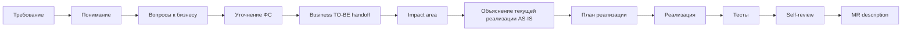

# AI-agent как усилитель delivery-процесса: от требования до MR

**Формат:** мастер-класс с live demo на opencode.
**Длительность:** 60 минут.
**Аудитория:** Java-разработчики (40%), системные аналитики (30%), tech leads и архитекторы (30%).
**Тон:** прямой, с критикой текущего хаоса в использовании Kilo Code.
**Demo-задача:** добавление поля `daysRemaining` в response endpoint'а `POST /FL/gracePeriod` сервиса `packagesearch` (Spring Boot 3, Java 17). Подробный operational сценарий — в `[[Live Demo Script]]`.

> Сопровождающие документы: `Live Demo Script.md`, `Speaker Notes.md`, `Fallback Demo Script.md`, `Pre-Show Checklist.md`, `Cannot Show.md`, `Call To Action.md`, `Templates.md`.

---

# Введение: формат, цель, что увидим

Добрый день. будет рассказано про управляемый процесс на живом коде, паттерны, план внедрения AI агенты в разработке.

---

# AI-агент по частям: subagents, MCP, AGENTS.md, skills, commands, hooks

Введу в курс про базовые термины  AI-агентов, чтоб понимать, когда я скажу «запускаю subagent» или «через MCP агент видит OpenAPI» —  понимать, о чём речь.

## Subagents

Subagent — это отдельный экземпляр агента с собственным контекстом и собственной задачей. Не новая модель, не новый инструмент — просто **изолированная сессия для конкретного задачи**.

Зачем. Когда вы делаете большую задачу, у главной сессии быстро забивается контекст: логи, неудачные попытки, исследования. Subagent позволяет вынести часть работы в отдельный «контекстный пузырь» — он сделал своё дело, вернул summary, главная сессия осталась чистой.

В opencode это поддерживается из коробки: можно вызвать subagent для исследования или review, и он работает в своём контексте. Называется этот шаблон orchestrator-workers: главный агент координирует, рабочие выполняют узкие задачи.

Ключевое: subagent — это не параллелизм ради скорости. Это **изоляция контекста ради качества**. Тот же агент, что писал код, его проверять не должен — это предвзятый ревьюер.

## MCP — Model Context Protocol

MCP — это стандарт, через который агент подключается к внешним источникам и инструментам не как «копипаст текста», а как структурированный API.

Конкретно: вместо того, чтобы вы скопировали OpenAPI-спеку в чат — агент через MCP получает к ней программный доступ. Может прочитать схему, проверить контракт, найти конкретный endpoint. То же с базой данных, файловой системой, Jira.

Зачем. Без MCP агент работает с тем, что вы ему дали в промпте. С MCP — он работает с источниками напрямую и видит их актуальное состояние. Это разница между «снимок в момент копипаста» и «живой запрос». 

После покажу как подключать mcp.
## AGENTS.md — правила проекта

AGENTS.md — это файл в корне репозитория, который агент читает в начале каждой сессии. Туда кладутся **конвенции, которые агент сам не выведет из кода**: build-команды, code style, security-ограничения, naming-правила, что нельзя трогать без явного разрешения.

Зачем. Без AGENTS.md вы повторяете правила в каждом промпте: «помни, у нас Spring Boot, Java 17, не используй Lombok». С AGENTS.md — пишете один раз, коммитите в git, и поведение агента становится консистентным между всеми разработчиками команды.

В opencode AGENTS.md — стандартное имя файла. В других агентных инструментах могут быть свои названия, но концепция универсальна.

## Skills — переиспользуемые специализации

Skill — это сохранённая «специализация» агента: набор инструкций, контекст, поведенческие правила под конкретный тип задач. Например: skill `pr-reviewer` — агент с чек-листом ревью, паттернами проверки безопасности и стилем feedback'а.

Зачем. Без skills вы каждый раз пишете «представь, что ты ревьюер, проверь diff по чек-листу...» — и каждый раз получается чуть по-разному. С skills — это переиспользуемая специализация, которая работает одинаково у всех в команде.

Особенность skills: они **активируются автоматически**, когда агент видит подходящий контекст. Не вы вызываете skill — агент сам выбирает, применить ли его. Это удобно, но иногда непредсказуемо — поэтому есть commands.

## Commands — параметризованные промт-шаблоны

Command — сохранённый промт-шаблон с параметрами, который вызывается явно по имени: `/review`, `/impact <feature>`, `/mr-summary`. В opencode команды живут как файлы в `.opencode/commands/<name>.md`.

Зачем. Если один и тот же промт повторяется в команде десять раз — это кандидат в command. Главное отличие от skills: skill **активируется автоматически** по контексту, command — **явно по имени**. Skill — автопилот, command — ручное управление. На практике используются вместе: skills в фоне, commands — для предсказуемых типовых операций.

## Hooks — события, запускающие действия

Hook — это правило: «когда происходит X, автоматически выполни Y». Например: после каждой генерации кода — автоматически запустить `mvn compile`. Перед коммитом — прогнать линтер. После завершения задачи — обновить статус в Jira или отправить нотификацию.

Зачем. Это слой автоматизации, который превращает агента из «отвечает на промпт» в «работает в pipeline». Hooks — это то, что делает workflow воспроизводимым, а не зависимым от того, не забыл ли пользователь нажать кнопку.

В opencode hooks реализованы через permission-rules и автоматические команды. В других инструментах — иначе. Но смысл один: события и реакции на них.

---

**Subagents** — изоляция контекста. **MCP** — структурированный доступ к источникам. **AGENTS.md** — конвенции проекта. **Skills** — автоактивирующиеся специализации. **Commands** — параметризованные шаблоны промптов. **Hooks** — события и реакции.

---


#  Workflow

Теперь — общая модель. Прежде чем дать вам двенадцать шагов, я хочу показать **базовый паттерн**, который под ними лежит.

## Базовая 7-шаговая модель

Любая нетривиальная задача с AI-агентом проходит семь шагов:

1. **Анализ** — изучить, что есть, как работает, где менять.
2. **План** — описать минимальные правки и порядок.
3. **Подтверждение** — человек читает план и валидирует.
4. **Маленькие правки** — точечные изменения с explicit scope.
5. **Diff review** — человек читает diff каждой правки.
6. **Тесты** — прежде чем что-то коммитить.
7. **Ручное принятие** — git commit от человека, не автоматически.

Шаги один–три идут в **Plan-mode** — это режим, где агент только читает и предлагает, никаких правок. Шаги четыре–семь — в **Build-mode** — где агент уже меняет файлы, запускает команды.

В opencode переключение между режимами явное.

Двенадцать шагов, которые я сейчас покажу — это операционализация этой семёрки под enterprise delivery с явным handoff от аналитика к разработчику.

## 12 шагов: от требования до MR



Шаги один–пять — **территория аналитика и Plan-mode**. У аналитика **нет доступа к программному коду** — он работает с тикетом, ответами бизнеса и handoff-артефактом. Шаги шесть–двенадцать — **территория разработчика**: шаги шесть–семь идут в Plan-mode (read-only через MCP к коду), переход в Build-mode на шаге девять. Восьмой шаг — approval gate, граница между Plan и Build внутри dev-блока.

1. **Требование** — входной артефакт. Бизнес-тикет от продукта, AC. Агент уже прочитал `AGENTS.md` проекта — конвенции, запреты, стек. Это фундамент, на котором всё держится.
2. **Понимание** *(аналитик, Plan-mode)* — что я понял из требования, какие неизвестные. Первая точка, где агент ловит то, что мы пропустили. Без code refs.
3. **Вопросы к бизнесу** *(аналитик, Plan-mode)* — что не закрыто требованием. Без этого шага мы реализуем не то. Бизнес-вопросы, не технические.
4. **Уточнение ФС** *(аналитик, Plan-mode)* — после ответов на вопросы. AC переписаны с явными edge cases в бизнес-терминах.
5. **Business TO-BE handoff** *(аналитик, Plan-mode)* — диаграмма уровня «Пользователь → Клиент → API» без внутренних компонентов сервера. Точка передачи разработчику.
6. **Impact area** *(разработчик, Plan-mode)* — какие места в коде затрагиваются. Dev получает на вход бизнес-FS, через MCP к репозиторию находит конкретные file:line. Самый дорогой шаг вручную; здесь агент даёт максимальный выигрыш.
7. **Объяснение текущей реализации — AS-IS** *(разработчик, Plan-mode)* — как это работает сейчас, sequence из живого кода. Половина багов рождается из непонимания того, что код реально делает.
8. **План реализации** *(разработчик, approval gate, Plan→Build)* — что и в каких файлах меняем. Здесь же — техническое решение, как материализовать бизнес-требование в API-контракте. Самый важный шаг, на который большинство забивают. После approval — переключаемся в Build-mode.
9. **Реализация** *(разработчик, Build-mode)* — маленький контролируемый diff. По одному пункту плана за раз.
10. **Тесты** *(разработчик, Build-mode)* — happy path + edge cases. Edge cases приходят из шага три — открытых вопросов.
11. **Self-review** *(разработчик, Build-mode)* — пройти чек-лист, найти свои же ошибки. У агента это получается лучше, чем у нас, потому что он не устаёт.
12. **MR description** *(разработчик, Build-mode)* — handoff на reviewer'а. Финальный артефакт, и его reviewer открывает первым.

И что критично: точка синхронизации между ролями — написанная документация аналитики (refined FS + business TO-BE шага 5). Без неё разработчик импровизирует, без неё аналитик не закрыт.

## Четыре правила управления агентом

Под workflow лежат четыре правила. Их нарушение делает любой workflow декоративным.

**Правило первое: Plan first.** Анализ и план до правок. Plan-mode.

**Правило второе: Маленькие diff'ы.** Лучше пять контролируемых diff'ов по тридцать строк, чем один на двести. Для лучшего контроля.

**Правило третье: Diff review каждой правки.** Без пропусков. Если не понимаешь каждую строку — не мержишь.

**Правило четвёртое: Ответственность на человеке.** AI-agent не является субъектом ответственности. За код — вы. За архитектурное решение — архитектор. За постановку — аналитик. «Агент так написал» в post-mortem не работает.

А теперь — к demo. Пройдём весь workflow от тикета до MR. И отдельно подсвечу те шаги, где работает аналитик — потому что demo показывает не только разработческую часть, а полный цикл.

---

# Demo


---

# Лучшие практики

## Интро

Главный экспертный блок. Двадцать четыре минуты — восемь паттернов, по две с половиной минуты на каждый, плюс время на ваши реакции и уточнения. Каждый паттерн — определение, что замещает, **реальный пример из этого же сервиса**, который вы только что видели в demo, цитата авторитетного источника, и как починить если уже сломано.

---

## Паттерн 1 — Context engineering, не prompt engineering

**Суть.**  
AI-агенту важен не только промпт, а весь контекст, который он видит: правила проекта, файлы, ошибки, ограничения и прошлые попытки.
**Проблема.**  
Если в сессии уже много кода, логов и обсуждений, важное требование может потеряться. Агент начинает чинить задачу локально, но ломает ограничение, которое было задано в начале.
**Прикладной пример.**  
Нужно изменить обработчик ошибок в сервисе. Главное ограничение:

> нельзя менять формат ответа API, потому что его уже используют другие системы.

Сначала агент это учитывает. Потом в сессию добавляют несколько файлов, stack trace, старые попытки исправления и новые уточнения. В итоге агент исправляет ошибку, но меняет формат ответа API.
Код стал «рабочим», но контракт сломан.
**Правильное действие.**  
Не писать ещё один длинный промпт поверх старой сессии, а пересобрать контекст:

> `/clear` → правила проекта → короткое требование → критичное ограничение → только нужные файлы.

**Главная мысль.**  
Плохой результат часто лечится не новым промптом, а чистым и правильно собранным контекстом.

---

## Паттерн 2 — Plan-Gate-Execute

****Суть.**  
Агент не должен сразу писать код. Сначала он должен предложить план, а человек — проверить scope и риски.

Формула простая:

> сначала план → потом approval → только потом реализация.

**Проблема.**  
Если сразу написать агенту «сделай», он может решить задачу слишком широко: добавить лишний рефакторинг, изменить общие классы, затронуть другие модули и создать ненужный риск.

**Правильный паттерн.**  
Для любой нетривиальной задачи:

> Plan first. Code only after approval.

**Главная мысль.**  
Не давай агенту сразу строить решение.  
Сначала заставь его показать план — именно там чаще всего видны лишний scope, риски и ненужный рефакторинг.

---

## Паттерн 3 — Verification Oracle
Суть паттерна в том, что агент должен не просто писать код, а сразу проверять свою работу через объективный источник истины: тесты, сборку, линтер или интеграционные проверки.

Проблема возникает тогда, когда агент пишет «правдоподобный» код. В чате он выглядит нормально, логика кажется убедительной, но на практике код может не компилироваться, ломать тесты или нарушать контракт. Если проверку каждый раз делает человек, он превращается в передатчика ошибок: запустил тесты, скопировал stack trace, отправил агенту, снова запустил.

Правильный паттерн — сразу дать агенту критерий готовности. Например: «реализуй endpoint, после каждого изменения запускай `mvn test`, анализируй ошибки сам и продолжай, пока сборка не станет зелёной».

Так агент работает не по ощущению «задача сделана», а по проверяемому результату. Он пишет код, запускает проверки, читает ошибки, исправляет и повторяет цикл.

Главная мысль: без verification loop это просто чат с генерацией кода. С verification loop агент становится исполнителем, который сам доводит задачу до состояния «проверено и работает».

---

## Паттерн 4 — Subagent Decomposition

Суть паттерна в том, что сложную задачу не нужно вести в одной большой сессии. Лучше разделить работу между несколькими изолированными агентами: один исследует проблему, другой реализует решение, третий проверяет результат.

Проблема одной большой сессии в том, что контекст быстро загрязняется. Агент сначала читает старый код, строит гипотезы, находит спорные места, потом сам пишет решение и сам же его ревьюит. В итоге он тащит за собой все промежуточные догадки и становится плохим ревьюером собственного кода.

Правильный паттерн — разделить роли. Например, сначала отдельный subagent получает только задачу на investigation: найти все места, где используется конкретный класс, включая DI, reflection и тесты. Он возвращает короткое summary: file, line и зачем используется. В основную сессию не нужно тащить весь поиск — достаточно результата.

После этого main-agent реализует изменение уже с чистым контекстом. А затем отдельный reviewer-agent получает только diff и checklist. У него свежий взгляд, поэтому он чаще замечает проблемы, которые пропускает агент-исполнитель: NPE, нарушение контракта, лишний scope или забытый тест.

Главная мысль: не заставляй одного агента быть исследователем, разработчиком и ревьюером одновременно. Разделение subagents даёт чище контекст, меньше предвзятости и более качественный результат.

---

## Паттерн 5 — Working memory externalization (AGENTS.md)

Суть паттерна в том, что правила проекта не должны жить в голове разработчика или повторяться в каждом промпте. Их нужно вынести в отдельный файл, например `AGENTS.md`, который агент читает в начале работы.

Проблема в том, что без такого файла каждый разработчик управляет агентом по-своему. Один напоминает про Java 21, Spring Boot 3, стиль логирования и запрет на Lombok. Другой забывает. В итоге агент пишет код в разном стиле, а репозиторий постепенно превращается в набор разных подходов.

Правильный паттерн — хранить проектные правила рядом с кодом. В `AGENTS.md` фиксируются основные команды сборки, стиль кода, naming, архитектурные ограничения, security-правила и зоны, которые нельзя менять без согласования.

Тогда агент в каждой новой сессии стартует не с пустого места, а с одинаковой «рабочей памяти» проекта. Это снижает количество лишних замечаний на code review и делает поведение агента одинаковым для всей команды.

Главная мысль: не держи правила проекта в промптах. Вынеси их в файл, закоммить в репозиторий и заставь агента читать его перед работой. Context window — это временная память, а `AGENTS.md` — постоянная память проекта.

---

## Паттерн 6 — Verifiability boundary

Суть паттерна: агенту стоит отдавать только те задачи, результат которых можно проверить.

Если есть тесты, сборка, линтер, контракт, схема или чёткие acceptance criteria — агент может работать автономно и сам закрывать цикл проверки.

Если результат нельзя объективно проверить, агент не должен принимать финальное решение. В таких задачах он может помогать с анализом, вариантами и рисками, но ответственность остаётся на человеке.

Главный вопрос перед задачей:

> как я пойму, что результат правильный?

Если ответа нет — это не зона автономной работы агента.  
Главная мысль: агент ускоряет только проверяемые задачи. В непроверяемых он может не ускорить работу, а скрыть ошибку за убедительным текстом.

---

# Риски, анти-паттерны

Три минуты, три категории рисков плюс одна общая мораль. Без сглаживания.

## Риск 1 — Безопасность, IP, утечки

Главный принцип: **никогда не передавать в агента то, что не должно покидать контур**. Секреты, production-данные клиентов, внутренние NDA-документы целиком, IP-логика (скоринг, ценообразование). Если данные нельзя в внешнюю систему — их нельзя и в агента, который работает через внешний API. Классификация данных компании применима к работе с агентом 1:1.

Анти-паттерн: «копирую production-логи в чат для дебага». Решение: обезличивание перед отправкой.

## Риск 2 — Качество кода, галлюцинации

Главный риск: **ложное ощущение готовности**. Агент даёт уверенный ответ, выглядит правдоподобно. Но правдоподобно — не значит правильно. Результат агента — гипотеза, а не истина.

Агент может выдумать API, класс, метод — иногда видно только в runtime. Защита: сборка локально, тесты зелёные, edge cases покрыты, diff review без пропусков. На агентский код смотреть **внимательнее**, чем на свой.

## Риск 3 — Ответственность, ownership

Главный вопрос: **кто отвечает за код, написанный с агентом?**

Ответ: **человек, который закоммитил.** Точка. Тот, кто на git blame. Когда в три ночи прилетит alert — поднимут не агента. Поднимут вас. И вопрос будет не «как агент это написал», а «почему ты это закоммитил».

Из этого: code review, SAST, penetration testing остаются как были. Архитектурные решения принимает человек. Никаких автоматических мержей агентского кода. И в MR — обязательно attribution: что делал агент, какая модель.


---

## Как AI встроен в фазы спринта

![[Pasted image 20260512201800.png]]

На слайде — пять фаз спринта: Подготовка, Планирование, Реализация, Review/Testing, Улучшение. Сверху — этапы внедрения, начиная с пилота. Снизу — что происходит внутри одной фазы: основное действие человека → AI помогает → human checkpoint → артефакт на выход.

Артефакты идут по цепочке: AI-ready постановка → Ready for Sprint → Review-ready MR → Accepted increment → обновлённая документация.

Суть: AI не заменяет роль — он сидит внутри неё. Аналитик остаётся аналитиком, разработчик — разработчиком. AI ускоряет черновик, человек подписывает выход фазы.

Достигаем этого не указом, а пилотом.


---

# Приложение A. Сжатая шпаргалка по 4 правилам

| # | Правило | Анти-паттерн | Решение |
|---|---|---|---|
| 1 | Контекст перед действием | «Сразу пиши код по тикету» | Сначала понимание, impact area, гипотеза |
| 2 | Гипотеза перед правкой | «Diff без объяснения, что меняем» | Approval gate перед кодом |
| 3 | Маленький diff | «Перепиши класс» | По одному шагу плана |
| 4 | Проверка через инструменты | «Верю объяснению» | Сборка, тесты, grep, IDE, SQL |

---

# Приложение B. Чек-лист качества (раздаточный)

## Для аналитики

```text
[ ] Понятна бизнес-цель изменения
[ ] Описан основной сценарий
[ ] Описаны альтернативные сценарии
[ ] Описаны ошибки и исключения
[ ] Есть список открытых вопросов
[ ] Проверены входные и выходные данные
[ ] Проверены изменения OpenAPI/контрактов
[ ] Есть acceptance criteria (проверяемые)
[ ] Есть data mapping, если затронуты данные
[ ] Есть sequence diagram/BPMN, если сценарий интеграционный
```

## Для разработки

```text
[ ] Найдена точка входа
[ ] Определён impact area
[ ] Изменения ограничены scope задачи
[ ] Нет лишнего рефакторинга
[ ] Использован существующий стиль проекта
[ ] Добавлены/обновлены тесты (включая edge cases)
[ ] Проверена обработка ошибок (включая null)
[ ] Проверены логи/метрики, если нужно
[ ] OpenAPI обновлён, если менялся контракт
[ ] Подготовлено понятное MR summary
[ ] В MR указано использование агента
```

## Для безопасности

```text
[ ] Нет секретов в промптах/контексте
[ ] Нет персональных данных без обезличивания
[ ] Не раскрыты внутренние production-данные
[ ] Не раскрыта IP/проприетарная бизнес-логика
[ ] Используется разрешённый инструмент/контур
[ ] Diff проверен человеком
[ ] Архитектурные решения не приняты агентом автономно
[ ] В MR явно указано использование агента
```

---

# Приложение C. Финальная формула доклада

```text
AI-agent не заменяет delivery-process.
AI-agent усиливает delivery-process, если встроен в него правильно.

Слабый подход:
требование → агент → большой непроверенный результат.

Сильный подход:
требование → понимание → impact area → объяснение → вопросы →
ФС → sequence → план → реализация → тесты → self-review → MR.

Это не один промпт. Это workflow.
И главное — он управляемый.
```

> **Не делегируйте агенту ответственность. Делегируйте ему рутину анализа, структурирования и первичной подготовки. Контроль над решением, качеством и рисками — оставляйте человеку.**
