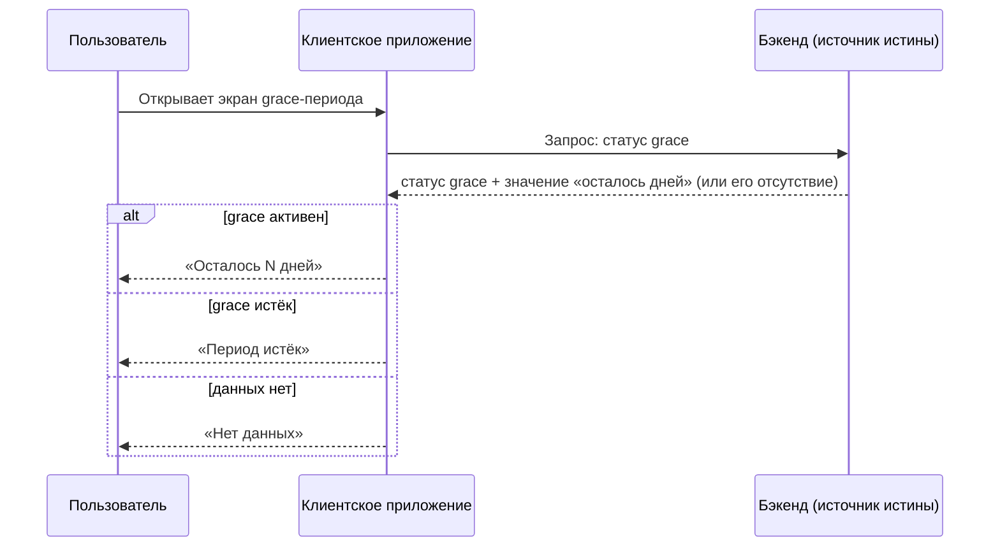
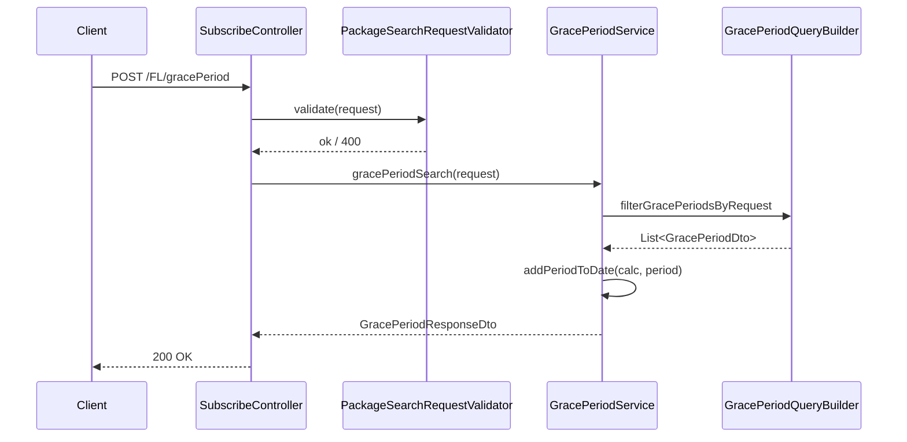

# Live Demo Script — управляемый workflow от тикета до MR

**20 минут** внутри блока live demo. Демо идёт на **реальном сервисе `packagesearch`** (Spring Boot 3, Java 17). На вход аналитику и разработчику приходит **бизнес-задача**: устранить расхождение в показателе «осталось дней» grace-периода между мобильным и веб-клиентами.

Главный тезис demo: **AI-агент эффективен не тогда, когда ему говорят «сделай задачу», а когда его ведут через ограниченный, проверяемый engineering workflow: аналитика → контракт → impact analysis → план → реализация → тесты → проверка → MR.**

Demo показывает не «магическое автокодирование», а зрелый delivery cycle: понимание перед кодом, read-only discovery перед изменениями, контроль scope, plan before edit, verification loop, явные human-checkpoints, контрактное мышление, edge cases, MR-ready результат.

**Важно про роли.** Аналитик в demo **не имеет доступа к программному коду** — его агент работает только с тикетом, бизнес-FS и ответами от продукта. Технический impact, AS-IS из кода, реализация, тесты, MR — это работа разработчика после handoff на шаге 5.

---

## TL;DR (для спикера, не для аудитории)

- **Сервис:** `Sources/programm/packagesearch` (Spring Boot 3, Java 17, springdoc-openapi 2.4.0).
- **Endpoint (откроет dev на шаге 6):** `POST /FL/gracePeriod` → `GracePeriodResponseDto`.
- **Решение dev'а на шаге 8:** добавить поле `Integer daysRemaining` (календарные дни от `calculationDate` до `graceEndDate`).
- **Файлы (планируемые изменения):** `dto/graceperiod/GracePeriodResponseDto.java`, `service/GracePeriodService.java`, новый `test/.../GracePeriodServiceTest.java`.
- **Контракт:** request не меняется, response получает additive-поле — backwards-compatible, OpenAPI обновится springdoc'ом автоматически.
- **WOW#4:** `ChronoUnit.DAYS.between(ZonedDateTime, ZonedDateTime)` возвращает 24-часовые интервалы → 23h59m считает за 0 дней. Self-review агента ловит этот silent bug.
- **Live mvn:** `mvn -Dtest=GracePeriodServiceTest test` — два прогона на сцене (после step 10 и после 11b).

---

## Каркас сценария: ORPAV-HC

На каждом шаге demo агент работает по одной схеме, и зал её видит в плашке в начале шага:

- **Observe** — что найдено в тикете / предыдущем шаге / коде.
- **Reason** — какой вывод из этого следует.
- **Plan** — что нужно сделать дальше.
- **Act** — какие изменения или проверки выполнить.
- **Verify** — как убедиться, что результат корректен.
- **Human checkpoint** — что должен подтвердить разработчик/докладчик перед следующим шагом.

Это не теоретическая модель — это **операционный каркас**, по которому идёт каждый из 12 шагов demo. Спикер на сцене произносит эти слова не каждый раз, но в материале они зафиксированы — чтобы аудитория видела повторяемый паттерн.

---

## Шесть явных human-checkpoint точек

Между шагами есть шесть точек, где работа агента останавливается и человек принимает решение. Они не растворены в speaker line — они вынесены отдельными блоками в материале и в речи спикера явно проговариваются.

| HC | Когда | Что подтверждаем |
|---|---|---|
| **HC2** | После шага 5 (Business TO-BE) | Аналитика завершена, контракт и edge cases ясны, переходим к dev |
| **HC1** | После шага 6 (impact analysis) | Карта impact area полная, лишних точек нет, request DTO не трогаем |
| **HC3** | В начале шага 8 (contract decision) | Меняем response (additive), request не трогаем, OpenAPI обновится auto |
| **HC4** | В конце шага 8 (approval gate) | План реализации одобрен, scope ограничен 2+1 файлами, можно кодить |
| **HC5** | После шага 10 (tests green) | Тесты прошли, но ещё не сделан self-review — задача НЕ закрыта |
| **HC6** | После шага 11b (fix applied) | Готовы к hand-off на reviewer'а, можно генерить MR description |

Если на любом checkpoint'е ответ «нет» — возврат на соответствующий шаг назад. Это первое, что аудитория должна увидеть: **процесс с обратимыми checkpoint'ами, а не one-shot prompt**.

> Хронологически HC2 идёт раньше HC1 — потому что аналитик заканчивает работу раньше, чем dev завершает impact-анализ. Нумерация исторически закреплена в материалах доклада, не пугаемся.

---

## Per-step timing budget (20 мин total)

Время внутреннее по demo (0:00 = старт demo). Слот в общем тайминге доклада спикер сводит сам.

| # | Шаг | Длит. | Внутр. слот | WOW | HC | Track |
|---|---|---:|---:|---|---|---|
| 1 | Trigger (business ticket) | 0:30 | 0:00–0:30 | | | shared |
| 2 | Understanding | 1:00 | 0:30–1:30 | | | analyst |
| 3 | Questions to business | 1:30 | 1:30–3:00 | ⚡#3 | | analyst |
| 4 | Refined FS | 1:00 | 3:00–4:00 | | | analyst |
| 5 | Business TO-BE handoff | 1:00 | 4:00–5:00 | | →HC2 | analyst→dev |
| 6 | Impact area + MCP | 2:00 | 5:00–7:00 | ⚡#1 | →HC1 | dev |
| 7 | AS-IS Mermaid из кода | 1:30 | 7:00–8:30 | ⚡#2 | | dev |
| 8 | Implementation plan | 1:30 | 8:30–10:00 | | HC3,→HC4 | dev |
| 9 | Limited implementation | 2:00 | 10:00–12:00 | | | dev |
| 10 | Tests + live mvn | 2:00 | 12:00–14:00 | | →HC5 | dev |
| 11 | Self-review (truncation) | 2:30 | 14:00–16:30 | ⚡#4 | | dev |
| 11b | Apply fix + re-run mvn | 1:30 | 16:30–18:00 | | →HC6 | dev |
| 12 | MR description | 1:30 | 18:00–19:30 | ⚡#5 | | dev |
| | Outro demo | 0:30 | 19:30–20:00 | | | |
| | **Итого** | **20:00** | | | | |

**Track callouts** — на шагах 2, 3, 4, 5 спикер произносит «аналитики, обратите внимание». На шаге 6 — переход «теперь к разработческой части».

WOW-паузы — 3 секунды. Шаги 1, 4 — спикер только показывает результат, минимум комментариев.

---

## Pre-demo setup (выполняется в T-25, не в эфире)

См. `[[Pre-Show Checklist]]` для полного перечня. Ключевое:

- IDE/opencode открыты в директории `Sources/programm/packagesearch/` (используется на шагах 6+).
- Для шагов 2–5 (analyst) — отдельная сессия opencode **без MCP к коду**, только text-context. Это эмулирует реальное ограничение «у аналитика нет доступа к репозиторию».
- opencode терминал в правой половине экрана (большой font, 18+ pt).
- `mvn dependency:go-offline` выполнен — `.m2` прогрет.
- MCP к OpenAPI/файловой системе работает в dev-сессии.
- Слайд с псевдо-Jira-тикетом PKG-2026-104 (бизнес-формулировка) открыт во второй вкладке.
- Mermaid-preview подготовлен (vscode preview, mermaid.live, или плагин в opencode).
- `git status` чистый. На случай fallback'а — приготовлена branch `demo/days-remaining-prepared` с готовым результатом.
- Notification mute, Slack closed, IDE без отвлекающих popups.

---

## Шаг 1 — Trigger (0:00–0:30)

> [!abstract] ORPAV-HC на этом шаге
> **Observe.** Поступил бизнес-тикет PKG-2026-104. **Reason.** Описание короткое, AC бизнес-уровня, технических деталей нет — потому что заполнял продукт. **Plan.** Не давать агенту команду «реализуй». **Act.** Открыть opencode-терминал аналитика, отказаться от impulse-prompt'а. **Verify.** Спикер вслух фиксирует анти-паттерн. **Human checkpoint.** Не применим — это вход в demo.

**Setup.** На экране — слайд с псевдо-Jira-тикетом:

```
PKG-2026-104 — Унифицировать показатель «осталось дней» grace-периода

Бизнес-проблема:
Клиенты в мобильном приложении и веб-кабинете видят разные значения
«осталось дней» до окончания grace-периода — расхождение до одного
дня. Поддержка получает регулярные обращения, доверие к показателю
падает.

Бизнес-требование:
Источником истины для значения «осталось дней» должен стать сервер.
Клиентские приложения только отображают полученное значение,
самостоятельный пересчёт убираем.

Acceptance:
- На всех клиентах одинаковое значение «осталось дней».
- Поведение для уже истёкшего grace согласовано с продуктом.
- Текущие версии клиентских приложений продолжают работать без
  обновления (backwards compatibility).
```

**Speaker line (20 сек):**

> «Вот тикет от продукта. Бизнес-проблема, бизнес-требование, бизнес-AC. Ни одного упоминания DTO, endpoint'а, типа данных — этого продукт и не должен писать. Кажущаяся простота: «расхождение в днях», ну что тут думать. И всё же — много нерешённого. На этой задаче и аналитик может ошибиться в трактовке, и разработчик может ошибиться в реализации.»

**Action (10 сек).** Переключаемся в opencode-терминал. Не копируем тикет в одну строку «реализуй». Произносим:

> «Я не дам агенту команду 'реализуй'. Это первая ошибка, которую делает большинство. Я попрошу другое.»

> [!warning] Anti-pattern (чего НЕ должно быть)
> «Возьми эту задачу, добавь поле в API, чтобы клиенты получали число дней». Большой scope, нулевой контекст, нулевая верификация. Получим непредсказуемый diff на стыке аналитики и разработки, который потом часами разбирать.

> [!tip] Best practice (для аудитории)
> Бизнес-тикет — это **триггер для аналитики**, а не для кодогенерации. Между тикетом и первой правкой файлов должно пройти 7 шагов: понимание → вопросы → refined FS → business TO-BE → handoff → impact → AS-IS. Только потом — план и код.

**Pattern callout (→ блок «Сильные паттерны»).** Анти-паттерн «сделай задачу целиком». Plan first.

**Fallback trigger.** Не применимо.

---

## Шаг 2 — Understanding (0:30–1:30) *(аналитик)*

> [!abstract] ORPAV-HC на этом шаге
> **Observe.** Текст тикета — единственный вход. **Reason.** Прежде чем что-либо делать, агент должен сформулировать задачу своими словами и найти неоднозначности. Аналитик не знает имён классов, не лезет в код — он работает с бизнес-формулировкой. **Plan.** Запросить структурированное понимание + 3–5 открытых вопросов. **Act.** Промпт с явным запретом писать код и упоминать технические детали. **Verify.** В ответе должны быть три блока: понимание задачи, вовлечённые роли/системы, открытые вопросы. **Human checkpoint.** Спикер читает ответ и подтверждает: «понимание совпадает с моим, вопросы реальные».

**Промпт:**

```
Ты помогаешь системному аналитику. Тикет PKG-2026-104:
"Унифицировать показатель «осталось дней» grace-периода. Клиенты в
мобильном и веб-кабинете показывают разные значения. Сервер должен
стать источником истины. Существующие клиенты не должны ломаться."

У тебя НЕТ доступа к коду — только текст. Не пиши код. Не предлагай
имена полей, классов, endpoint'ов. Верни:
1. Что я понял из тикета своими словами (что хочет бизнес, кому больно).
2. Какие роли и системы участвуют (без code refs).
3. Что НЕ ясно из текста — список открытых вопросов (3-5).
```

**Expected output cheat-sheet:**
- Понимание: «Бизнес хочет, чтобы значение «осталось дней» было одинаковым на всех клиентских поверхностях. Источник истины переносится с клиента на сервер. Цель — снять путаницу у пользователей и нагрузку с поддержки.»
- Роли и системы: продукт (постановщик), бизнес (отвечает на вопросы), серверный API (новая ответственность — расчёт), мобильное приложение и веб-кабинет (потребители), поддержка (получатели жалоб).
- Открытые вопросы (3–5 из набора):
  - Что такое «день» — календарный (граница по полуночи) или 24-часовой слот?
  - Что показывать клиенту, если grace уже истёк?
  - По какой таймзоне считать границу — по серверу, по клиенту, по UTC?
  - «Сегодня» считаем за день или нет?
  - Когда у клиента нет данных вообще — что показывать?

**Speaker line (25 сек):**

> «Заметили — он не написал код. Он не угадал название поля. Он не подсказал endpoint. Аналитик не знает этих имён, и его агент тоже не должен их знать. Он вернул структурированную карту понимания и четыре-пять открытых вопросов. Один из них — про negative case, что показывать, когда grace истёк — мы ещё к нему вернёмся.
>
> **Аналитики, обратите внимание** — это декомпозиция требования. Первый из ваших ключевых сценариев. Агент не пишет ФС — он раскладывает входной артефакт на структуру.»

> [!warning] Anti-pattern (чего НЕ должно быть)
> Агент игнорирует «не пиши код / не упоминай имена» и сразу выдаёт «добавьте поле `daysRemaining` в `GracePeriodResponseDto`». Если так — переспрашиваем с акцентом и фиксируем перед залом: «вот почему мы аналитику отдельный контекст создаём, без MCP к коду — иначе агент мешает роли».

> [!tip] Best practice (для аудитории)
> **Контекст агента должен соответствовать роли пользователя.** У аналитика — текстовый контекст, не code-MCP. У разработчика — code-MCP, не «полная business memory». Один универсальный «всезнающий агент» — это анти-паттерн контекстной инженерии.

**Pattern callout.** Plan first. Контекст перед действием.

**Fallback trigger.** Агент пишет код или упоминает технические имена → перейти на `fallback/02-understanding.png`, прокомментировать «видите, я попросил, он всё равно начал — это причина, почему контекст агента приходится формировать строго под роль».

---

## Шаг 3 — Questions to business (1:30–3:00) ⚡ WOW #3 *(аналитик)*

> [!abstract] ORPAV-HC на этом шаге
> **Observe.** AC в тикете покрывают happy path, но не покрывают edge cases. **Reason.** До передачи задачи в разработку нужно закрыть бизнес-вопросы — иначе разработчик будет принимать решения за бизнес фантазиями. **Plan.** Заставить агента сгенерировать 3–5 конкретных бизнес-вопросов и пометить самый важный. **Act.** Промпт с акцентом на конкретные сценарии. **Verify.** Среди вопросов есть «что показывать, если grace истёк» — главный missed question. **Human checkpoint.** Спикер играет за бизнес, отвечает на вопросы вслух (это переходит в шаг 4).

**Промпт:**

```
Я системный аналитик. До передачи задачи разработчику я хочу
задать продукту и бизнесу вопросы, ответы на которые могут
изменить решение или AC.

Дай 3-5 конкретных вопросов. Каждый — про конкретный пользовательский
сценарий, не общая риторика. Без технических терминов, без имён полей.
Пометь самый важный — тот, на который нельзя «угадать» ответ.
```

**Expected output cheat-sheet:**

1. Что считаем «днём»: календарный день (граница в полночь) или 24-часовой слот от момента запроса?
2. По чьей таймзоне определяется граница «дня» — по клиенту, по серверу или по UTC?
3. **★ Что показывать пользователю, если grace уже истёк? Прочерк, ноль, отдельный текст, или это вообще другая UI-история?** ← *missed question*
4. «Сегодня» считаем за день, который ещё остался, или нет?
5. Если grace был продлён во время сессии — новое значение должно прийти сразу или со следующим обновлением?

**Speaker line (40 сек):**

> «Стоп. Третий вопрос. Прочтите его про себя.
>
> Что показывать пользователю, если grace уже истёк. Этот вопрос мы могли пропустить. Я мог пропустить. Аналитик мог пропустить. Продукт его не написал — потому что в его картине мира «осталось дней» подразумевает «грейс ещё активен». В тикете про это — ноль.
>
> Здесь агент сработал не как code generator. Он сработал как pair-аналитик.
>
> Вы покупаете не «AI пишет код». Вы покупаете «AI заставляет нас не пропускать вопросы».
>
> **Аналитики** — если ваш сценарий «напиши красивый текст ФС» — вы используете агента слабо. Сильное использование — это **ускорение мышления**: найти дырки, проверить контракт, собрать вопросы.»

⚡ **WOW #3.** Делать паузу после «не пропускать вопросы».

> [!warning] Anti-pattern (чего НЕ должно быть)
> Агент **угадывает** ответы вместо того, чтобы задавать вопросы: «вероятно, при истёкшем grace показываем ноль, я так и зафиксирую». Это закрытие неоднозначности фантазиями. Возврат: «не угадывай, спрашивай».

> [!tip] Best practice (для аудитории)
> **Безопасные default-варианты — отдельный режим работы.** Если бизнес-ответ недоступен прямо сейчас, агент должен явно сказать: «возможны два пути — A с обоснованием X, B с обоснованием Y; принимаю B как safer default, готов поменять при ответе от продукта». Не «решил молча и сделал».

**Pattern callout.** Ускорение мышления, не генерация текста.

**Fallback trigger.** Все вопросы общие, «missed question» не появился → `fallback/05-questions.png` + «у меня припасён правильный вариант, обсудим, что в нём важно».

---

## Шаг 4 — Refined FS (3:00–4:00) *(аналитик)*

> [!abstract] ORPAV-HC на этом шаге
> **Observe.** Получены ответы от бизнеса (спикер играет за продукт). **Reason.** Ответы нужно зафиксировать как часть AC, с явными edge cases — потому что бизнес сейчас в комнате, а через два дня уже нет. **Plan.** Передать ответы агенту и попросить переписать AC. **Act.** Промпт с пятью конкретными правилами. **Verify.** В обновлённых AC явно прописаны все ветки: активный grace, истёкший, без данных, граница «сегодня». **Human checkpoint.** Спикер вслух соглашается с обновлёнными AC.

**Live interaction.** Спикер играет за продукт 20 сек:

> «Допустим, я получил ответы:
> 1. Календарный день, граница в полночь по UTC.
> 2. Если grace истёк — клиенту показываем прочерк, на сервере это значит «значение отсутствует».
> 3. «Сегодня» считается за день, который ещё остался — стандартная пользовательская интуиция.
> 4. Если данных нет (например, клиент не в grace вообще) — тоже прочерк.
> 5. Если grace продлевается — новое значение прилетит со следующим запросом, immediate-push не требуется.»

**Промпт:**

```
Учти ответы бизнеса:
1. Календарный день, граница в полночь по UTC.
2. Если grace уже истёк → «осталось дней» = отсутствует (на UI прочерк).
3. Если grace активен и заканчивается сегодня → 0.
4. Если данных о grace нет → отсутствует.
5. «Сегодня» считаем за день, который ещё остался.

Перепиши acceptance criteria и добавь явные edge cases.
Не пиши код. Не упоминай имена полей или endpoint'ов.
```

**Expected output cheat-sheet:**
- AC: 4–5 пунктов с явной семантикой каждого сценария.
- Edge cases: активный grace на много дней; активный grace = 0 дней (заканчивается сегодня); истёкший grace; отсутствие данных; граница часового пояса (граница UTC, не локальная).

**Speaker line (20 сек):**

> «Видите — я только что подменил продукт на двадцать секунд. Теперь у меня обновлённая ФС с явными edge cases, в бизнес-терминах. В реальности этот цикл — два дня, потому что продукт уже на следующей задаче. Здесь — две минуты.»

> [!warning] Anti-pattern (чего НЕ должно быть)
> Агент возвращает ответы бизнеса в виде технического описания: «значение = null, если…». «Не упоминай имена и технические детали» — повторить. AC должна читаться продуктом.

> [!tip] Best practice (для аудитории)
> **Edge cases — это материализованные открытые вопросы.** Каждый ответ бизнеса должен превращаться в явную ветку AC. Если ветки нет — значит, ответ не получен; решение откладывается, а не угадывается.

**Pattern callout.** Цикл «требование → вопросы → ФС → edge cases» короче с агентом на порядок.

**Fallback trigger.** Агент не учёл ответы или просочились технические термины → переспросить с акцентом или показать `fallback/06-refined-fs.png`.

---

## Шаг 5 — Business TO-BE handoff (4:00–5:00) *(аналитик)*

> [!abstract] ORPAV-HC на этом шаге
> **Observe.** AC обновлены, edge cases зафиксированы. **Reason.** Нужен handoff-артефакт для разработчика — один артефакт, понятный продукту, аналитику, разработчику, QA. Технических деталей в нём не должно быть — это бизнес-диаграмма. **Plan.** Попросить агента нарисовать sequence/flow на уровне «пользователь — клиент — API» с явными ветками из AC. **Act.** Промпт на Mermaid с явным запретом упоминать внутренние компоненты сервера. **Verify.** Все ветки соответствуют ответам бизнеса из шага 4. **Human checkpoint → HC2.** «Аналитика завершена, контракт ясен на бизнес-уровне, переходим к разработческой части».

**Промпт:**

```
Нарисуй Mermaid sequence diagram бизнес-уровня для handoff
разработчику.

Участники:
- Пользователь
- Клиентское приложение (мобайл или веб)
- Бэкенд (источник истины)

Покажи запрос статуса grace и три ветки ответа:
- grace активен → «Осталось N дней»
- grace истёк → «Период истёк» (значение отсутствует)
- данных нет → «Нет данных» (значение отсутствует)

НЕ упоминай: имена endpoint'ов, имена полей DTO, имена сервисов,
имена классов на бэкенде. Это бизнес-диаграмма, не технический
sequence.
```

**Expected output cheat-sheet:**



**Speaker line (25 сек):**

> «Это бизнес-диаграмма handoff'а. Три участника. Никаких контроллеров, сервисов, query builder'ов — этого аналитик не знает и знать не должен.
>
> Один артефакт работает на четыре роли:
> продукт — для документации,
> разработчик — как вход в impact-анализ,
> QA — для test-плана,
> аналитик — как фиксация финальной картины.
>
> Это финальная точка работы аналитика. Дальше передаём разработчику — а ему предстоит свой первый шаг: понять, какие именно компоненты сервиса затрагивает эта картина.»

> [!warning] Anti-pattern (чего НЕ должно быть)
> В business TO-BE появились участники типа «GracePeriodService», «SubscribeController» или поля «daysRemaining». Это значит, аналитик «знает слишком много» — обычно потому, что копипастил предыдущие версии ФС или агент полез искать. Возврат: «убери всё внутреннее, оставь только границы Пользователь / Клиент / API».

> [!tip] Best practice (для аудитории)
> **Бизнес-диаграмма handoff'а — это контрактная граница между ролями.** Всё, что в ней есть, понятно продукту. Всё, что внутри API, — частная сфера разработчика. Эта граница не косметика, она определяет, кто за что отвечает.

**Pattern callout.** Один артефакт на четыре роли. Handoff — не пакет документов в Confluence через два дня, а Mermaid-блок в чате.

**Fallback trigger.** Некорректный Mermaid или просочились технические участники → `fallback/07-new-sequence.png` (заранее подготовленный business-level вариант).

---

> [!success] HUMAN CHECKPOINT — HC2 (после аналитики)
>
> **Что спикер подтверждает вслух перед залом (15 сек):**
> - AC обновлены, edge cases явные (активный/истёкший/нет данных/0 дней).
> - Business TO-BE-диаграмма соответствует ответам продукта.
> - Контракт API на бизнес-уровне ясен: «значение или его отсутствие».
> - Готовы переходить к разработческой части — теперь dev сам решит, в каком DTO и каким полем это материализовать.
>
> **Если ответ «нет» — возврат:** к шагу 3 или 4, дозакрыть открытые вопросы.
>
> **Спикер на сцене:** «Аналитика закончена. Переключаюсь в разработческий режим — это другая сессия, другой контекст, у этого агента есть MCP к коду. Но не в Build-mode. Сначала — где это вообще живёт.»

---

## Шаг 6 — Impact area + MCP (5:00–7:00) ⚡ WOW #1 *(dev)*

> [!abstract] ORPAV-HC на этом шаге
> **Observe.** На вход dev'у прилетели refined FS и business TO-BE — без имён классов и полей. **Reason.** Прежде чем что-либо менять, dev должен сам найти точки в коде, которые соответствуют business-картине. Без impact map можно случайно сломать audit-обвязку, request DTO или внутренний DB-слой. **Plan.** Через MCP пройти по коду и собрать file:line evidence для каждой точки business TO-BE. **Act.** Промпт явно требует доказательств: file:line для каждой точки, и явно перечисляет, что НЕ должно меняться. **Verify.** Каждая строчка ответа должна указывать на реальный файл — спикер может ткнуть в любую. **Human checkpoint → HC1.** «Карта impact area полная, лишних точек нет, request DTO не трогаем».

**Setup.** Переключаемся на dev-сессию opencode (у этого агента есть MCP). Спикер произносит:

> «Это другая сессия. У этого агента — MCP к репозиторию. Он видит код не как кусок текста, а как структурированный API. Может прочитать любой файл, найти все references, проверить контракт. На входе у него — только то, что подготовил аналитик. Имени поля он ещё не знает. Endpoint'а не знает. Сейчас выяснит сам.»

**Промпт:**

```
Я разработчик. От аналитика пришли:
1. Refined AC: API должно возвращать «осталось дней» grace-периода
   как количество календарных дней до конца grace, по UTC. Если grace
   истёк или данных нет — значение отсутствует.
2. Business TO-BE: Пользователь → Клиент → Бэкенд; ответ содержит
   статус grace и «осталось дней» (или его отсутствие).

Через MCP к репозиторию найди ВСЕ точки в кодовой базе packagesearch,
которые затронет реализация этой задачи.

Для каждой точки покажи file:line и одну строку — что именно
меняется или почему упоминается. Ищи:
- endpoint, который отдаёт информацию о grace-периоде
- response DTO этого endpoint'а (потенциальное место для нового значения)
- service слой (где вычислять и устанавливать)
- controller (вызывающий код)
- OpenAPI / Swagger
- существующие тесты на эту область
- audit / DTO factory (могут зависеть)
- внутренние DTO БД-слоя (НЕ должны меняться)
- request DTO (НЕ должен меняться)

Не предлагай реализацию. Только evidence из файлов.
```

**Expected output cheat-sheet (7–9 точек):**

```
rest/SubscribeController.java:287                   — endpoint POST /FL/gracePeriod (вход)
dto/graceperiod/GracePeriodResponseDto.java:32      — response DTO; место для нового поля
service/GracePeriodService.java:65                  — место установки значения перед return result
service/GracePeriodService.java:78–92               — addPeriodToDate (контекст; НЕ меняется)
rest/SubscribeController.java:287–290               — caller, без изменений
src/main/resources/application.yml                  — без изменений
test/.../GracePeriodService                         — тестов нет; будет новый файл
audit/AuditDataDto.java                             — без изменений (не зависит от поля)
dto/graceperiod/GracePeriodDto.java                 — internal DB DTO, без изменений
dto/graceperiod/GracePeriodRequestDto.java          — request DTO, без изменений
OpenAPI schema (springdoc auto)                     — обновится автоматически
```

**Speaker line (60 сек, держать паузу):**

> «Стоп. Полторы минуты. Посмотрите на это вместе со мной.
>
> Восемь-девять точек. Реальные file:line. По всему сервису. Чтобы получить эту карту вручную — я бы открыл IDE, сделал find-usages по `GracePeriodResponseDto`, прошёлся по тестам, проверил OpenAPI отдельно, посмотрел audit-обвязку. Минимум двадцать минут.
>
> Здесь — полторы минуты. И каждую строку я могу проверить — это не магия, это git blame и find-usages под капотом.
>
> И обратите внимание: на входе у агента **не было** имени `GracePeriodResponseDto`. Аналитик его не упоминал. Агент сам его нашёл, отталкиваясь от формулировки «endpoint, который отдаёт информацию о grace-периоде».
>
> **Вот это — усиление delivery-процесса.** Не «агент написал код». А «агент сократил мой codebase exploration в пятнадцать раз и сам перевёл бизнес-задачу в технические координаты».»

⚡ **WOW #1.** Сделать 3-секундную паузу после слов «в пятнадцать раз».

> [!warning] Anti-pattern (чего НЕ должно быть)
> Агент возвращает 2–3 точки и пишет «возможно, ещё в audit-слое, посмотри сам». Это **read-only discovery без evidence** — догадки, не доказательства. Или: агент сразу пишет «добавь поле `daysRemaining: Integer`» — это шаг 8, не 6. Возврат: «дай file:line для каждой точки, не предлагай реализацию».

> [!tip] Best practice (для аудитории)
> **Evidence из файлов, а не догадки.** Read-only discovery — это когда агент НЕ выдумывает архитектуру, а подтверждает выводы конкретными file:line. Если в ответе нет file:line — это не impact analysis, это гадание. И: read-only — буквально read-only. Никаких правок на этом шаге.

> [!info] Контрактное мышление в этой точке
> Обратите внимание на две строки в промпте — «request DTO НЕ должен меняться», «внутренние DTO БД-слоя НЕ должны меняться». Это **контрактная граница**. Изменение в response — additive, обратно совместимое. Изменение в request — breaking change, требующий версионирования API. Эту границу мы фиксируем уже на шаге impact analysis, а не на стадии MR.

**Pattern callout.** MCP даёт structured access — это смена качества impact analysis.

**Fallback trigger.** Агент находит < 4 точек или галлюцинирует имена → `fallback/03-impact-map.png` + «вот так выглядит результат, когда работает».

---

> [!success] HUMAN CHECKPOINT — HC1 (после impact analysis)
>
> **Что спикер подтверждает вслух перед залом (10–15 сек):**
> - Карта impact полная: endpoint, response DTO, service, controller, тесты, OpenAPI учтены.
> - Лишних точек нет: agent не предложил рефакторинг существующих методов.
> - Request DTO в списке «НЕ меняется» — контракт со стороны клиента сохранён.
> - Аналитика и dev сошлись: business TO-BE мапится на `POST /FL/gracePeriod` + `GracePeriodResponseDto`.
>
> **Если ответ «нет» — возврат:** переспросить агента с явным требованием доказательств, либо вручную дополнить карту.
>
> **Спикер на сцене:** «Карту принимаю. Идём дальше — AS-IS, чтобы понять текущий flow до правок.»

---

## Шаг 7 — AS-IS Mermaid из кода (7:00–8:30) ⚡ WOW #2 *(dev)*

> [!abstract] ORPAV-HC на этом шаге
> **Observe.** В impact map выявлены controller + service + validator. **Reason.** До правок нужно понимать текущий flow — иначе можно сломать невидимую цепочку. Это **технический** AS-IS, не бизнес-уровень; здесь имена компонентов на месте. **Plan.** Попросить агента построить sequence-диаграмму из живого кода. **Act.** Промпт с явными файлами и явной формой вывода (Mermaid). **Verify.** Mermaid рендерится; зал визуально сравнивает с ожиданиями. **Human checkpoint.** Не отдельный — встроен в HC4 (approval gate шага 8).

**Промпт:**

```
Прочитай файлы:
- rest/SubscribeController.java (метод gracePeriodSearch)
- service/GracePeriodService.java (метод gracePeriodSearch)
- validator/impl/PackageSearchRequestValidatorImpl.java
  (метод validate(GracePeriodRequestDto))

Нарисуй текущий flow POST /FL/gracePeriod как Mermaid sequence diagram —
**технический уровень**, с реальными именами компонентов.
Включи validator, service, query builder, точку формирования response.
Опиши под диаграммой 3-5 строк прозой.
```

**Expected output cheat-sheet:**



Прозовое описание упоминает: validator на line 281, service на line 287, response build на 54–63.

**Speaker line (40 сек):**

> «А теперь смотрите. Это техническая диаграмма НЕ из ФС. Не из Confluence. Это диаграмма из живого кода — буквально только что собрана из четырёх файлов.
>
> Сравните её с business TO-BE шага 5 — там было `Пользователь / Клиент / API`, три участника. Здесь — пять, с именами. Это две разных границы абстракции, и обе нужны.
>
> Если на этой диаграмме что-то не так — это про код, а не про документацию.
>
> Сколько у вас сервисов, где документация совпадает с реализацией? Вот именно. С агентом мы это закрываем за минуту.»

⚡ **WOW #2.** Хорошо включить Mermaid-preview прямо на экране, чтобы зал увидел rendering.

> [!warning] Anti-pattern (чего НЕ должно быть)
> Агент рисует диаграмму «по памяти» — не открывая файлы. Если в диаграмме есть участник, которого нет в impact map шага 6 — это галлюцинация, возврат с requeue. Или хуже: AS-IS-диаграмма дублирует business TO-BE с теми же участниками — это значит, агент не прочитал код.

> [!tip] Best practice (для аудитории)
> **Две диаграммы на два уровня абстракции — это правильно.** Business TO-BE (шаг 5, аналитик) и технический AS-IS (шаг 7, dev) не должны выглядеть одинаково. Если они одинаковы — одну из них рисовала неправильная роль.

**Pattern callout.** Mermaid из реального кода — самый дешёвый способ сверить ФС и реализацию.

**Fallback trigger.** Mermaid некорректен / не рендерится → `fallback/04-current-sequence.png`.

---

## Шаг 8 — Implementation plan + approval gate (8:30–10:00) *(dev)*

> [!abstract] ORPAV-HC на этом шаге
> **Observe.** Impact-карта и AS-IS получены. Известны: какие файлы трогаем, какие edge cases закрываем, что в контракте изменится. **Reason.** Если сейчас сказать «реализуй» — теряется единственный шанс перехватить scope creep. Также именно здесь dev принимает **техническое** решение: какое поле, какого типа, в каком DTO. Аналитик этого не делал. **Plan.** Запросить implementation plan с явным списком файлов, тестов, рисков и критериев готовности. **Act.** Промпт с явным запретом писать код. **Verify.** План содержит 4 пункта; нет упоминания рефакторинга соседних методов. **Human checkpoint → HC3 (contract) + HC4 (approval gate).** Две явные точки: подтверждаем контрактные допущения и одобряем scope.

> [!success] HUMAN CHECKPOINT — HC3 (перед изменением контракта)
>
> **Что спикер подтверждает вслух перед промптом (15 сек):**
> - Dev только что **сам решил** материализовать «осталось дней» как `Integer daysRemaining` в `GracePeriodResponseDto`. Это **техническое решение**, не аналитическое. Аналитик передавал бизнес-требование «значение или его отсутствие» — варианты материализации были `Integer` с nullable, отдельный объект status+value, отдельный endpoint. Выбран простейший — additive nullable Integer.
> - Меняем **response** DTO — additive, обратно совместимое изменение.
> - **Request** DTO остаётся неизменным.
> - **OpenAPI/Swagger** обновится автоматически (springdoc) — отдельной правки не требуется.
> - Контракт между сервисом и клиентами останется backwards-compatible (Jackson `FAIL_ON_UNKNOWN_PROPERTIES = false` по умолчанию у потребителей; новое поле они проигнорируют до обновления).
>
> **Если бы изменение было breaking** (поменять тип, переименовать, удалить поле): работа останавливается, эскалация на архитектора, отдельный API-version-тикет.

**Speaker line (15 сек, переход):**

> «Прежде чем просить план — фиксирую: dev принимает техническое решение, которого не было в ФС. `Integer daysRemaining`, nullable. Аналитик не должен был это решать — он передал «значение или его отсутствие», материализация — наша. И сейчас на approval gate я ещё раз сверюсь: response additive, request не трогаем, springdoc обновится сам.»

**Промпт:**

```
Я разработчик. Готов реализовать. Предложи план.
- НЕ пиши код.
- Список конкретных правок по файлам, в порядке выполнения.
- Для каждой правки: что меняется и почему.
- Где есть риск — отметь.
- Не делай рефакторинг существующих методов.
- Не меняй request DTO.
- Не меняй существующие поля response.
- Бизнес-логику grace period не трогать, кроме добавления нового
  derived-поля.
- Жди моего одобрения перед написанием кода.
```

**Expected output cheat-sheet:**

```
1. dto/graceperiod/GracePeriodResponseDto.java
   — добавить поле Integer daysRemaining (после String gracePeriod)
2. service/GracePeriodService.java
   — добавить private helper computeDaysRemaining(calc, end)
   — установить result.setDaysRemaining(...) перед return result (line 65)
3. test/.../GracePeriodServiceTest.java
   — новый файл, 4 теста: happy path, expired (null), null end (null),
     same-day (0)
4. mvn -Dtest=GracePeriodServiceTest test — verify green
Risks:
- backwards-compat: additive, не должен ломать клиентов
- семантика «дня» — пока 24h ChronoUnit, может потребовать calendar-day
Definition of done:
- diff < 50 строк, в 2 production-файлах + 1 тест
- все 4 теста зелёные
- self-review пройден
```

**Speaker line (50 сек):**

> «Approval gate. Агент остановился. План разумный — четыре пункта, никакого рефакторинга существующего кода, никаких 'я заодно подправлю addPeriodToDate'.
>
> **Это критичный момент.** Большинство тут говорит 'давай реализуй'. И теряет единственный шанс перехватить scope creep.
>
> Я говорю: 'scope ок, но рефакторинг `addPeriodToDate` — отдельный тикет, в этот diff не входит'. Поехали 1–2.»

> [!warning] Anti-pattern (чего НЕ должно быть)
> План содержит «заодно вынесем общий helper в утилитный класс», «отрефакторим валидатор», «обновим application.yml». Это **scope creep**. Если так — явно сказать «убери эти пункты, они идут отдельным тикетом».

> [!tip] Best practice (для аудитории)
> **Approval gate — это не формальность.** Это последний дешёвый момент изменить scope. После шага 9 (реализация) откатывать становится дорого. Каждый план должен содержать: список файлов, список тестов, риски, definition of done — четыре поля, без которых approval не выдаётся.

> [!info] Test-first или test-aware на этой задаче?
> Мы идём **test-aware**: тесты добавляются после реализации helper'а. Причина: тесты ссылаются на метод `computeDaysRemaining`, которого ещё не существует — test-first потребовал бы сначала создать пустую сигнатуру, потом её заполнять, что для этой 30-строчной задачи неоправданный overhead. **Для bug-fix задач** (где поведение уже есть, но неправильное) мы бы выбрали test-first: сначала тест, который воспроизводит баг, потом fix. Здесь — additive, не bug-fix, поэтому test-aware. Эту развилку проговариваем вслух — чтобы зал увидел, что выбор не «как привыкли», а осознанный.

**Pattern callout.** Approval gate отделяет хаотичный AI от controlled workflow.

**Fallback trigger.** Агент игнорирует «не пиши код» → `fallback/08-impl-plan.png`.

---

> [!success] HUMAN CHECKPOINT — HC4 (перед реализацией = approval gate)
>
> **Что спикер подтверждает вслух перед залом (10 сек):**
> - Scope: 2 production-файла + 1 новый тестовый файл. Не больше.
> - Лишних правок (рефакторинг, переименования) нет.
> - Риски явные, definition of done измеримый.
> - Можно переходить в Build-mode и выполнять пункты 1–2.
>
> **Если ответ «нет» — возврат:** убрать лишние пункты, переутвердить план. Не «реализуй и потом посмотрим».
>
> **Спикер на сцене:** «План одобрен. Build-mode. Реализуй пункты 1 и 2 — без тестов.»

---

## Шаг 9 — Limited implementation (10:00–12:00) *(dev)*

> [!abstract] ORPAV-HC на этом шаге
> **Observe.** План одобрен, файлы зафиксированы, scope ограничен. **Reason.** Изменение должно быть минимальным — каждая лишняя строка увеличивает review-стоимость. **Plan.** Реализовать только пункты 1 и 2, без тестов и без рефакторинга. **Act.** Промпт с явными ограничениями. **Verify.** Diff < 50 строк, в 2 файлах, никаких новых абстракций. **Human checkpoint.** Не отдельный — встроен в шаг 10 (через verification loop).

**Промпт:**

```
Реализуй пункты 1 и 2 плана. Не пиши тесты — они отдельным шагом.
Не делай рефакторинг существующего кода. Стиль проекта (Lombok @Data,
package layout, существующие импорты).

После diff покажи изменённые файлы и количество строк.
```

**Expected output cheat-sheet (~30 строк, 2 файла):**

`GracePeriodResponseDto.java` (+3 строки):
```java
    String gracePeriod;

    Integer daysRemaining;

    @JsonFormat(...) ZonedDateTime begDate;
```

`GracePeriodService.java` (+8 строк, импорт `java.time.temporal.ChronoUnit`):
```java
    // в gracePeriodSearch перед return result (line 64-65)
    result.setDaysRemaining(computeDaysRemaining(calculationDate, graceEndDate));
    return result;
}

private Integer computeDaysRemaining(ZonedDateTime calc, ZonedDateTime end) {
    if (calc == null || end == null) return null;
    if (end.isBefore(calc)) return null;
    return (int) ChronoUnit.DAYS.between(calc, end);
}
```

**Speaker line (50 сек, проходимся по diff):**

> «Тридцать строк. В двух файлах. Никакого рефакторинга. Никаких новых абстракций. Никаких 'я заодно поправил вот тут стиль'.
>
> Это — сильный паттерн. Маленький контролируемый diff. Каждую строку я могу прочитать и понять. На ревью ревьюер тратит две минуты, не двадцать.
>
> Сравните это с 'агент перепиши сервис' — на выходе двести строк, полдня объяснять зачем.»

> [!warning] Anti-pattern (чего НЕ должно быть)
> Diff > 60 строк, появились новые классы, переименован существующий метод, изменён существующий unit-тест. Любой из этих маркеров — повод откатить и переспросить с акцентом на «scope только из пунктов 1–2 плана».

> [!tip] Best practice (для аудитории)
> **Diff читается как объяснение, а не как фокус-покус.** Если вы не можете построчно прокомментировать diff агента — это либо ваш пробел, либо diff неправильный. В обоих случаях — не мержим.

**Pattern callout.** Маленький diff = низкая стоимость ревью + низкий риск регрессий.

**Fallback trigger.** Diff > 60 строк или агент трогает чужие методы → `fallback/09-diff.png` (готовый правильный) + «вот эталон».

---

## Шаг 10 — Tests + live mvn (12:00–14:00) *(dev)*

> [!abstract] ORPAV-HC на этом шаге
> **Observe.** Helper реализован, поле в DTO добавлено. **Reason.** Без тестов задача не закрыта, но что важнее — без verification loop'а агент не знает, что он не сломал поведение. **Plan.** Создать тестовый класс с покрытием happy + 3 edge cases (которые пришли из шага 3/4 — открытых вопросов аналитика). **Act.** Промпт с явным перечислением кейсов и команда mvn. **Verify.** Live mvn зелёный на сцене. **Human checkpoint → HC5.** «Тесты прошли, но задача НЕ закрыта без self-review».

**Промпт:**

```
Создай unit-тесты для computeDaysRemaining в новом файле
src/test/java/ru/it_alnc/packagesearch/service/GracePeriodServiceTest.java.

Покрытие:
- happy path: calc=2026-01-01, end=2026-01-15 → 14
- expired: calc=2026-02-01, end=2026-01-15 → null
- null end: calc=2026-01-01, end=null → null
- same day: calc=end → 0

Стиль проекта: junit5 + assertj, как в
PackageSearchRequestValidatorImplTest. Покажи команду для запуска.
```

**Expected output cheat-sheet.** Класс `GracePeriodServiceTest` с 4 методами:
- `daysRemaining_HappyPath_returnsBetween`
- `daysRemaining_GraceAlreadyExpired_returnsNull`
- `daysRemaining_NullEndDate_returnsNull`
- `daysRemaining_SameDay_returnsZero`

Команда:
```bash
mvn -Dtest=GracePeriodServiceTest test
```

**LIVE ACTION.** Спикер запускает команду на сцене.

**Speaker line (во время компиляции, ~30 сек заполнить):**

> «Пока компилит — обращу внимание на чек-лист. Тесты выводятся не из 'кажется надо проверить'. Они выводятся из открытых вопросов шага 3. Помните 'третий вопрос' — что показывать пользователю, если grace истёк? Вот этот тест — `daysRemaining_GraceAlreadyExpired_returnsNull` — он буквально замыкает цикл с шагом 3. Цикл замкнулся: открытый вопрос → ответ бизнеса → AC → реализация → тест.»

Ожидаемый вывод mvn (30–40 сек на прогретой `.m2`):
```
[INFO] Tests run: 4, Failures: 0, Errors: 0, Skipped: 0
[INFO] BUILD SUCCESS
```

**Speaker line (после зелёного, 15 сек):**

> «Зелёный. Все четыре теста. Это — verification oracle. Агент не «сказал, что работает» — мы запустили и убедились.»

> [!warning] Anti-pattern (чего НЕ должно быть)
> Агент говорит «тесты должны проходить» — без фактического прогона. Или хуже: пишет в чате «mvn test → BUILD SUCCESS» как текст, не запуская. Если так — на сцене руками запускаем, и если не работает — это валидный материал для demo, показываем как агент ошибается.

> [!tip] Best practice (для аудитории)
> **Тесты выводятся из открытых вопросов.** Каждый edge case из шага 3/4 должен иметь свой тест-метод. Если у edge case нет теста — либо edge case надуман, либо тест пропущен.

> [!info] Контрактное мышление в этой точке
> Помимо unit-тестов на `computeDaysRemaining`, контракт response подтверждается тем, что **существующие тесты** (если они есть на endpoint) НЕ изменились и НЕ упали. Additive-изменение поля не должно влиять на сериализацию остальных полей. В этом demo тестов на endpoint нет, поэтому проверяем только helper — но в реальном проекте после mvn `-Dtest=GracePeriodServiceTest` нужно запустить **полный** test suite и убедиться, что регрессий нет.

**Pattern callout.** Verification Oracle — агент не догадывается, агент проверяет.

**Fallback trigger.**
- mvn падает с compile error → исправить вручную (агент предложит правку), повторить.
- mvn идёт > 60 сек → перейти на `fallback/10-tests-green.png` (скриншот зелёного), сказать «у меня дома точно так же».
- Тесты красные → отлично для honest demo: «вот, агент ошибся в типе. Поправили, запускаем снова».

---

> [!success] HUMAN CHECKPOINT — HC5 (после тестов)
>
> **Что спикер подтверждает вслух перед залом (10 сек):**
> - mvn зелёный, 4 теста прошли.
> - Покрытие соответствует edge cases из refined FS шага 4.
> - **Но задача НЕ закрыта** — впереди self-review. Зелёные тесты ≠ корректный код. Тесты ловят то, на что они написаны; self-review ловит то, на что тестов нет.
>
> **Если бы тесты упали:** возврат к шагу 9, агент объясняет причину перед fix, и только потом fix. Без замалчивания ошибок.
>
> **Спикер на сцене:** «Тесты прошли. Но я не закрываю задачу — впереди self-review. Это критическое отличие нашего workflow от 'агент сказал готово'.»

---

## Шаг 11 — Self-review (truncation finding) (14:00–16:30) ⚡ WOW #4 *(dev)*

> [!abstract] ORPAV-HC на этом шаге
> **Observe.** Тесты зелёные, но это не доказательство корректности — это доказательство «не упало на тех кейсах, что мы написали». **Reason.** Self-review нужен как отдельный subagent — у автора кода замылен глаз. **Plan.** Прогнать diff по explicit чек-листу, отдельно спросить «где я мог пропустить ошибку». **Act.** Промпт-чек-лист на 7 пунктов. **Verify.** Агент находит truncation на midnight boundary — silent bug, который не ловится текущими тестами. **Human checkpoint.** Не отдельный — внутри HC6 после fix.

**Промпт:**

```
Сделай self-review своего диффа по чек-листу:
- Семантика: правильно ли мы интерпретировали "дни" из AC?
- Backward compatibility соблюдена?
- Null/empty/missing случаи покрыты?
- Тесты добавлены и проходят?
- Стиль проекта соблюдён?
- Edge cases на boundary условиях?
- Что бы я не пропустил при ревью?

Отдельно: где я сам мог пропустить ошибку?
```

**Expected output cheat-sheet (truncation finding):**

> «**Найден потенциальный silent bug на midnight boundary.**
>
> `ChronoUnit.DAYS.between(ZonedDateTime, ZonedDateTime)` возвращает количество **полных 24-часовых интервалов**, не календарных дней.
>
> Пример: если `calculationDate = 2026-01-01T23:59:00Z` и `graceEndDate = 2026-01-02T23:58:59Z`, разница 23h59m → возвращает `0`. А пользователь, глядя на UI, ожидает «1 день остался».
>
> AC требует «календарных дней по UTC», но реализация считает интервалами. Бизнес очевидно подразумевал календарную семантику.
>
> Варианты fix:
> 1. Оставить 24h-семантику + явный комментарий в Javadoc (transparent но удивительно).
> 2. `ChronoUnit.DAYS.between(calc.toLocalDate(), end.toLocalDate())` — календарные дни.
> 3. Ceiling math (округление вверх для «осталось»).
>
> Рекомендация: вариант 2 — соответствует пользовательской интуиции и AC шага 4.»

**Speaker line (90 сек, держать паузу):**

> «**Стоп.**
>
> Смотрите. Агент нашёл проблему в собственном коде. Через две минуты после того, как сам же его написал. Не я нашёл. Не reviewer найдёт через час. Он сам.
>
> И смотрите, какую проблему. Это не косметика. `ChronoUnit.DAYS.between` — выглядит правильно, **компилируется**, **тесты прошли**. Все четыре теста зелёные. Но это **silent bug** на midnight boundary. На production это даст «осталось ноль дней» там, где пользователь ждёт «осталось один день» — буквально то самое расхождение, ради устранения которого продукт писал тикет.
>
> Это не магия. У агента просто есть чек-лист, и он проходит его без исключений. **Я знаю про этот чек-лист — но я могу пропустить, устать, торопиться.**
>
> Самокритичный агент — это не «агент умнее меня». Это «агент не пропустит то, что я пропущу».
>
> Принимаю — **вариант 2**, calendar-day семантика. AC шага 4 буквально говорит «календарный день, граница в полночь по UTC».»

⚡ **WOW #4.** Длинная пауза на «то, что я пропущу».

> [!warning] Anti-pattern (чего НЕ должно быть)
> Агент пишет «всё ок, замечаний нет». Это не self-review, это self-approval — разные вещи. Если так — открыто комментируем перед залом и переспрашиваем с акцентом на «найди слабое место сам».

> [!tip] Best practice (для аудитории)
> **Self-review = отдельный subagent.** Тот же агент, что писал код, его проверять не должен — он предвзятый. Идеально: новая сессия с чистым контекстом, на вход — только diff и чек-лист. Это subagent-decomposition в действии.

> [!info] Timezone-риск, который только что закрыли
> В сервисе используются `ZonedDateTime`. Изначальная реализация считала разницу в **interval-семантике** (24h), а AC шага 4 запрашивает **календарную семантику** (LocalDate по UTC). Это типичный timezone-trap: код «работает» на дневных календарях разных пользователей по-разному. Закрытие — приведение к `LocalDate` через `.toLocalDate()` (теряем time-of-day, оставляем дату — что нам и нужно для семантики «дни календаря»).

**Pattern callout.** Self-review = чек-лист без исключений. Слабое звено человека, сильная сторона процесса.

**Fallback trigger.**
- Агент не нашёл truncation, говорит «всё ок» → `fallback/11-self-review.png` (готовый с подсаженным finding) + сказать «если у вас агент говорит 'всё ок' — он не делает self-review, он делает self-approval, это разные вещи».
- Агент находит другой bug (например, NPE на null) — это тоже валидно, использовать его.

---

## Шаг 11b — Apply fix + re-run mvn (16:30–18:00) *(dev)*

> [!abstract] ORPAV-HC на этом шаге
> **Observe.** Self-review показал silent bug. **Reason.** Fix должен быть минимальным — 3 строки. И обязательно подтверждён повторным прогоном тестов. **Plan.** Применить вариант 2, обновить тесты-комментарии под календарную семантику, прогнать mvn ещё раз. **Act.** Промпт с явным fix и командой. **Verify.** Второй live mvn зелёный. **Human checkpoint → HC6.** «Цикл замкнут, готов к hand-off на reviewer'а».

**Промпт:**

```
Примени вариант 2 к computeDaysRemaining: используй
calc.toLocalDate() и end.toLocalDate() для календарной семантики.

Если какой-то существующий тест опирался на 24h-границу - обнови
его комментарий или ассерт под календарную семантику.

После правки запусти mvn -Dtest=GracePeriodServiceTest test
```

**Expected output cheat-sheet.** Изменение в `GracePeriodService.computeDaysRemaining` (3 строки):
```java
return (int) ChronoUnit.DAYS.between(
    calc.toLocalDate(),
    end.toLocalDate()
);
```

**LIVE ACTION.** mvn запускается второй раз.

**Speaker line (после зелёного, 50 сек):**

> «Зелёный. Снова четыре теста — теперь с календарной семантикой.
>
> **Verification loop замкнут второй раз.**
>
> Self-review нашёл проблему. Fix применён. Тесты прошли. И всё это — без того, чтобы я открыл IDE и руками искал что не так.
>
> Это и есть delivery cycle. Не один промпт. Не «магически появился готовый код». **Серия маленьких циклов с проверкой на каждом.**»

> [!warning] Anti-pattern (чего НЕ должно быть)
> «Fix применён, тесты не запускали — должно работать». Никогда. После любого fix — обязательный прогон. Без исключений.

> [!tip] Best practice (для аудитории)
> **После fix — повторный прогон. Всегда.** Это не «параноя» — это базовая гигиена verification loop'а. Один и тот же тест, прогнанный до и после fix, даёт две разные точки в graph квалификации: до — ловил ли он баг? после — закрыт ли он?

**Pattern callout.** Plan-Gate-Execute + Verification Oracle вместе. Цикл замкнулся.

**Fallback trigger.** mvn падает после fix → агент исправляет, перепрогон. Если опять — переключаемся на `fallback/11b-fixed-mvn.png`.

---

> [!success] HUMAN CHECKPOINT — HC6 (перед MR summary)
>
> **Что спикер подтверждает вслух перед залом (15 сек):**
> - Self-review дал finding, finding закрыт.
> - Повторный mvn зелёный.
> - Изменение готово к review: minimal diff, тесты, edge cases, documented risks.
> - Готовы генерировать MR description.
>
> **Если ответ «нет» — возврат:** если self-review дал второй finding, не закрытый в 11b — обратно в 11b. Не «полажу в MR с открытыми рисками молча».
>
> **Спикер на сцене:** «Готов к hand-off. Теперь — MR description, чтобы reviewer не восстанавливал контекст с нуля.»

---

## Шаг 12 — MR description (18:00–19:30) ⚡ WOW #5 *(dev)*

> [!abstract] ORPAV-HC на этом шаге
> **Observe.** Изменение реализовано, протестировано, self-review пройден. **Reason.** Reviewer открывает description первым, а не diff — значит description должен экономить ему контекст. **Plan.** Сгенерировать description по шаблону: что, файлы, тесты, риски, AI-attribution. **Act.** Промпт с явным шаблоном. **Verify.** Description содержит раздел «Риски» с truncation-историей. **Human checkpoint.** HC6 уже пройден — этот шаг финализирует hand-off.

**Промпт:**

```
Подготовь MR description по шаблону:
- Что изменено
- Затронутые файлы
- Что проверено (тесты, edge cases)
- Риски (включая truncation finding и его resolution)
- AI usage (что делал агент, что — я; architectural decisions)
- Открытые вопросы (если есть, не критичные)

Выдай как Markdown, готовый к копированию в GitLab/GitHub.
```

**Expected output cheat-sheet:**

```markdown
## Что изменено
Добавлено derived-поле `daysRemaining` в response `/FL/gracePeriod` —
количество **календарных** дней от calculationDate до graceEndDate.
Семантика согласована с бизнесом на шаге аналитики, уточнена после
self-review (см. раздел Риски).

## Затронутые файлы
- dto/graceperiod/GracePeriodResponseDto.java — +1 поле
- service/GracePeriodService.java — +1 helper, +1 вызов, +1 import
- test/.../GracePeriodServiceTest.java — новый, 4 теста

## Тесты
- happy path, expired (null), null end (null), same-day (0)
- mvn -Dtest=GracePeriodServiceTest test → green
- регрессий нет

## Риски
- Truncation на midnight boundary: первая реализация использовала
  ChronoUnit.DAYS.between(ZonedDateTime, ZonedDateTime) — 24h семантика.
  Self-review показал, что 23h59m = 0 дней. Зафиксировано: используется
  toLocalDate().between(...) для календарной семантики.
- Backwards-compat: additive — старые клиенты, игнорирующие новое поле,
  не ломаются (Jackson FAIL_ON_UNKNOWN_PROPERTIES default).
- OpenAPI schema обновится автоматически (springdoc).

## AI usage
Файлы выше: agent-generated в opencode, self-review проведено.
Architectural decision: 1 (calendar-day vs 24h семантика) — принято
автором, не агентом. Технический выбор материализации
(nullable Integer vs отдельный status-объект) — принято автором.

Reviewer'у в первую очередь смотреть:
- GracePeriodService.computeDaysRemaining — корректность семантики
- 4 теста — покрытие edge cases

## Открытые вопросы (не блокирующие)
- Локализация формата «дней» на фронте — вне scope этого MR.
- Метрика «частота expired-кейсов» — кандидат в follow-up тикет.
```

**Speaker line (75 сек, медленно, кульминация):**

> «А вот это — то, что reviewer открывает первым. Он не открывает diff. Он открывает description.
>
> И сразу видит: что изменено, какие файлы, что проверено, какие риски.
>
> **Особенно — раздел Риски.** Там написано про truncation, который мы нашли на self-review. Reviewer не должен это сам обнаружить — мы уже это обработали и зафиксировали решение. Это — handoff в полном смысле.
>
> Сколько у вас MR'ов с описанием 'fix bug' или 'добавил поле'? Вот это — то самое, что съедает на ревью часы.
>
> Здесь — две минуты на генерацию описания, которое экономит ревьюеру пятнадцать минут на восстановление контекста.
>
> Это — 'агент в delivery workflow'. Не magic. Не chatbot. **Инструмент, который соединяет требование, код, тесты, ревью — в один цикл.**»

⚡ **WOW #5.** Кульминация demo. Не делать паузу — переход к outro.

> [!warning] Anti-pattern (чего НЕ должно быть)
> Description пустой или «fix bug». Или: AI-attribution отсутствует — reviewer не знает, что код agent-generated, и не знает, на что смотреть внимательнее. Любой из этих маркеров — возврат, переспрос с явным шаблоном.

> [!tip] Best practice (для аудитории)
> **MR description — это интерфейс к reviewer'у.** Output structure as constraint: задан шаблон → агент его заполняет. Без шаблона результат непредсказуем. С шаблоном — стабильный handoff каждый раз.

**Pattern callout.** MR description = handoff на reviewer'а. Output structure as constraint — поэтому это работает.

**Fallback trigger.** MR description слабый / пустой → `fallback/12-mr-description.md`.

---

## Outro demo (19:30–20:00)

**Speaker line (30 сек):**

> «Двенадцать шагов. Двадцать минут. **Реальный сервис, реальный код, реальный flow от бизнес-тикета до MR.**
>
> Шесть явных human-checkpoint точек, где работа агента останавливалась, и я принимал решение. Шаги аналитика — два, три, четыре, пять — без доступа к коду; шаги разработчика — шесть–двенадцать — с MCP к коду. Два контекста, две роли, один workflow, полный delivery cycle.
>
> Если бы я бросил всё в один промпт — был бы двести-строчный diff, никаких артефактов handoff'а, никакого approval gate, **никакого finding'а про truncation**.
>
> Двенадцать маленьких циклов с моим контролем. Это и есть «усилитель delivery-процесса».
>
> Дальше — главный экспертный блок. Восемь паттернов с реальными примерами из этого же сервиса.»

---

## Где остаётся человек владельцем решения

Финальный сводный sidebar — те моменты demo, где **человек**, а не агент, принимает решение. Это закрывает best-practice «контроль над решением остаётся человеком».

| Момент demo | Решение | Кто принял |
|---|---|---|
| После шага 3 (missed question) | Какой ответ дать на «что показывать при истёкшем grace» | Человек (играя за продукт) |
| После шага 5 (HC2) | Аналитика завершена, переходим к dev | Человек |
| После шага 6 (HC1) | Карта impact area полная, request не трогаем | Человек |
| Начало шага 8 (HC3) | Как материализовать «значение или отсутствие» — выбран nullable Integer | Человек |
| Конец шага 8 (HC4) | Approve scope: 2+1 файла, без рефакторинга | Человек |
| Шаг 11 (truncation) | Выбор calendar-day vs 24h семантика | Человек |
| Конец шага 11b (HC6) | Готовы к hand-off, открытых рисков нет | Человек |
| Шаг 12 | Какие открытые вопросы помечать как non-blocking | Человек |

**Что делал агент:** декомпозиция бизнес-тикета, генерация вопросов к бизнесу, draft AC, business TO-BE, impact map, AS-IS из кода, план реализации, код, тесты, self-review, draft MR description.

**Что делал человек:** все архитектурные решения, все ответы за бизнес, все scope-решения, выбор материализации API-контракта, выбор семантики «дня», approval каждого шага, ownership финального коммита.

Это и есть granding-line: **agent работает с проверяемой рутиной, человек — с непроверяемыми решениями**.

---

## Общие правила во время demo

### Вопросы из зала во время demo
- Короткий вопрос («а как opencode настроить?») — отложить: «отвечу в Q&A».
- Технический («а MCP это что?») — 10 секунд краткий ответ и продолжить.
- Никогда не уходить в долгий разговор во время demo. Тайминг ломается мгновенно.

### Если агент думает дольше ожидаемого
- 10 секунд тишины — нормально, держать паузу.
- 30 секунд — заполнить пояснением: «пока агент думает, обращу внимание на то, что я попросил его НЕ делать».
- 60 секунд — пора переключаться на fallback. «Сегодня неудачный день для opencode, не страшно — у меня есть результат заранее».

### Если агент даёт совсем не то
- Не пытаться «перепромптить на лету» более 1 раза.
- Сразу переходить на fallback и комментировать: «Видите, как агент тоже ошибается. Это нормально. Поэтому весь наш workflow построен вокруг проверок, а не доверия.»
- Это не провал demo — это валидное demonstration анти-паттерна.

### Тайминг-чекпоинты для контроля

| Внутр. время | Должен быть в конце шага |
|---|---|
| 3:00 | конец step 3 (questions to business + WOW#3) |
| 5:00 | конец step 5 (Business TO-BE handoff + HC2) |
| 7:00 | конец step 6 (impact area + WOW#1) |
| 10:00 | конец step 8 (plan + HC4) |
| 14:00 | конец step 10 (tests + first mvn green) |
| 18:00 | конец step 11b (fix + second mvn green) |
| 19:30 | конец step 12 (MR description) |

Если на 5:00 ты ещё в шаге 4 — сократить шаг 5 до 30 секунд, business TO-BE использовать готовый из fallback.

Если на 7:00 ты ещё в шаге 5 — пропустить AS-IS Mermaid (шаг 7), сослаться на business TO-BE.

Если на 14:00 ты ещё в шаге 9 — пропустить шаг 11b целиком, оставить только finding в step 11 без apply-fix-цикла.

### Аварийная посадка (если совсем плохо)
Если на 16:00 ещё не дошёл до step 10 — переключиться на готовую branch `demo/days-remaining-prepared` и закрыть demo описанием артефактов: «вот что у нас получилось, ключевая мысль — workflow не магия, а серия проверяемых шагов». Перейти в outro.

---

## Связь с блоком «Сильные паттерны»

После demo в основном блоке доклада (29–53 мин) спикер ссылается на конкретные моменты demo:

| Паттерн | Какой шаг demo цитировать |
|---|---|
| 1. Context engineering | step 6 (MCP impact analysis) + step 2 (analyst-context без code-MCP) |
| 2. Plan-Gate-Execute | step 8 (approval gate перед кодом) |
| 3. Verification Oracle | step 10 + 11b (live mvn зелёный дважды) |
| 4. Subagent decomposition | step 3 (pair-аналитик) + step 11 (self-review как separate context) |
| 5. AGENTS.md | вне demo, но опереться: «агент с первого промпта знал Java 17, Spring Boot, стиль» |
| 6. Output structure | step 12 (MR template) |
| 7. Agentic attribution | step 12 («AI usage» секция) |
| 8. Verifiability boundary | post-demo: «эта задача — high-verifiability, поэтому agent ускоряет; задача архитектуры — нет» |
