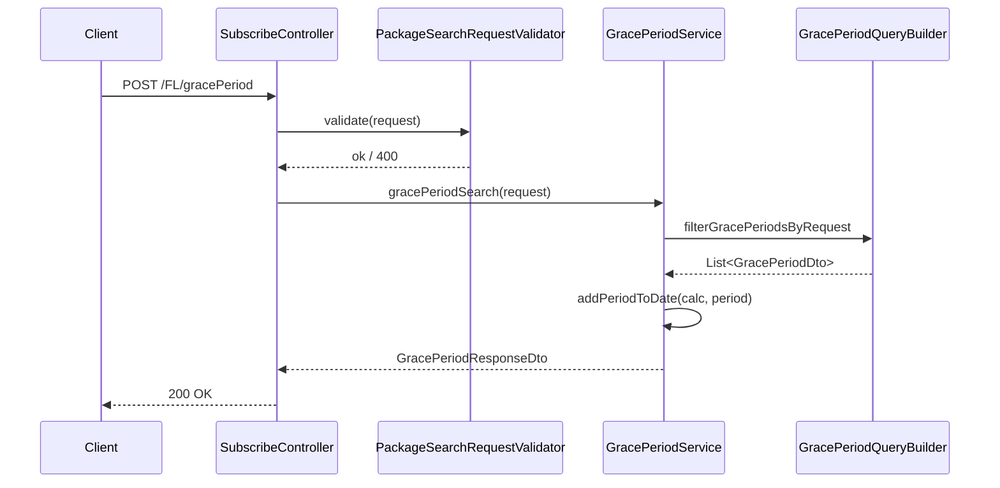
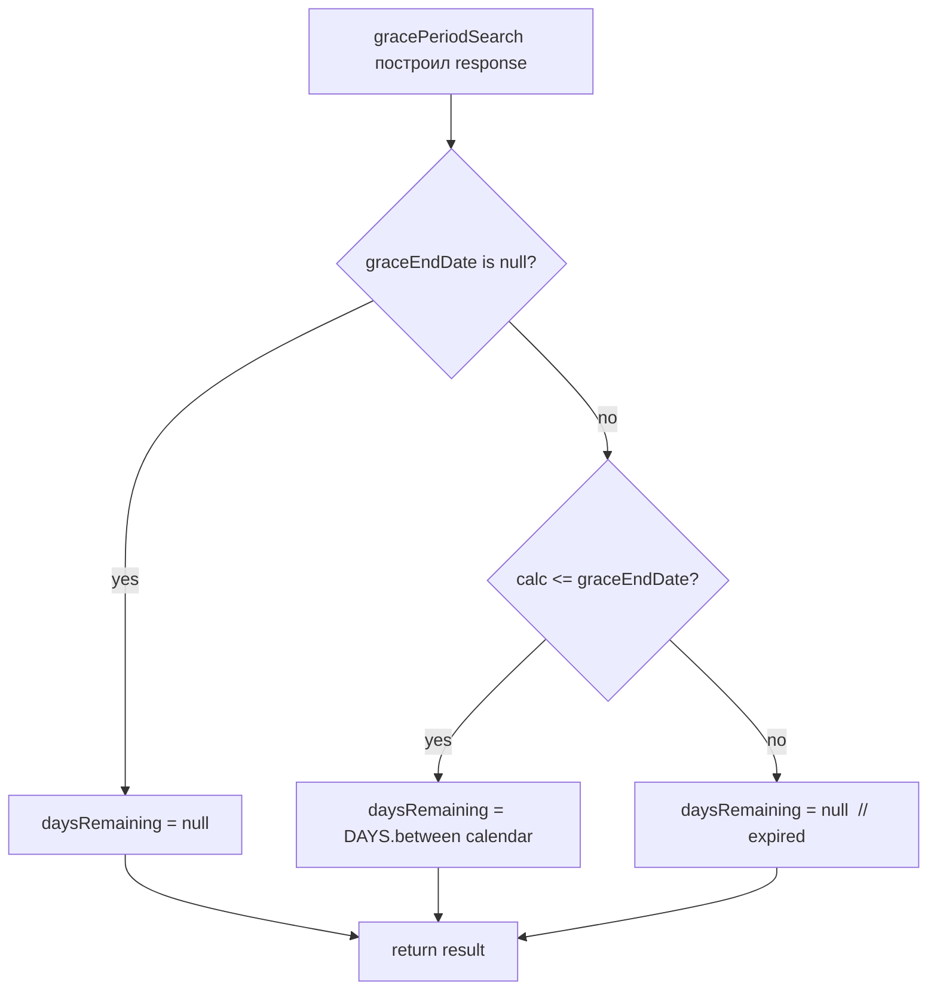

# Live Demo Script — 12 шагов на реальном сервисе packagesearch

**20 минут** внутри блока live demo. Демо идёт на **реальном production-сервисе `packagesearch`** (Spring Boot 3, Java 17). Задача: добавить derived-поле `daysRemaining` в response endpoint'а `POST /FL/gracePeriod`. Поле — количество календарных дней от `calculationDate` до `graceEndDate`.

> Demo-задача и WOW-маппинг закреплены планом `senior-vectorized-flute.md`. Этот файл — operational script: дословные промпты, реплики, fallback'и.

> Каждый шаг = блок: time slot → setup на экране → точный промпт → expected output → speaker line → pattern callout → fallback trigger.

---

## TL;DR

- **Сервис:** `Sources/programm/packagesearch` (Spring Boot 3, Java 17, springdoc-openapi 2.4.0).
- **Endpoint:** `POST /FL/gracePeriod` → `GracePeriodResponseDto`.
- **Задача:** добавить поле `Integer daysRemaining` (календарные дни от `calculationDate` до `graceEndDate`).
- **Файлы:** `dto/graceperiod/GracePeriodResponseDto.java`, `service/GracePeriodService.java`, новый `test/.../GracePeriodServiceTest.java`.
- **WOW#4:** `ChronoUnit.DAYS.between(ZonedDateTime, ZonedDateTime)` возвращает 24-часовые интервалы → 23h59m считает за 0 дней. Self-review агента ловит этот silent bug.
- **Live mvn:** `mvn -Dtest=GracePeriodServiceTest test` — два прогона на сцене (после step 10 и после 11b).

---

## Per-step timing budget (20 мин total)

Время внутреннее по demo (0:00 = старт demo). Слот в общем тайминге доклада спикер сводит сам.

| # | Шаг | Длит. | Внутр. слот | WOW | Track |
|---|---|---:|---:|---|---|
| 1 | Trigger | 0:30 | 0:00–0:30 | | |
| 2 | Understanding | 1:00 | 0:30–1:30 | | analyst |
| 3 | Impact area + MCP | 2:00 | 1:30–3:30 | ⚡#1 | |
| 4 | Explain existing + Mermaid | 1:30 | 3:30–5:00 | ⚡#2 | |
| 5 | Questions to business | 1:30 | 5:00–6:30 | ⚡#3 | analyst |
| 6 | Refine ФС | 1:00 | 6:30–7:30 | | analyst |
| 7 | TO-BE Mermaid | 1:00 | 7:30–8:30 | | analyst→dev handoff |
| 8 | Implementation plan | 1:30 | 8:30–10:00 | | dev |
| 9 | Limited implementation | 2:00 | 10:00–12:00 | | dev |
| 10 | Tests + live mvn | 2:00 | 12:00–14:00 | | dev |
| 11 | Self-review (truncation) | 2:30 | 14:00–16:30 | ⚡#4 | dev |
| 11b | Apply fix + re-run mvn | 1:30 | 16:30–18:00 | | dev |
| 12 | MR description | 1:30 | 18:00–19:30 | ⚡#5 | dev |
| | Outro demo | 0:30 | 19:30–20:00 | | |
| | **Итого** | **20:00** | | | |

**Track callouts** — на шагах 2, 5, 6, 7 спикер произносит «аналитики, обратите внимание». На шаге 8 — переход «теперь к разработческой части».

WOW-паузы — 3 секунды (тише, чем в материале — длиннее эффект). Шаги 1, 6, 7 — спикер только показывает результат, минимум комментариев.

---

## Pre-demo setup (выполняется в T-25, не в эфире)

См. `[[Pre-Show Checklist]]` для полного перечня. Ключевое:

- IDE/opencode открыты в директории `Sources/programm/packagesearch/`.
- opencode терминал в правой половине экрана (большой font, 18+ pt).
- `mvn dependency:go-offline` выполнен — `.m2` прогрет.
- MCP к OpenAPI работает (springdoc на `http://localhost:8080/v3/api-docs` если сервис поднимали; либо MCP-провайдер для локального filesystem).
- Слайд с псевдо-Jira-тикетом PKG-2026-104 открыт во второй вкладке.
- Mermaid-preview подготовлен (vscode preview, mermaid.live, или плагин в opencode).
- `git status` чистый. На случай fallback'а — приготовлена branch `demo/days-remaining-prepared` с готовым результатом.
- Notification mute, Slack closed, IDE без отвлекающих popups.

---

## Шаг 1 — Trigger (0:00–0:30)

**Setup:**
На экране — слайд с псевдо-Jira-тикетом:

```
PKG-2026-104 — Добавить поле daysRemaining в /FL/gracePeriod

Описание:
Фронт и мобайл считают дни до конца grace-периода
самостоятельно, есть расхождения на ±1 день.
Перенести расчёт на сервер.

AC:
- В response /FL/gracePeriod появилось поле daysRemaining (Integer).
- Поведение определено для случая, когда grace уже истёк.
- Существующие клиенты не ломаются.
```

**Speaker line (20 секунд):**

> «Вот тикет. Три строки описания, три строки acceptance criteria. Маленькая, понятная задача — типичная enterprise-постановка. Много кажется ясным, но кое-что — не ясно совсем.»

**Action (10 секунд):**
Переключаемся в opencode терминал. Не копируем тикет, не пишем «реализуй». Произносим:

> «Я не дам агенту команду 'реализуй'. Это первая ошибка, которую делает большинство. Я попрошу другое.»

**Pattern callout:** *Анти-паттерн «сделай задачу целиком». Plan first.*

**Fallback trigger:** не применимо.

---

## Шаг 2 — Understanding (0:30–1:30) *(аналитик)*

**Промпт:**

```
Прочитай тикет PKG-2026-104:
"Добавить поле daysRemaining (Integer) в response /FL/gracePeriod —
количество дней от calculationDate до graceEndDate. Поведение для
истёкшего grace должно быть определено."

Не пиши код. Не предлагай реализацию. Верни:
1. Что я понял из тикета своими словами.
2. Какие сущности и точки кода участвуют.
3. Что НЕ ясно из текста — список открытых вопросов (3-5).
```

**Expected output cheat-sheet:**
- Понимание: «Добавить computed-поле в `GracePeriodResponseDto`, основной endpoint `/FL/gracePeriod`, источник данных — `calculationDate` + `graceEndDate` из текущего ответа».
- Сущности: `GracePeriodResponseDto`, `GracePeriodService.gracePeriodSearch`, `SubscribeController.gracePeriodSearch`.
- Открытые вопросы (агент должен вернуть 3–5 из этого набора):
  - Что такое «день» — календарный или 24-часовой?
  - Что вернуть, если grace уже истёк?
  - Какая таймзона определяет границу?
  - Inclusive/exclusive: «сегодня» считаем?
  - Тип `Integer` или `Long`?

**Speaker line (после ответа агента, 25 секунд):**

> «Заметили — он не написал код. Он вернул структурированную карту понимания. И нашёл четыре открытых вопроса. Один из них — про negative case, что вернуть, когда grace уже истёк — мы ещё к нему вернёмся.
>
> **Аналитики, обратите внимание** — это декомпозиция требования. Первый из ваших ключевых сценариев. Агент не пишет ФС — он раскладывает входной артефакт на структуру.»

**Pattern callout:** *Plan first. Контекст перед действием.*

**Fallback trigger:** агент пишет код несмотря на инструкцию → перейти на `fallback/02-understanding.png`, прокомментировать «видите, я попросил, он всё равно начал — это причина почему мы отдельно проверяем формат ответа».

---

## Шаг 3 — Impact area + MCP (1:30–3:30) ⚡ WOW #1

**Setup:**
Спикер произносит:

> «Сейчас включу секунду MCP. У меня подключена кодовая база этого сервиса через MCP — это значит, агент видит её не как кусок текста, а как структурированный API. Может прочитать любой файл, найти все references, проверить контракт. Смотрите.»

**Промпт:**

```
Через MCP к репозиторию найди ВСЕ точки в кодовой базе packagesearch,
которые затронет добавление поля Integer daysRemaining
в GracePeriodResponseDto.

Для каждой точки покажи file:line и одну строку — что именно
меняется или почему упоминается. Ищи:
- response DTO (где добавлять поле)
- service слой (где вычислять и устанавливать)
- controller (вызывающий код)
- OpenAPI / Swagger
- существующие тесты на эту область
- audit / DTO factory (могут зависеть)
- внутренние DTO БД-слоя (НЕ должны меняться)
- request DTO (НЕ должен меняться)
```

**Expected output cheat-sheet (агент должен вернуть 7–9 точек):**

```
dto/graceperiod/GracePeriodResponseDto.java:32      — +поле Integer daysRemaining
service/GracePeriodService.java:65                  — установить значение перед return result
service/GracePeriodService.java:78–92               — addPeriodToDate (контекст; НЕ меняется)
rest/SubscribeController.java:287–290               — caller, без изменений
src/main/resources/application.yml                  — без изменений
test/.../GracePeriodService                         — тестов нет; будет новый файл
audit/AuditDataDto.java                             — без изменений (не зависит от поля)
dto/graceperiod/GracePeriodDto.java                 — internal DB DTO, без изменений
dto/graceperiod/GracePeriodRequestDto.java          — request DTO, без изменений
OpenAPI schema (springdoc auto)                     — обновится автоматически
```

**Speaker line (60 секунд, на этой паузе долго стоять):**

> «Стоп. Девяносто секунд. Посмотрите на это вместе со мной.
>
> Восемь-девять точек. Реальные file:line. По всему сервису. Чтобы получить эту карту вручную — я бы открыл IDE, сделал find-usages по `GracePeriodResponseDto`, прошёлся по тестам, проверил OpenAPI отдельно, посмотрел audit-обвязку. Минимум двадцать минут.
>
> Здесь — девяносто секунд. И каждую строку я могу проверить — это не магия, это git blame и find-usages под капотом.
>
> **Вот это — усиление delivery-процесса.** Не «агент написал код». А «агент сократил мой codebase exploration в пятнадцать раз».»

⚡ **WOW #1.** Сделать 3-секундную паузу после слов «в пятнадцать раз».

**Pattern callout:** *MCP даёт structured access — это смена качества impact analysis.*

**Fallback trigger:** агент находит < 4 точек или галлюцинирует имена → `fallback/03-impact-map.png` + «вот так выглядит результат, когда работает».

---

## Шаг 4 — Explain existing + Mermaid (3:30–5:00) ⚡ WOW #2

**Промпт:**

```
Прочитай файлы:
- rest/SubscribeController.java (метод gracePeriodSearch)
- service/GracePeriodService.java (метод gracePeriodSearch)
- validator/impl/PackageSearchRequestValidatorImpl.java
  (метод validate(GracePeriodRequestDto))

Нарисуй текущий flow POST /FL/gracePeriod как Mermaid sequence diagram.
Включи validator, service, query builder, точку формирования response.
Опиши под диаграммой 3-5 строк прозой.
```

**Expected output cheat-sheet:**



Прозовое описание упоминает: validator на line 281, service на line 287, response build на 54–63.

**Speaker line (40 секунд):**

> «А теперь смотрите. Это диаграмма НЕ из ФС. Не из Confluence. Это диаграмма из живого кода — буквально только что собрана из четырёх файлов.
>
> Если на этой диаграмме что-то не так — это про код, а не про документацию.
>
> Сколько у вас сервисов, где документация совпадает с реализацией? Вот именно. С агентом мы это закрываем за минуту.»

⚡ **WOW #2.** Хорошо включить Mermaid-preview прямо на экране, чтобы зал увидел rendering.

**Pattern callout:** *Mermaid из реального кода — самый дешёвый способ сверить ФС и реализацию.*

**Fallback trigger:** Mermaid некорректен / не рендерится → `fallback/04-current-sequence.png`.

---

## Шаг 5 — Questions to business (5:00–6:30) ⚡ WOW #3 *(аналитик)*

**Промпт:**

```
Я разработчик. До того как писать код, я хочу задать аналитику или
бизнесу вопросы, которые не закрыты тикетом и которые могут
изменить решение.

Дай 3-5 конкретных вопросов. Каждый — про конкретный сценарий,
не общая риторика. Пометь самый важный.
```

**Expected output cheat-sheet:**

1. Что считаем «днём» — календарный (граница по полуночи) или 24-часовой слот?
2. Какая таймзона определяет границу — сервер, клиент, UTC?
3. **★ Что возвращать, если grace уже истёк (graceEndDate < calculationDate)?** ← *missed question*
4. Inclusive/exclusive — «сегодня» считаем за день?
5. Тип `Integer` или `Long`?

**Speaker line (40 секунд):**

> «Стоп. Третий вопрос. Прочтите его про себя.
>
> Что возвращать, если grace уже истёк. Этот вопрос мы могли пропустить. Я мог пропустить. Аналитик мог пропустить. В тикете про это — ноль.
>
> Здесь агент сработал не как code generator. Он сработал как pair-аналитик.
>
> Вы покупаете не «AI пишет код». Вы покупаете «AI заставляет нас не пропускать вопросы».
>
> **Аналитики** — если ваш сценарий «напиши красивый текст ФС» — вы используете агента слабо. Сильное использование — это **ускорение мышления**: найти дырки, проверить контракт, собрать вопросы.»

⚡ **WOW #3.** Делать паузу после «не пропускать вопросы».

**Pattern callout:** *Ускорение мышления, не генерация текста.*

**Fallback trigger:** все вопросы общие, «missed question» не появился → `fallback/05-questions.png` + «у меня припасён правильный вариант, обсудим, что в нём важно».

---

## Шаг 6 — Refine ФС (6:30–7:30) *(аналитик)*

**Live interaction:** спикер играет за аналитика 20 секунд.

**Speaker line:**

> «Допустим, я получил ответы от бизнеса:
> 1. Календарный день, граница по UTC.
> 2. Если grace истёк — `null` (фронт различает 'нет данных' и 'истёк' иначе).
> 3. `Integer`.
> 4. `Сегодня` входит в подсчёт — стандартная семантика.»

**Промпт:**

```
Учти эти ответы:
1. Календарный день, граница по UTC.
2. Если graceEndDate < calculationDate → daysRemaining = null.
3. Если graceEndDate == calculationDate → 0.
4. Если graceEndDate is null (defensive) → null.
5. Тип Integer.

Обнови acceptance criteria и добавь edge cases.
Не пиши код.
```

**Expected output cheat-sheet:**
- AC: 4-5 пунктов с явной семантикой каждого случая.
- Edge cases: null end, expired, same-day, far-future, boundary at midnight.

**Speaker line (20 секунд):**

> «Видите — я только что подменил аналитика на двадцать секунд. Теперь у меня обновлённая ФС с явными edge cases. В реальности этот цикл — два дня, потому что аналитик уже на следующей задаче. Здесь — две минуты.»

**Pattern callout:** *Цикл «требование → вопросы → ФС → edge cases» короче с агентом на порядок.*

**Fallback trigger:** агент не учёл ответы → переспросить с акцентом или показать `fallback/06-refined-fs.png`.

---

## Шаг 7 — TO-BE Mermaid (7:30–8:30)

**Промпт:**

```
Обнови предыдущую Mermaid диаграмму. Добавь ветку обработки
daysRemaining в точке формирования response: проверка null
graceEndDate, проверка expired, computation. Используй flowchart.
```

**Expected output cheat-sheet:**



**Speaker line (25 секунд):**

> «Та же логика, плюс ветки. Это — handoff-артефакт. Один артефакт работает на три роли:
> аналитик — для документации,
> разработчик — для понимания,
> QA — для test-плана.
>
> Это финальная точка работы аналитика. Дальше передаём разработчику.»

**Pattern callout:** *Один артефакт на 3 роли. Handoff — не пакет документов в Confluence через два дня, а Mermaid-блок в чате.*

**Fallback trigger:** некорректный Mermaid → `fallback/07-new-sequence.png`.

---

## Шаг 8 — Implementation plan + approval gate (8:30–10:00)

**Speaker line (10 секунд, переход):**

> «Теперь — разработческая часть. Аналитик закончил. Переключаюсь в Build-mode? Нет ещё. Сначала план.»

**Промпт:**

```
Я разработчик. Готов реализовать. Предложи план.
- НЕ пиши код.
- Список конкретных правок по файлам, в порядке выполнения.
- Для каждой правки: что меняется и почему.
- Где есть риск — отметь.
- Жди моего одобрения перед написанием кода.
```

**Expected output cheat-sheet:**

```
1. dto/graceperiod/GracePeriodResponseDto.java
   — добавить поле Integer daysRemaining (после String gracePeriod)
2. service/GracePeriodService.java
   — добавить private helper computeDaysRemaining(calc, end)
   — установить result.setDaysRemaining(...) перед return result (line 65)
3. test/.../GracePeriodServiceTest.java
   — новый файл, 4 теста: happy path, expired (null), null end (null),
     same-day (0)
4. mvn -Dtest=GracePeriodServiceTest test — verify green
Risks:
- backwards-compat: additive, не должен ломать клиентов
- семантика «дня» — пока 24h ChronoUnit, может потребовать calendar-day
```

**Speaker line (50 секунд):**

> «Approval gate. Агент остановился. План разумный — четыре пункта, никакого рефакторинга существующего кода, никаких 'я заодно подправлю addPeriodToDate'.
>
> **Это критичный момент.** Большинство тут говорит 'давай реализуй'. И теряет единственный шанс перехватить scope creep.
>
> Я говорю: 'scope ок, но рефакторинг `addPeriodToDate` — отдельный тикет, в этот diff не входит'. Поехали 1–2.»

**Pattern callout:** *Approval gate отделяет хаотичный AI от controlled workflow.*

**Fallback trigger:** агент игнорирует «не пиши код» → `fallback/08-impl-plan.png`.

---

## Шаг 9 — Limited implementation (10:00–12:00)

**Промпт:**

```
Реализуй пункты 1 и 2 плана. Не пиши тесты — они отдельным шагом.
Не делай рефакторинг существующего кода. Стиль проекта (Lombok @Data,
package layout, существующие импорты).

После diff покажи изменённые файлы и количество строк.
```

**Expected output cheat-sheet (~30 строк, 2 файла):**

`GracePeriodResponseDto.java` (+3 строки):
```java
    String gracePeriod;

    Integer daysRemaining;

    @JsonFormat(...) ZonedDateTime begDate;
```

`GracePeriodService.java` (+8 строк, импорт `java.time.temporal.ChronoUnit`):
```java
    // в gracePeriodSearch перед return result (line 64-65)
    result.setDaysRemaining(computeDaysRemaining(calculationDate, graceEndDate));
    return result;
}

private Integer computeDaysRemaining(ZonedDateTime calc, ZonedDateTime end) {
    if (calc == null || end == null) return null;
    if (end.isBefore(calc)) return null;
    return (int) ChronoUnit.DAYS.between(calc, end);
}
```

**Speaker line (50 секунд, проходимся по diff):**

> «Тридцать строк. В двух файлах. Никакого рефакторинга. Никаких новых абстракций. Никаких 'я заодно поправил вот тут стиль'.
>
> Это — сильный паттерн. Маленький контролируемый diff. Каждую строку я могу прочитать и понять. На ревью ревьюер тратит две минуты, не двадцать.
>
> Сравните это с 'агент перепиши сервис' — на выходе двести строк, полдня объяснять зачем.»

**Pattern callout:** *Маленький diff = низкая стоимость ревью + низкий риск регрессий.*

**Fallback trigger:** diff > 60 строк или агент трогает чужие методы → `fallback/09-diff.png` (готовый правильный) + «вот эталон».

---

## Шаг 10 — Tests + live mvn (12:00–14:00)

**Промпт:**

```
Создай unit-тесты для computeDaysRemaining в новом файле
src/test/java/ru/it_alnc/packagesearch/service/GracePeriodServiceTest.java.

Покрытие:
- happy path: calc=2026-01-01, end=2026-01-15 → 14
- expired: calc=2026-02-01, end=2026-01-15 → null
- null end: calc=2026-01-01, end=null → null
- same day: calc=end → 0

Стиль проекта: junit5 + assertj, как в
PackageSearchRequestValidatorImplTest. Покажи команду для запуска.
```

**Expected output cheat-sheet:**

Класс `GracePeriodServiceTest` с 4 методами:
- `daysRemaining_HappyPath_returnsBetween`
- `daysRemaining_GraceAlreadyExpired_returnsNull`
- `daysRemaining_NullEndDate_returnsNull`
- `daysRemaining_SameDay_returnsZero`

Команда:
```bash
mvn -Dtest=GracePeriodServiceTest test
```

**LIVE ACTION:** Спикер запускает команду на сцене.

**Speaker line (во время компиляции, ~30 сек заполнить):**

> «Пока компилит — обращу внимание на чек-лист, который мы сейчас пройдём. Тесты выводятся не из 'кажется надо проверить'. Они выводятся из открытых вопросов шага 5. Помните 'третий вопрос' — что вернуть для expired? Вот этот тест — `daysRemaining_GraceAlreadyExpired_returnsNull` — он буквально замыкает цикл с шагом 5. Цикл замкнулся: открытый вопрос → ответ → AC → реализация → тест.»

Ожидаемый вывод mvn (30–40 сек на прогретой `.m2`):
```
[INFO] Tests run: 4, Failures: 0, Errors: 0, Skipped: 0
[INFO] BUILD SUCCESS
```

**Speaker line (после зелёного, 15 секунд):**

> «Зелёный. Все четыре теста. Это — verification oracle. Агент не «сказал, что работает» — мы запустили и убедились.»

**Pattern callout:** *Verification Oracle — агент не догадывается, агент проверяет.*

**Fallback trigger:**
- mvn падает с compile error → исправить вручную (агент предложит правку), повторить.
- mvn идёт > 60 сек → перейти на `fallback/10-tests-green.png` (скриншот зелёного), сказать «у меня дома точно так же».
- тесты красные → отлично для honest demo: «вот, агент ошибся в типе. Поправили, запускаем снова».

---

## Шаг 11 — Self-review (truncation finding) (14:00–16:30) ⚡ WOW #4

**Промпт:**

```
Сделай self-review своего диффа по чек-листу:
- Семантика: правильно ли мы интерпретировали "дни" из AC?
- Backward compatibility соблюдена?
- Null/empty/missing случаи покрыты?
- Тесты добавлены и проходят?
- Стиль проекта соблюдён?
- Edge cases на boundary условиях?
- Что бы я не пропустил при ревью?

Отдельно: где я сам мог пропустить ошибку?
```

**Expected output cheat-sheet (truncation finding):**

> «**Найден потенциальный silent bug на midnight boundary.**
>
> `ChronoUnit.DAYS.between(ZonedDateTime, ZonedDateTime)` возвращает количество **полных 24-часовых интервалов**, не календарных дней.
>
> Пример: если `calculationDate = 2026-01-01T23:59:00Z` и `graceEndDate = 2026-01-02T23:58:59Z`, разница 23h59m → возвращает `0`. А пользователь, глядя на UI, ожидает «1 день остался».
>
> AC требует «целых дней», но не определяет calendar-day vs 24h. Бизнес очевидно подразумевал календарную семантику.
>
> Варианты fix:
> 1. Оставить 24h-семантику + явный комментарий в Javadoc (transparent но удивительно).
> 2. `ChronoUnit.DAYS.between(calc.toLocalDate(), end.toLocalDate())` — календарные дни.
> 3. Ceiling math (округление вверх для «осталось»).
>
> Рекомендация: вариант 2 — соответствует пользовательской интуиции.»

**Speaker line (90 секунд, держать паузу):**

> «**Стоп.**
>
> Смотрите. Агент нашёл проблему в собственном коде. Через две минуты после того, как сам же его написал. Не я нашёл. Не reviewer найдёт через час. Он сам.
>
> И смотрите, какую проблему. Это не косметика. `ChronoUnit.DAYS.between` — выглядит правильно, **компилируется**, **тесты прошли**. Все четыре теста зелёные. Но это **silent bug** на midnight boundary. На production это даст «осталось ноль дней» там, где пользователь ждёт «осталось один день».
>
> Это не магия. У агента просто есть чек-лист, и он проходит его без исключений. **Я знаю про этот чек-лист — но я могу пропустить, устать, торопиться.**
>
> Самокритичный агент — это не «агент умнее меня». Это «агент не пропустит то, что я пропущу».
>
> Принимаю — **вариант 2**, calendar-day семантика. Бизнес очевидно про календарные дни говорил.»

⚡ **WOW #4.** Длинная пауза на «то, что я пропущу».

**Pattern callout:** *Self-review = чек-лист без исключений. Слабое звено человека, сильная сторона процесса.*

**Fallback trigger:**
- агент не нашёл truncation, говорит «всё ок» → `fallback/11-self-review.png` (готовый с подсаженным finding) + сказать «если у вас агент говорит 'всё ок' — он не делает self-review, он делает self-approval, это разные вещи».
- агент находит другой bug (например, NPE на null) — это тоже валидно, использовать его.

---

## Шаг 11b — Apply fix + re-run mvn (16:30–18:00)

**Промпт:**

```
Примени вариант 2 к computeDaysRemaining: используй
calc.toLocalDate() и end.toLocalDate() для календарной семантики.

Если какой-то существующий тест опирался на 24h-границу - обнови
его комментарий или ассерт под календарную семантику.

После правки запусти mvn -Dtest=GracePeriodServiceTest test
```

**Expected output cheat-sheet:**

Изменение в `GracePeriodService.computeDaysRemaining` (3 строки):
```java
return (int) ChronoUnit.DAYS.between(
    calc.toLocalDate(),
    end.toLocalDate()
);
```

**LIVE ACTION:** mvn запускается второй раз.

**Speaker line (после зелёного, 50 секунд):**

> «Зелёный. Снова четыре теста — теперь с календарной семантикой.
>
> **Verification loop замкнут второй раз.**
>
> Self-review нашёл проблему. Fix применён. Тесты прошли. И всё это — без того, чтобы я открыл IDE и руками искал что не так.
>
> Это и есть delivery cycle. Не один промпт. Не «магически появился готовый код». **Серия маленьких циклов с проверкой на каждом.**»

**Pattern callout:** *Plan-Gate-Execute + Verification Oracle вместе. Цикл замкнулся.*

**Fallback trigger:** mvn падает после fix → агент исправляет, перепрогон. Если опять — переключаемся на `fallback/11b-fixed-mvn.png`.

---

## Шаг 12 — MR description (18:00–19:30) ⚡ WOW #5

**Промпт:**

```
Подготовь MR description по шаблону:
- Что изменено
- Затронутые файлы
- Что проверено (тесты, edge cases)
- Риски (включая truncation finding и его resolution)
- AI usage (что делал агент, что — я; architectural decisions)

Выдай как Markdown, готовый к копированию в GitLab/GitHub.
```

**Expected output cheat-sheet:**

```markdown
## Что изменено
Добавлено derived-поле `daysRemaining` в response `/FL/gracePeriod` —
количество **календарных** дней от calculationDate до graceEndDate.
Семантика согласована с бизнесом после self-review (см. раздел Риски).

## Затронутые файлы
- dto/graceperiod/GracePeriodResponseDto.java — +1 поле
- service/GracePeriodService.java — +1 helper, +1 вызов, +1 import
- test/.../GracePeriodServiceTest.java — новый, 4 теста

## Тесты
- happy path, expired (null), null end (null), same-day (0)
- mvn -Dtest=GracePeriodServiceTest test → green
- регрессий нет

## Риски
- Truncation на midnight boundary: первая реализация использовала
  ChronoUnit.DAYS.between(ZonedDateTime, ZonedDateTime) — 24h семантика.
  Self-review показал, что 23h59m = 0 дней. Зафиксировано: используется
  toLocalDate().between(...) для календарной семантики.
- Backwards-compat: additive — старые клиенты, игнорирующие новое поле,
  не ломаются (Jackson FAIL_ON_UNKNOWN_PROPERTIES default).
- OpenAPI schema обновится автоматически (springdoc).

## AI usage
Файлы выше: agent-generated в opencode, self-review проведено.
Architectural decision: 1 (calendar-day vs 24h семантика) — принято
автором, не агентом.

Reviewer'у в первую очередь смотреть:
- GracePeriodService.computeDaysRemaining — корректность семантики
- 4 теста — покрытие edge cases
```

**Speaker line (75 секунд, медленно, кульминация):**

> «А вот это — то, что reviewer открывает первым. Он не открывает diff. Он открывает description.
>
> И сразу видит: что изменено, какие файлы, что проверено, какие риски.
>
> **Особенно — раздел Риски.** Там написано про truncation, который мы нашли на self-review. Reviewer не должен это сам обнаружить — мы уже это обработали и зафиксировали решение. Это — handoff в полном смысле.
>
> Сколько у вас MR'ов с описанием 'fix bug' или 'добавил поле'? Вот это — то самое, что съедает на ревью часы.
>
> Здесь — две минуты на генерацию описания, которое экономит ревьюеру пятнадцать минут на восстановление контекста.
>
> Это — 'агент в delivery workflow'. Не magic. Не chatbot. **Инструмент, который соединяет требование, код, тесты, ревью — в один цикл.**»

⚡ **WOW #5.** Кульминация demo. Не делать паузу — переход к outro.

**Pattern callout:** *MR description = handoff на reviewer'а. Output structure as constraint — поэтому это работает.*

**Fallback trigger:** MR description слабый / пустой → `fallback/12-mr-description.md`.

---

## Outro demo (19:30–20:00)

**Speaker line (30 секунд):**

> «Двенадцать шагов. Двадцать минут. **Реальный сервис, реальный код, реальный flow от тикета до MR.**
>
> Включая шаги аналитика — два, пять, шесть, семь — и шаги разработчика — восемь–двенадцать. Один workflow, две роли, полный delivery cycle.
>
> Если бы я бросил всё в один промпт — был бы двести-строчный diff, никаких артефактов handoff'а, никакого approval gate, **никакого finding'а про truncation**.
>
> Двенадцать маленьких циклов с моим контролем. Это и есть «усилитель delivery-процесса».
>
> Дальше — главный экспертный блок. Восемь паттернов с реальными примерами из этого же сервиса.»

---

## Общие правила во время demo

### Вопросы из зала во время demo
- Короткий вопрос («а как opencode настроить?») — отложить: «отвечу в Q&A».
- Технический («а MCP это что?») — 10 секунд краткий ответ и продолжить.
- Никогда не уходить в долгий разговор во время demo. Тайминг ломается мгновенно.

### Если агент думает дольше ожидаемого
- 10 секунд тишины — нормально, держать паузу.
- 30 секунд — заполнить пояснением: «пока агент думает, обращу внимание на то, что я попросил его НЕ делать».
- 60 секунд — пора переключаться на fallback. «Сегодня неудачный день для opencode, не страшно — у меня есть результат заранее».

### Если агент даёт совсем не то
- Не пытаться «перепромптить на лету» более 1 раза.
- Сразу переходить на fallback и комментировать: «Видите, как агент тоже ошибается. Это нормально. Поэтому весь наш workflow построен вокруг проверок, а не доверия.»
- Это не провал demo — это валидное demonstration анти-паттерна.

### Тайминг-чекпоинты для контроля

| Внутр. время | Должен быть в конце шага |
|---|---|
| 3:30 | конец step 3 (impact area) |
| 6:30 | конец step 5 (questions) |
| 10:00 | конец step 8 (plan) |
| 14:00 | конец step 10 (tests + first mvn green) |
| 18:00 | конец step 11b (fix + second mvn green) |
| 19:30 | конец step 12 (MR description) |

Если на 6:30 ты ещё в шаге 4 — сократить шаги 6–7 до 1 минуты вместе и не делать live interaction в шаге 6 (просто прокомментировать ответы).

Если на 14:00 ты ещё в шаге 9 — пропустить шаг 11b целиком, оставить только finding в step 11 без apply-fix-цикла.

### Аварийная посадка (если совсем плохо)
Если на 16:00 ещё не дошёл до step 10 — переключиться на готовую branch `demo/days-remaining-prepared` и закрыть demo описанием артефактов: «вот что у нас получилось, ключевая мысль — workflow не магия, а серия проверяемых шагов». Перейти в outro.

---

## Связь с блоком «Сильные паттерны»

После demo в основном блоке доклада (29–53 мин) спикер ссылается на конкретные моменты demo:

| Паттерн | Какой шаг demo цитировать |
|---|---|
| 1. Context engineering | step 3 (MCP impact analysis) |
| 2. Plan-Gate-Execute | step 8 (approval gate перед кодом) |
| 3. Verification Oracle | step 10 + 11b (live mvn зелёный дважды) |
| 4. Subagent decomposition | step 11 (self-review-как-subagent можно показать) |
| 5. AGENTS.md | вне demo, но опереться: «агент с первого промпта знал Java 17, Spring Boot, стиль» |
| 6. Output structure | step 12 (MR template) |
| 7. Agentic attribution | step 12 («AI usage» секция) |
| 8. Verifiability boundary | post-demo: «эта задача — high-verifiability, поэтому agent ускоряет; задача архитектуры — нет» |
