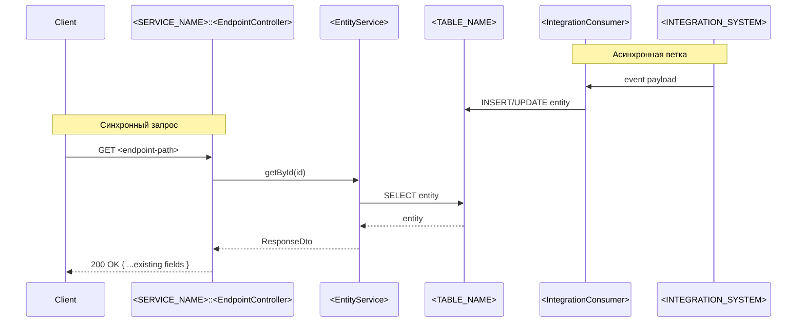
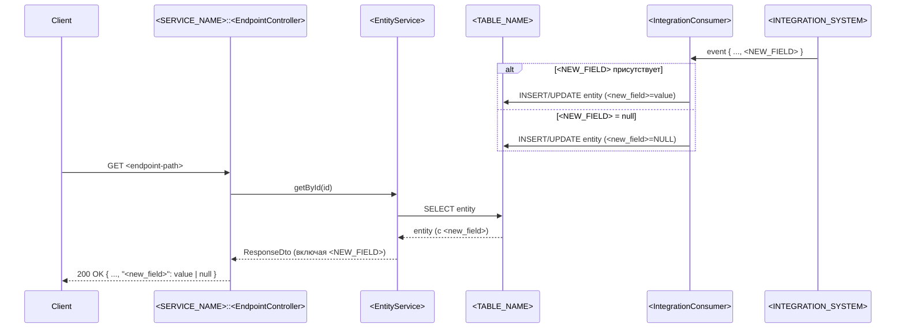

# Templates — шаблоны для доклада, demo и pilot-команды

Все шаблоны — для прямого использования спикером во время доклада, командой во время pilot'а и для копирования в `Sources/` если нужно как раздаточный материал.

---

## 1. Pseudo-Jira ticket для demo

Файл: `demo/ticket.md`. Открывается на экране на шаге 1 demo (23:00).

```markdown
# <TICKET-ID>: Добавить поле <NEW_FIELD> в ответ <ENDPOINT>

## Что нужно

В response endpoint'а <ENDPOINT> сервиса <SERVICE_NAME>
добавить поле <NEW_FIELD>. Поле приходит из <INTEGRATION_SYSTEM>
в составе уже получаемого нами события и должно сохраняться
в таблице <TABLE_NAME>.

## Acceptance criteria

- При запросе <ENDPOINT> в response присутствует поле <NEW_FIELD>
- Если <INTEGRATION_SYSTEM> не вернул поле, в response — null
- Поле сохраняется при первичной обработке события
- Существующие потребители <ENDPOINT> не сломаются

## Out of scope

- Изменение схемы события от <INTEGRATION_SYSTEM> (контракт уже расширен)
- UI / другие сервисы-потребители
```

---

## 2. Context pack — шаблон

Используется на шаге 0 (до первого промпта). Можно скопировать в начало системного сообщения opencode или держать рядом.

```markdown
## Context pack для агента

**Требование:** добавить поле <NEW_FIELD> в response <ENDPOINT>

**Цель изменения:**
бизнесу нужно отображать <NEW_FIELD> в клиентском приложении

**Границы задачи:**
- меняем только <SERVICE_NAME>
- меняем только OpenAPI + DTO + service + tests
- НЕ трогаем: схему БД (поле уже есть), консьюмеры события, UI

**Что нельзя менять:**
- публичные контракты других endpoint'ов
- общую схему ответа (только добавить поле)
- backward compatibility

**Затронутые системы:**
- <SERVICE_NAME>
- <INTEGRATION_SYSTEM> (источник)
- <TABLE_NAME> (хранилище)

**Известные точки входа:**
- (заполнить после impact analysis)

**Ожидаемый результат:**
- diff в OpenAPI, DTO, service, tests
- self-review, что я не упустил
- готовый MR description

**Критерии проверки:**
- mvn test проходит
- response endpoint содержит новое поле
- null обрабатывается корректно
```

---

## 3. Impact map — шаблон ответа агента

То, что должно вернуть агент на шаге 3 (Impact area). Используется на live demo как эталон.

```text
Impact area для добавления <NEW_FIELD>:

ВХОДНАЯ ТОЧКА:
  <MODULE_NAME>/api/<EndpointController>.java:42
    @GetMapping("/<endpoint-path>")
    -> возвращает <ResponseDto>

DTO/MAPPING:
  <MODULE_NAME>/dto/<ResponseDto>.java
  <MODULE_NAME>/mapper/<EntityToDtoMapper>.java:78
    -> отсюда формируется поле response

СЕРВИСНЫЙ СЛОЙ:
  <MODULE_NAME>/service/<EntityService>.java:115
    -> метод getById()

ИСТОЧНИК ДАННЫХ:
  <MODULE_NAME>/repository/<EntityRepository>.java
  <MODULE_NAME>/entity/<Entity>.java
    -> поле <new_field> в БД уже существует (миграция XYZ)

ИНТЕГРАЦИОННАЯ ТОЧКА:
  <MODULE_NAME>/integration/<IntegrationConsumer>.java:54
    -> здесь приходит сообщение от <INTEGRATION_SYSTEM>
    -> поле уже парсится в Entity

OPENAPI:
  <MODULE_NAME>/src/main/resources/openapi.yaml:128
    -> схема ResponseDto

ТЕСТЫ:
  <MODULE_NAME>/test/.../<EndpointControllerTest>.java
  <MODULE_NAME>/test/.../<EntityServiceTest>.java

ПОХОЖИЕ РЕАЛИЗАЦИИ:
  В прошлом квартале добавлялось поле <SIMILAR_FIELD> —
  паттерн тот же.

РИСКИ:
  - тесты <EndpointControllerTest> на null-сценариях нет
  - mapper не покрыт unit-тестом отдельно
```

---

## 4. Mermaid sequence — шаблон

То, что агент строит на шаге 4 и обновляет на шаге 7.

### Текущий flow (шаг 4)



### После изменения (шаг 7)



---

## 5. MR description — шаблон

Эталон того, что агент возвращает на шаге 12. Этот же шаблон становится частью pilot playbook'а.

```markdown
## Что изменено

Добавлено поле <NEW_FIELD> в response endpoint'а <ENDPOINT>.
Поле приходит из <INTEGRATION_SYSTEM>, сохраняется в <TABLE_NAME>,
возвращается в API.

## Затронутые файлы

- `<MODULE_NAME>/api/<EndpointController>.java` — нет изменений (через DTO)
- `<MODULE_NAME>/dto/<ResponseDto>.java` — +1 поле
- `<MODULE_NAME>/mapper/<EntityToDtoMapper>.java` — +1 строка маппинга
- `<MODULE_NAME>/src/main/resources/openapi.yaml` — +1 поле в схеме
- `<MODULE_NAME>/test/.../<EndpointControllerTest>.java` — +1 тест
- `<MODULE_NAME>/test/.../<EntityServiceTest>.java` — +1 тест на null

## Что проверено

- [x] mvn test — все тесты зелёные
- [x] Поле в response при наличии в БД
- [x] Поле = null когда в БД null
- [x] Существующие потребители не сломаны
  (контрактные тесты не упали)

## Риски

- Низкий: изменение аддитивное, backward-compatible
- Контракт публичный → откат потребует совместного релиза
  с потребителями

## Что reviewer'у смотреть в первую очередь

1. Маппер — нет ли потери null-семантики
2. OpenAPI — `nullable: true` для нового поля
3. Тест на null — корректно ли проверяется отсутствие

## Использование AI-агента

Использовался opencode для:
- impact analysis (нашёл затрагиваемые файлы)
- генерации тестов на null-edge case
- сборки этого MR description

Self-review checklist пройден. Архитектурные решения принимались человеком.
```

---

## 6. Self-review checklist (то, по чему агент проверяет себя на шаге 11)

```text
[ ] Изменения в scope задачи (не вышел за границы)
[ ] Не введены лишние абстракции
[ ] Не сломан публичный контракт
[ ] Backward compatibility соблюдена
[ ] Null/empty/missing случаи покрыты
[ ] Тесты добавлены/обновлены
[ ] Стиль соответствует проекту (naming, formatting)
[ ] Нет hardcoded значений, которые должны быть в config
[ ] Нет TODO/FIXME без обоснования
[ ] Логирование адекватное (не лишнее, не отсутствующее)
[ ] Обработка ошибок выровнена с остальным кодом
[ ] OpenAPI обновлён, если менялся контракт
```

---

## 7. Wow-moments — формулировки на экране

5 ключевых вау-моментов. Каждый — момент в demo, на котором спикер делает паузу и подсвечивает.

| # | Момент | Время demo | Что говорит спикер |
|---|---|---|---|
| 1 | Impact across 3 modules in 90s | 25:30–28:30 | "Я бы потратил 30 минут с grep'ом и find usages. Агент сделал это за 90 секунд — и связал найденные точки в карту" |
| 2 | Mermaid sequence из реального кода | 28:30–30:30 | "Это диаграмма не из ФС. Это диаграмма из живого кода. Если что-то на ней не так — это про код, а не про документацию" |
| 3 | Question to business that we missed | 30:30–32:00 | "Заметили? Этот вопрос аналитик мог не задать. Я мог не задать. Здесь агент сработал как pair-аналитик" |
| 4 | Self-review catches own bug | 42:30–44:30 | "Агент нашёл проблему в собственном коде. Не потому что он умнее меня — потому что у него есть чек-лист и он его проходит без исключений" |
| 5 | MR description with rationale | 44:30–47:00 | "Вот это reviewer открывает первым. Описание, которое не надо реверс-инженерить из кода" |

---

## 8. Team pains — формулировки от 2-го лица

Используются в блоке 4–9 ("Где enterprise теряет время"). Звучат как обвинение, но конкретное.

```text
1. Вход в legacy-сервис — это недели.
   Никто из вас не знает все интеграции конкретного сервиса целиком.
   Я говорю «вашего», потому что это нормально для больших систем,
   но мы притворяемся, что это не так.

2. ФС написана. Разработчик начал. Через два дня приходят вопросы.
   Аналитик уже на другой задаче.
   Контекст в голове у одного человека, а исполнитель — другой.
   Мы платим за это в каждом спринте.

3. На code review всплывают проблемы, которые должны были
   быть видны ещё на этапе анализа.
   Не потому что аналитик плохой. Потому что инструменты
   не помогают сверить ФС с кодом до разработки.

4. MR без summary. Reviewer открывает diff и реверс-инженерит
   из кода: что вообще тут изменено и зачем.
   Это самая дорогая операция в процессе ревью —
   и она у нас бесплатная по умолчанию.

5. SQL-запрос на проде. Логи нужны срочно.
   Никто не помнит точно, где смотреть.
   Каждый ищет по-своему. Через неделю забудем снова.
```

---

## 9. Kilo Code anti-patterns — formulations

Используются в блоке 4–9 (как continuation болей) и в блоке 47–55 (как анти-паттерны).

```text
1. "Напиши реализацию <REQUIREMENT>" в одну строку.
   Это не использование агента. Это RNG.
   Результат — какой повезёт.

2. Копипаст 200 строк кода в чат.
   Вместо того, чтобы агент сам прочитал репозиторий
   через инструменты контекста.
   Результат — агент видит только то, что вы ему дали,
   и не видит того, что вы упустили.

3. Принять первый ответ как финальный.
   Никакой итерации, никакого review.
   Результат — самый медленный, самый шумный код в репо.

4. Каждый в команде делает по-своему.
   У одного промпты на 5 строк, у другого — на 50.
   Результат не воспроизводится. Знание не передаётся.
   Playbook'а нет.

5. Агент = "умный chatbot".
   Нет понимания, что это инструмент в workflow,
   а не собеседник.
   Результат — агент используется на 10% мощности.
```

---

## 12. Vocabulary slide — 6 элементов AI-агента (для блока 4–9)

Один слайд на весь блок 4–9. Сетка 3×2, каждая ячейка раскрывается по мере того, как спикер говорит о термине. Альтернативно — все 6 видны сразу, текущая подсвечена.

```
┌──────────────────┬──────────────────┬──────────────────┐
│   SUBAGENTS      │       MCP        │   AGENTS.md      │
│                  │                  │                  │
│   Изоляция       │   Структурный    │   Конвенции      │
│   контекста      │   доступ         │   проекта        │
│                  │   к источникам   │                  │
│   [Anthropic,    │   [open          │   [Karpathy,     │
│    opencode]     │    standard]     │    opencode]     │
├──────────────────┼──────────────────┼──────────────────┤
│     SKILLS       │    COMMANDS      │      HOOKS       │
│                  │                  │                  │
│   Автоакти-      │   Параметри-     │   События        │
│   вирующиеся     │   зованные       │   и реакции      │
│   специализации  │   промт-шаблоны  │                  │
│   [opencode,     │   /<name>        │   [opencode,     │
│    общий]        │   [opencode]     │    общий]        │
└──────────────────┴──────────────────┴──────────────────┘
```

### Skills vs Commands — критичное различие

Эти два пункта спикер должен подсветить отдельно:

| | Skill | Command |
|---|---|---|
| Когда | автоматически по контексту | явно по имени `/...` |
| Кто решает | модель | пользователь |
| Аналогия | автопилот | ручное управление |

### Финальная фраза блока (запоминающийся ритм)

В конце блока, после всех 6 объяснений, обязательно произнести:

> **Subagents** — изоляция контекста. **MCP** — структурированный доступ к источникам. **AGENTS.md** — конвенции проекта. **Skills** — автоактивирующиеся специализации. **Commands** — параметризованные шаблоны промптов. **Hooks** — события и реакции.

Темп — слегка замедленный, чтобы зал зафиксировал ассоциации. На Skills и Commands — особенно отчётливо.

### Произношение

| Термин | Как произносить |
|---|---|
| Subagents | «са́б-эйджентс» (английский акцент) |
| MCP | «эм-си-пи» (по буквам) |
| AGENTS.md | «эйджентс-эм-ди» или «файл agents.md» |
| Skills | «скиллс» |
| Commands | «коммандз» или «слэш-команды» (избегать «команды» без уточнения) |
| Hooks | «хуки» (по-русски, устоявшееся) |

### Раздаточный материал

PDF-cheat-sheet на 1 страницу: 6 терминов + определение + одна команда/пример в opencode для каждого + сравнительная таблица Skill/Subagent/Command/MCP из AI Agents §6.0. Раздаётся после доклада тем, кто хочет.

---

## 11. Сильные паттерны — слайд 4×2 (для блока 47–51)

Один слайд на весь экспертный блок. Сетка 4×2, каждая ячейка содержит имя паттерна + источник микрошрифтом в углу. На экране параллельно с тем, как спикер говорит. **Не зачитывается** — работает как visual anchor.

```
┌─────────────────────────────┬─────────────────────────────┐
│ 1. CONTEXT ENGINEERING      │ 2. PLAN-GATE-EXECUTE        │
│    > prompt engineering     │    approval gate IS the     │
│    Window как RAM           │    architecture             │
│    [Anthropic, Karpathy]    │    [Anthropic, Cognition]   │
├─────────────────────────────┼─────────────────────────────┤
│ 3. VERIFICATION ORACLE      │ 4. SUBAGENT DECOMPOSITION   │
│    Агент сам запускает      │    Clean context per        │
│    тесты, не ты             │    concern                  │
│    [Willison, Anthropic]    │    [Anthropic]              │
├─────────────────────────────┼─────────────────────────────┤
│ 5. AGENTS.md                │ 6. OUTPUT STRUCTURE         │
│    Working memory           │    JSON schema как          │
│    externalization          │    interface contract       │
│    [Karpathy, opencode]     │    [Eugene Yan]             │
├─────────────────────────────┼─────────────────────────────┤
│ 7. ATTRIBUTION в MR         │ 8. VERIFIABILITY BOUNDARY   │
│    Audit trail =            │    Знать границу = это      │
│    compliance артефакт      │    дисциплина               │
│    [EU AI Act, ISACA]       │    [Karpathy 2026]          │
└─────────────────────────────┴─────────────────────────────┘
```

### Источники (для footer слайда / handout)

| # | Паттерн | URL источника |
|---|---|---|
| 1 | Context engineering | https://www.anthropic.com/engineering/effective-context-engineering-for-ai-agents |
| 2 | Plan-Gate-Execute | https://www.anthropic.com/research/building-effective-agents |
| 3 | Verification Oracle | https://simonwillison.net/guides/agentic-engineering-patterns/red-green-tdd/ |
| 4 | Subagent decomposition | https://www.anthropic.com/research/building-effective-agents |
| 5 | AGENTS.md | https://karpathy.bearblog.dev/sequoia-ascent-2026/ |
| 6 | Output structure | https://eugeneyan.com/writing/llm-patterns/ |
| 7 | Attribution в MR | https://codeslick.dev/blog/eu-ai-act-audit-trail-2026 |
| 8 | Verifiability boundary | https://karpathy.bearblog.dev/sequoia-ascent-2026/ |

### Как использовать на выступлении

- Слайд показывается с самого начала блока 47:00 и остаётся неизменным до 51:00.
- На каждом паттерне спикер указывает рукой/курсором на соответствующую ячейку.
- В конце outro (50:55) слайд можно убрать с экрана за 5 секунд до финального переходного слайда «Risks».
- Раздаточный материал (handout): печатная версия слайда + URL-источников в виде PDF на 1 страницу. Раздаётся по запросу после доклада.

---

## 10. Pilot 4-week milestones — overview

Полная версия в `Call To Action.md`. Здесь — компактная сводка для слайда финального блока.

| Неделя | Фокус | Decision gate |
|---|---|---|
| W1 | Setup + 3 пилотных задачи в pipeline (analyst + dev) | Запустились ли все три? |
| W2 | Handoff analyst↔dev на агенте | Сократилось ли число вопросов post-handoff? |
| W3 | Метрики на ретро (время analysis, impact, MR description) | Видим ли изменение vs baseline? |
| W4 | Retrospective + решение о scale | Расширяемся / корректируем / откатываем |
